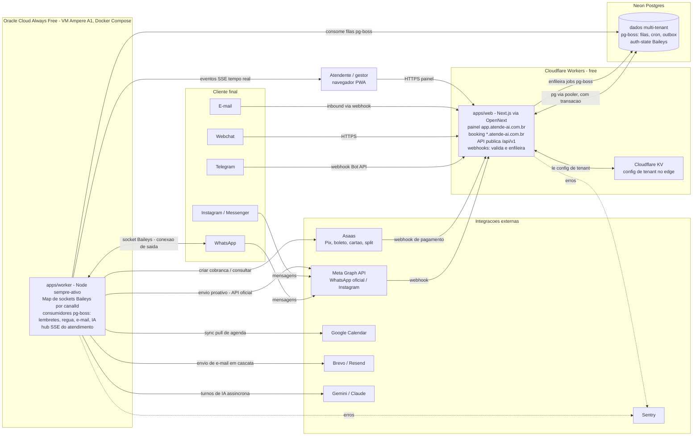

# 01 — Arquitetura

**Sumário executivo.** O atende-ai é um SaaS multi-tenant brasileiro de agendamento + atendimento omnichannel (WhatsApp primeiro) para salões, barbearias, clínicas e escritórios. A arquitetura tem exatamente **três peças**: `apps/web` (Next.js via OpenNext em Cloudflare Workers — painel PWA, booking pública white-label, API pública e recepção de webhooks), **Neon Postgres** (dados + filas pg-boss + auth-state Baileys, tudo no mesmo banco) e `apps/worker` (Node sempre-ativo em Oracle Cloud Always Free — sockets Baileys, consumidores de fila, hub SSE). Todo o desenho é orientado por duas restrições assumidas como requisito, não como acidente: **custo zero de infraestrutura** (free tiers permanentes; só domínio e gateway por transação são custos aceitos) e **isolamento de tenant como regra inviolável** (shared schema + `empresaId` pervasivo, com RLS na Fase 2). Este documento registra as decisões, os trade-offs honestos de cada uma, os bounded contexts e os riscos com mitigação.

---

## 1. Visão de alto nível — as 3 peças

### 1.1 `apps/web` — Next.js via OpenNext em Cloudflare Workers

O front e a borda HTTP do sistema, publicados no free tier da Cloudflare (100k req/dia, 10ms CPU por invocação). Responsabilidades:

- **Painel PWA** em `app.atende-ai.com.br` — painel único para todos os tenants; o tenant vem da sessão JWT, nunca da URL.
- **Booking pública white-label** em subdomínio wildcard `{slug}.atende-ai.com.br` — a única superfície onde o tenant é resolvido pelo hostname.
- **API pública `/api/v1`** — route handlers versionados, contrato Zod, autenticação por API key por tenant (plano Pro+).
- **Recepção de webhooks** (Meta Graph API, Asaas, Telegram, e-mail inbound, Google Calendar watch na Fase 2) que **apenas validam assinatura, normalizam e enfileiram** no pg-boss. Nenhum webhook executa lógica de negócio na borda: o processamento pesado é sempre do worker. Isso mantém o handler dentro dos 10ms de CPU e torna a borda idempotente e barata.

SSR é deliberadamente leve: server components enxutos, dados via adapter `pg` pelo pooler do Neon (com transação — abandonamos o driver Neon HTTP usado no ev-tracker), mutações do painel por Server Actions.

### 1.2 Neon Postgres — dados, filas e estado de sessão no mesmo banco

Um único Postgres serverless (free tier: 100 CU-h/mês, 0,5 GB) concentra três papéis:

1. **Dados de produto** — schema compartilhado multi-tenant (ver seção 5), acesso via Prisma com adapter `pg` pelo pooler, com suporte a transação.
2. **pg-boss** — filas, cron e **outbox transacional**: gravar um `Agendamento` e o job do lembrete acontece na **mesma transação** Postgres. Sem broker externo, sem custo, sem mensagem órfã.
3. **Auth-state Baileys** — as credenciais de sessão WhatsApp de cada canal persistem no Postgres (padrão herdado do ev-tracker). A VM do worker é 100% descartável: destruí-la não derruba nenhuma sessão WhatsApp.

### 1.3 `apps/worker` — Node sempre-ativo em Oracle Cloud Always Free

Uma VM Ampere A1 (Always Free) rodando o worker via Docker Compose. É o único processo de vida longa do sistema e concentra tudo que não cabe em serverless:

- **Gestor de N sockets Baileys** — um `Map<canalId, socket>` mantém uma conexão WhatsApp por canal de tenant, com reconexão com backoff e auth-state no Postgres.
- **Consumidores pg-boss** — lembretes de agendamento, régua de cobrança, envio de e-mail (cascata Brevo → Resend), processamento assíncrono de IA (turnos de conversa que estouram o tempo da borda).
- **Hub SSE** do painel de atendimento — o navegador do atendente abre uma conexão SSE direto contra o worker para receber mensagens em tempo real.

A VM **não recebe nenhum webhook**: todo tráfego de entrada externo passa pelo domínio Cloudflare e vira job na fila. O worker só faz conexões de saída (Postgres, WhatsApp, APIs externas) e aceita apenas as conexões SSE do painel. Isso reduz superfície de ataque e torna o IP da VM irrelevante — trocá-la de provedor não muda nenhuma configuração externa.

---

## 2. Diagrama de componentes

Leitura do diagrama: **webhooks entram exclusivamente pelo domínio Cloudflare e viram jobs**; o worker consome as filas e faz todas as chamadas de saída; **nenhuma seta externa aponta para a VM** — a única conexão de entrada que ela aceita é o SSE do painel autenticado.

---

## 3. Decisões e trade-offs

### 3.1 Cloudflare Workers (via OpenNext) em vez de Vercel

**Decisão:** hospedar `apps/web` em Cloudflare Workers usando o adapter OpenNext.

**Motivo:** o Vercel Hobby **proíbe uso comercial** nos termos de serviço — um SaaS cobrando R$ 149/mês está fora de conformidade desde o primeiro cliente — e o Vercel Pro custa US$ 20/mês por membro, furando o orçamento zero. O free tier da Cloudflare **permite uso comercial** com 100k requisições/dia e 10ms de CPU por invocação, suficiente para o MVP com folga.

**Trade-off honesto:** OpenNext é uma camada de adaptação, não o deploy de primeira classe que a Vercel oferece para Next.js — features novas do framework chegam com atraso e ocasionalmente exigem workaround; e o teto de 10ms de CPU obriga SSR minimalista (nada de renderização pesada na borda). Aceitamos a fricção porque o upgrade natural é barato e sem migração: **Workers Paid a US$ 5/mês** remove o teto prático de CPU (30s) muito antes de qualquer necessidade de sair da Cloudflare.

### 3.2 Oracle Cloud Always Free para o worker

**Decisão:** rodar `apps/worker` numa VM Ampere A1 do Oracle Cloud Always Free, provisionada com Docker Compose.

**Motivo:** em 2026 é o **único always-on gratuito real** que sobrou — Railway e Fly encerraram seus free tiers, e o free do Render hiberna após inatividade, o que **derruba o socket Baileys** e mata a proposta de valor do canal WhatsApp. Sockets Baileys e hub SSE exigem processo de vida longa; serverless não serve.

**Trade-off honesto:** a OCI **exige cartão de crédito na criação da conta** (verificação, sem cobrança — única exceção à regra "sem cartão" do projeto) e tem histórico de reclamar de capacidade na criação de instâncias Ampere e, raramente, de encerrar contas free ociosas. Mitigação estrutural na seção 6: a VM é gado, não estimação. **Plano B documentado:** Northflank free (2 serviços) ou Railway Hobby a US$ 5/mês.

### 3.3 pg-boss em vez de QStash (ou broker dedicado)

**Decisão:** filas, cron e outbox via **pg-boss dentro do próprio Neon Postgres**.

**Motivo:** custo zero absoluto, retries e cron nativos, e — o argumento decisivo — **outbox transacional**: gravar o `Agendamento` e o job do lembrete na **mesma transação** Postgres elimina por construção a classe de bug "agendou mas o lembrete nunca existiu". Nenhum broker externo oferece isso sem padrão outbox manual.

**Trade-off honesto:** pg-boss consome conexões e CU-h do próprio Neon (polling dos consumidores), e o free tier do Neon é apertado (100 CU-h/mês); filas de altíssimo volume um dia pressionarão o banco. **Plano B documentado: QStash** (1.000 mensagens/dia no free), que externaliza a fila ao custo de perder a transação conjunta — se migrarmos, o outbox vira tabela própria + relay.

### 3.4 Realtime: SSE servido pelo worker + fallback polling

**Decisão:** o painel de atendimento recebe mensagens em tempo real por **SSE servido diretamente pelo worker** (que já é um processo de vida longa), com **fallback de polling a cada 5s** quando a conexão SSE não estabelece (proxies corporativos, redes móveis instáveis).

**Motivo:** SSE é unidirecional (servidor → navegador), exatamente o que o caso de uso pede, sem a complexidade de WebSocket; e servi-lo do worker evita o problema de conexões longas em plataforma serverless (Workers cobra duração).

**Trade-off honesto:** todos os atendentes de todos os tenants conectam na mesma VM — o hub SSE é um ponto único e o número de conexões simultâneas cresce com a base. **Saída documentada: Pusher** (200k mensagens/dia no free) se o SSE virar gargalo; o contrato de eventos é o mesmo, muda só o transporte.

### 3.5 Cache: memória do worker + Cloudflare KV — sem Redis, deliberadamente

**Decisão:** dois níveis de cache e nenhum Redis. No worker, cache **em memória de processo com TTL curto** (config de canal, árvores publicadas, prompts). Na borda, **Cloudflare KV** (100k leituras/dia no free) para a config de tenant que o edge precisa resolver rápido — em especial o mapeamento `slug → empresaId` da booking wildcard.

**Motivo:** um Redis gerenciado gratuito confiável não existe (Upstash free é apertado e é mais um vendor), e os dados cacheados aqui são pequenos, raramente mutáveis e tolerantes a staleness de segundos.

**Trade-off honesto:** KV é *eventually consistent* (propagação de escrita em ~60s) — mudança de config de tenant pode demorar até um minuto para valer no edge; e cache em memória do worker zera a cada deploy. Ambos são aceitáveis para config; **nada transacional ou de sessão vai para cache**, isso é papel do Postgres e do JWT.

---

## 4. Bounded contexts

| Contexto | Responsabilidade |
|---|---|
| `identidade` | Empresas (tenants), unidades, usuários, papéis/RBAC, escopos, sessão JWT, onboarding e aceite de DPA |
| `agenda` | Serviços, profissionais, **salas/recursos físicos** (com capacidade), **bloqueios de horário** (férias, almoço, manutenção — por profissional, sala ou unidade), horários de funcionamento por unidade, agendamentos (com **exclusion constraint anti-sobreposição por profissional e por sala**), booking pública, sincronização Google Calendar |
| `clientes` | Cadastro de clientes finais dos tenants, `IdentidadeCanal` (resolução inbound → cliente), merge de identidades, histórico |
| `atendimento` | Conversas omnichannel, conectores de canal, máquina de estados (árvore ⇄ IA → humano), `PropostaAcao` (propose-confirm), fila de atendimento, SSE |
| `financeiro` | Cobranças (Pix/boleto/cartão via Asaas), baixa automática por webhook, régua de cobrança com escalonamento, split, assinaturas recorrentes (cartão/Pix Automático), provisionamentos a pagar/receber + fluxo de caixa com projeções (Fase 2), DRE por empresa/período + controle de impostos (Fase 3) |
| `contratos` | Modelos de contrato, geração de documento, assinatura eletrônica própria (OTP + hash + trilha de evidências), manifesto PDF |
| `fiscal` | NFS-e (manual no MVP via emissor nacional; automática via Focus NFe na Fase 2), NF-e da loja (Fase 3) |
| `loja` | Catálogo de produtos, carrinho e checkout na booking page (reutilizando a camada `PaymentProvider` — mesmos meios de pagamento do financeiro), pedidos, estoque, NF-e vinculada ao pedido (Fase 3) |
| `plataforma` | Billing do próprio SaaS (planos/limites/medição de uso), feature flags por plano, administração interna, jobs de plataforma auditados |

**Regra de dependência (inviolável):** `atendimento` e `financeiro` podem chamar `agenda` e `clientes`; **ninguém chama `atendimento` de volta** — quando `agenda` ou `financeiro` precisam notificar uma conversa (ex.: pagamento confirmado → avisar o cliente no WhatsApp), publicam **evento via outbox pg-boss** e um consumidor do `atendimento` reage. Isso mantém o grafo de dependências acíclico e o módulo mais complexo (atendimento) sem acoplamento reverso.

**Comunicação inter-módulo:** sempre por **funções exportadas de `packages/core`** (com contratos Zod), nunca por import de componente/página de UI de outro módulo. UI importa core; core nunca importa UI.

---

## 5. Estratégia multi-tenant

### 5.1 Shared schema + `empresaId` pervasivo

Todas as tabelas de dados de tenant carregam `empresaId`, e toda unicidade é composta: `@@unique([empresaId, ...])` (exceções: `Usuario.email` e models de plataforma). Um único schema, um único banco — o mais barato, o mais simples de migrar e o suficiente para o porte-alvo.

### 5.2 Enforcement em camadas

1. **Prisma Client Extension (camada 1, desde o dia 1):** um `AsyncLocalStorage` carrega o contexto do tenant da requisição; a extension **injeta `where { empresaId }` em toda query e `empresaId` em toda escrita** automaticamente. É impossível esquecer o filtro porque ele não é escrito à mão.
2. **Client cru confinado:** o Prisma sem extension (`prismaSemTenant`) existe **apenas em `packages/db/src/unsafe.ts`**, com regra de lint que proíbe importá-lo fora de jobs de plataforma explicitamente auditados. Uso fora disso é tratado como bug de segurança, não como estilo.
3. **RLS Postgres (camada 2, Fase 2):** políticas Row-Level Security como defesa em profundidade — cada transação executa `SET LOCAL app.empresa_id = ...` e o banco recusa linhas de outro tenant **mesmo se a aplicação tiver um bug**. Fica para a Fase 2 porque exige disciplina de transação em todo acesso; a camada 1 já cobre o MVP com teste automatizado de isolamento (critério de pronto do MVP: 3 tenants beta sem vazamento).

### 5.3 Resolução de tenant

- **Painel único** em `app.atende-ai.com.br`: o tenant vive na **sessão JWT** com payload `{usuarioId, empresaId, unidadeId, papelId, escopos[]}`. A identidade do tenant vem **sempre da sessão** — nunca de input do cliente, de parâmetro de URL sem validação, nem de saída de modelo de IA.
- **Wildcard `{slug}.atende-ai.com.br` só para a booking white-label**: única superfície onde o hostname resolve o tenant (lookup `slug → empresaId` cacheado no KV), e ela é read-only + criação de agendamento público com Zod na borda.

### 5.4 LGPD no modelo multi-tenant

Cada **empresa (tenant) é controladora** dos dados dos seus clientes finais; a **plataforma atende-ai é operadora**. Consequências práticas: os cinco models LGPD (`AuditLog`, `AccessLog`, `ConsentimentoLGPD`, `SolicitacaoLGPD`, `ConfigLgpd`) carregam `empresaId`; `ConfigLgpd` (política de retenção, textos de consentimento) é por empresa; e um **DPA (acordo de tratamento de dados) versionado é aceito no onboarding** de cada tenant, com registro do aceite em auditoria. As regras invioláveis herdadas do ev-tracker (auditoria antes de mutação destrutiva, consentimento insert-only, models LGPD sem `@relation`, soft-delete) estão no `CLAUDE.md` raiz e valem para todo o repositório.

---

## 6. Riscos e mitigações

| Risco | Probabilidade | Impacto | Mitigação |
|---|---|---|---|
| OCI reclama de capacidade Ampere ou encerra a conta Always Free | Média | Alto (worker fora do ar = WhatsApp Baileys e SSE mudos) | Auth-state Baileys **já persiste no Postgres** — nenhuma sessão se perde com a VM; worker é Docker Compose + provisionamento idempotente (script único), recriável em **menos de 1h** em Northflank free ou Railway US$ 5; nenhum webhook aponta para a VM, então a troca não exige reconfigurar integração externa |
| Limite de 10ms de CPU por invocação no Workers free | Média | Médio (respostas 5xx/timeout no painel e webhooks) | SSR minimalista por projeto (server components enxutos, zero processamento pesado na borda, webhooks só validam+enfileiram); **medir CPU time desde a semana 1** no dashboard Cloudflare; degrau seguinte é Workers Paid US$ 5/mês (30s CPU) |
| Neon free = 0,5 GB de armazenamento | Alta (conversas crescem rápido) | Médio | **Arquivar mensagens com mais de 90 dias em R2** como JSON compactado (egress zero), mantendo no Postgres metadados + ponteiro — preservando a trilha exigida pela LGPD (export e auditoria continuam possíveis); degrau seguinte é Neon Launch US$ 19/mês |
| Ban de número WhatsApp via Baileys (API não oficial) | Média | Alto para o tenant afetado | Política inviolável herdada do ev-tracker: **envio proativo (lembretes, régua de cobrança) só pela API oficial**; Baileys apenas responde conversas iniciadas pelo cliente; anti-ban do ev-tracker (pacing, presença) reusado em `packages/canais` |
| Câmbio US$/R$ fura as premissas de custo (base: US$ 1 = R$ 5,50) | Média | Médio (margens do doc 06 encolhem) | **Revisão trimestral** das premissas cambiais e dos preços de API (Meta, Gemini/Claude, Workers Paid); os planos têm folga de margem justamente para absorver oscilação sem reprecificar a cada trimestre |

---

*Documentos relacionados: `docs/02-modelo-de-dados.md` (ER por domínio), `docs/03-stack.md` (stack por componente), `docs/07-infra-free-tier.md` (limites exatos e gatilhos de migração de cada serviço citado aqui).*
