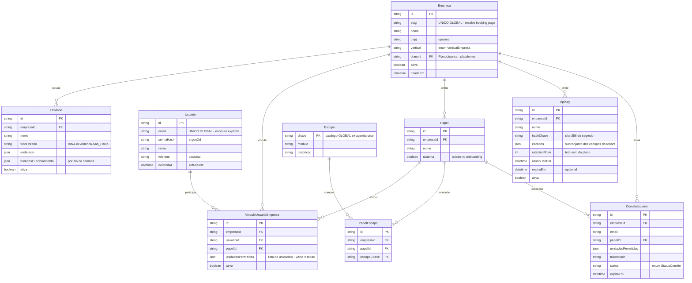
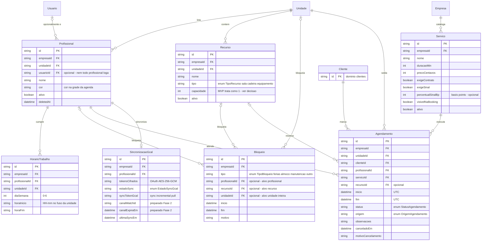
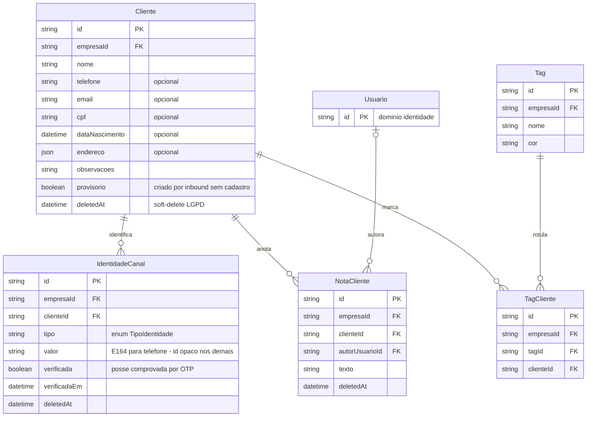
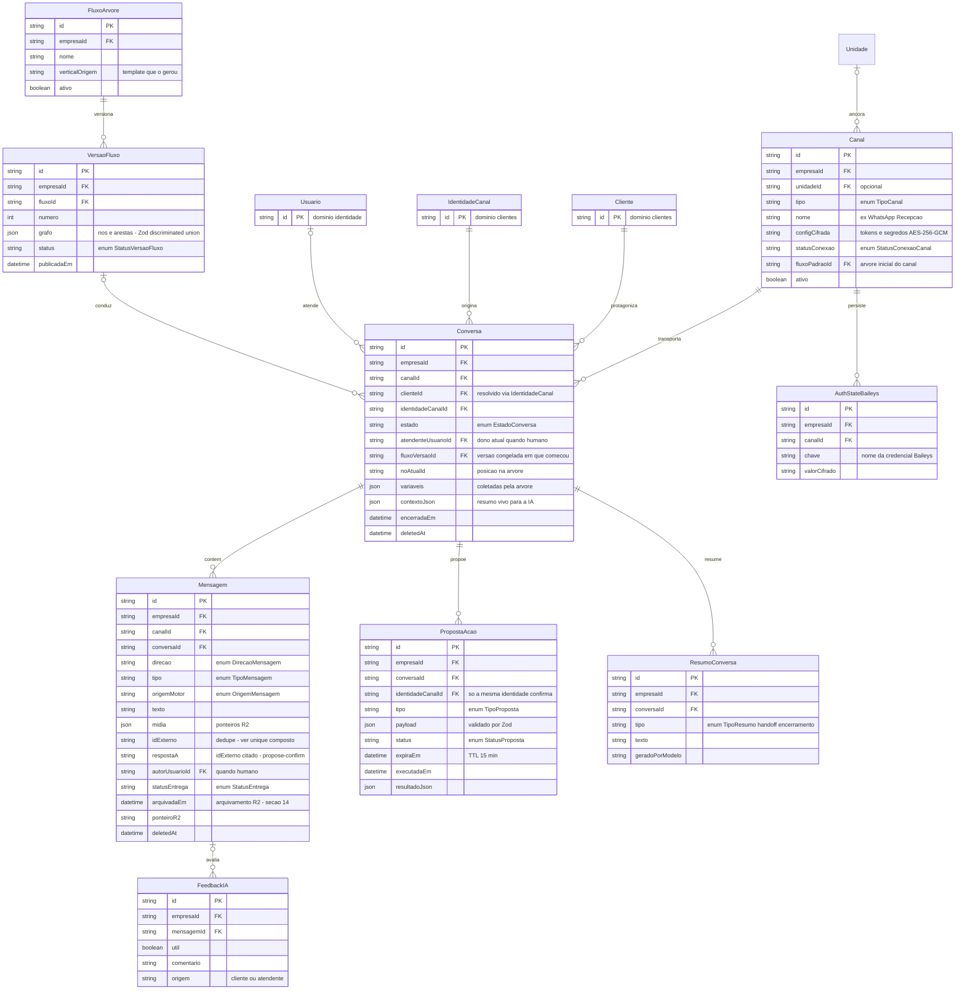
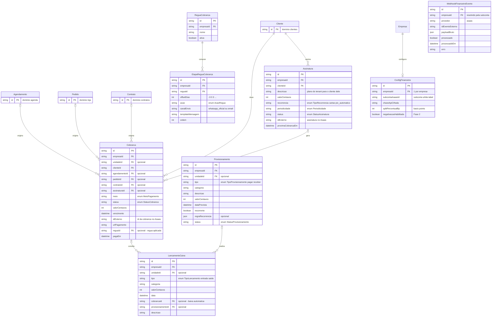
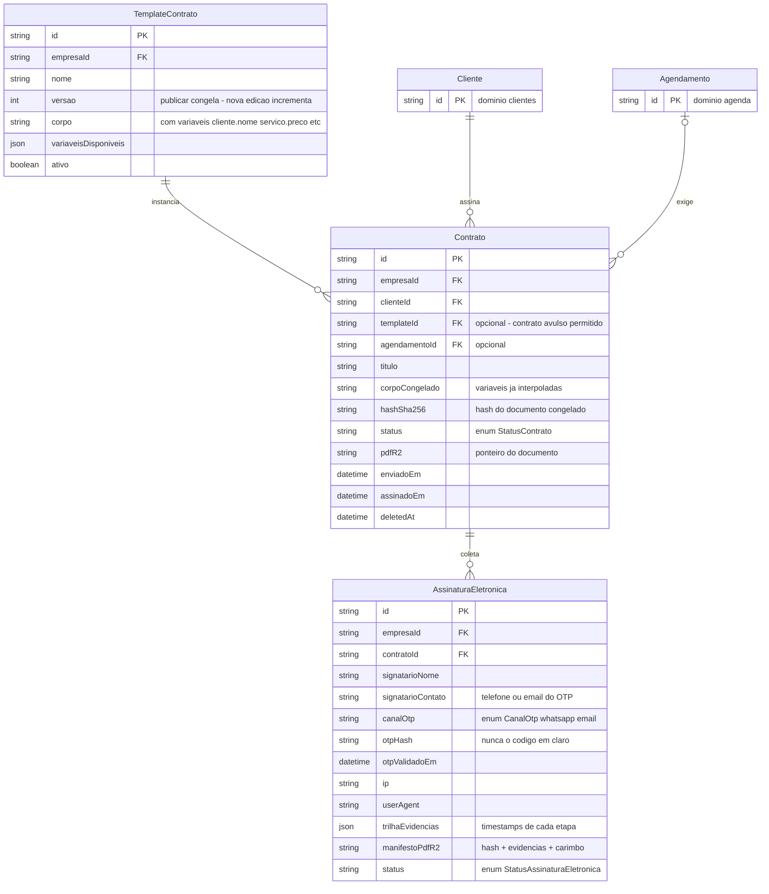
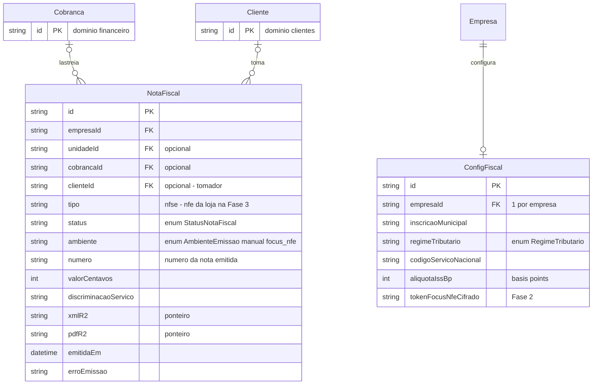
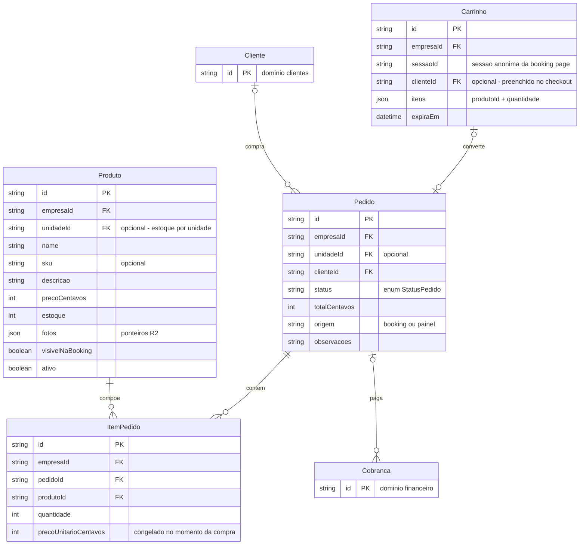
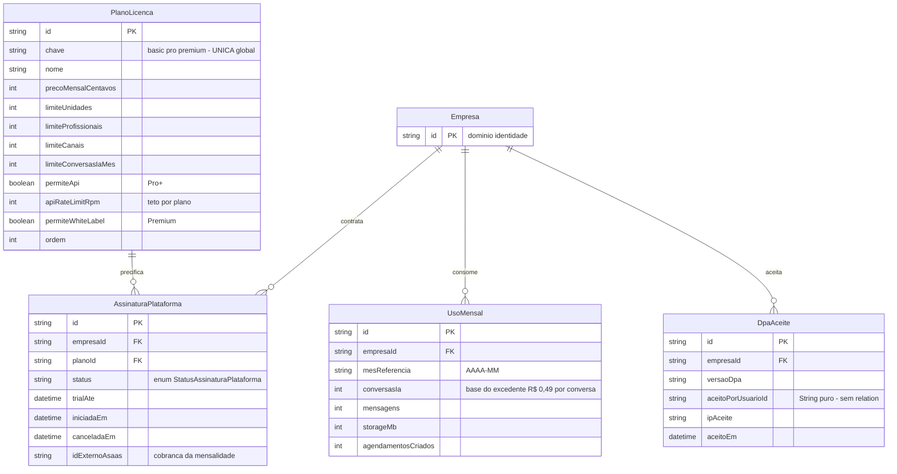
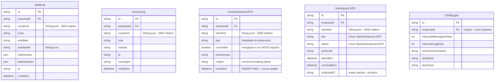

# 02 — Modelo de Dados (ER multi-tenant por domínio)

**Sumário executivo.** Este documento registra o modelo de dados completo do atende-ai: um único schema Postgres compartilhado por todos os tenants, com `empresaId` pervasivo, unicidade sempre composta com o tenant e isolamento garantido em camadas (Prisma Client Extension no MVP, RLS na Fase 2). O modelo está organizado por **bounded context** (identidade, agenda, clientes, atendimento, financeiro, contratos, fiscal, loja, plataforma, LGPD), com um diagrama ER por contexto, as unicidades compostas e os enums de cada domínio, e as decisões estruturais registradas com trade-off: **exclusion constraint Postgres com `tstzrange`** como juiz final da anti-sobreposição de agenda (SQL manual em migration, porque Prisma não a expressa), **models LGPD sem `@relation`** para que cascade delete jamais apague trilha, **arquivamento de mensagens >90 dias em R2** com ponteiro no banco, e **RBAC por escopos** com papéis padrão por vertical criados no onboarding. As regras invioláveis do `CLAUDE.md` raiz (tenancy, LGPD, centavos Int, UTC, `prisma migrate`) são premissas deste documento, não opções.

---

## 1. Convenções globais do schema

Valem para **todo** model salvo exceção explícita registrada aqui.

| # | Convenção | Detalhe |
|---|---|---|
| 1 | **IDs `cuid()`** | `id String @id @default(cuid())` em todos os models. Cuid é URL-safe, ordenável o suficiente e gerado no client (essencial para outbox transacional: o id existe antes do commit). UUID v4 descartado por índice menos amigável; autoincrement descartado por vazar cardinalidade entre tenants. |
| 2 | **`empresaId` pervasivo** | Toda tabela de dados de tenant carrega `empresaId String` + índice. `unidadeId` entra onde o dado tem ancoragem física (agendamento, canal, cobrança, pedido, nota fiscal, provisionamento, lançamento). Exceções: models de **plataforma** (seção 10) e o catálogo global `Escopo`/`PlanoLicenca`. |
| 3 | **Unicidade composta** | TODA unicidade é `@@unique([empresaId, ...])`. Exceções explícitas e fechadas: `Usuario.email` (global — um humano, um login, N tenants via vínculo), `Empresa.slug` (global — resolve a booking page por hostname) e models de plataforma. Qualquer outro `@unique` global em dado de tenant é bug de segurança. |
| 4 | **Soft-delete `deletedAt`** | Obrigatório em models cujo conteúdo é **dado pessoal de titular**: `Usuario`, `Profissional`, `Cliente`, `IdentidadeCanal`, `NotaCliente`, `Conversa`, `Mensagem`, `Contrato`. Toda leitura filtra `deletedAt: null` (a extension de tenant injeta). Exclusão definitiva só via fluxo LGPD (anonimização auditada), nunca `DELETE` direto. |
| 5 | **Dinheiro em centavos `Int`** | Nenhum `Float/Decimal` monetário. Percentuais (split, ISS, sinal) em **basis points `Int`** (2,99% = 299) pela mesma razão. |
| 6 | **Datas UTC** | `DateTime` sempre UTC no banco; conversão para o fuso da `Unidade` só na apresentação. `Unidade.fusoHorario` é IANA (`America/Sao_Paulo`). |
| 7 | **Enums nomeados** | Todo campo de estado usa `enum` Prisma nomeado (`StatusAgendamento`, `EstadoConversa`...), nunca string livre. Valores em snake_case minúsculo; exceção herdada do ev-tracker: `StatusProposta` em MAIÚSCULAS (`PENDENTE/CONFIRMADA/EXPIRADA/REJEITADA`) — mantida para reuso do motor propose-confirm sem renomear estados em código provado. |
| 8 | **Timestamps onipresentes** | `criadoEm DateTime @default(now())` e `atualizadoEm DateTime @updatedAt` em todo model. **Omitidos dos diagramas** para reduzir ruído — considere-os presentes. |
| 9 | **Segredos cifrados** | Campos `*Cifrado(a)` armazenam AES-256-GCM via `packages/core/crypto`. Nunca texto puro, nunca exportados (regra inviolável 8). |
| 10 | **PT-BR sem acentos** | Nomes de model e campo em português sem acento (`Cobranca`, `precoCentavos`); enums idem. |
| 11 | **`prisma migrate` sempre** | Toda mudança de schema por migration versionada; as exclusion constraints (seção 3) e as policies RLS (Fase 2) vivem em **migration SQL manual** (`--create-only` + edição do `.sql`). |

Nota de leitura dos diagramas: sintaxe Mermaid `erDiagram`; tipos simplificados (`string`, `int`, `boolean`, `datetime`, `json`); unicidades compostas indicadas em comentário do atributo ou na tabela "Unicidades e observações" de cada seção; entidades de outros contextos aparecem sem atributos (referência cruzada).

---

## 2. Domínio `identidade`

Tenants, unidades, usuários e RBAC. O ponto estrutural: **`Usuario` é global** (e-mail único no sistema inteiro) e a pertença a um tenant é o **`VinculoUsuarioEmpresa`** — um mesmo humano pode ser Administrador no salão A e Profissional na barbearia B, com papéis e unidades permitidas independentes. É esse vínculo que materializa o payload JWT `{usuarioId, empresaId, unidadeId, papelId, escopos[]}` na troca de tenant.



**Unicidades e observações**

| Model | Unicidade | Observação |
|---|---|---|
| `Empresa` | `slug` global (exceção) | Lookup `slug → empresaId` cacheado no KV para a booking wildcard |
| `Usuario` | `email` global (exceção) | Um login, N tenants; senha argon2id |
| `VinculoUsuarioEmpresa` | `@@unique([empresaId, usuarioId])` | Um papel por usuário por tenant; troca de papel é update auditado |
| `Papel` | `@@unique([empresaId, nome])` | `sistema=true` marca os papéis do onboarding (seção 12) — editáveis pelo Admin, recriáveis |
| `Escopo` | `chave` global | Catálogo **de plataforma** (sem `empresaId`): o produto define os escopos, o tenant compõe papéis |
| `PapelEscopo` | `@@unique([empresaId, papelId, escopoChave])` | |
| `ApiKey` | — (lookup por id embutido) | Ver decisão abaixo |
| `ConviteUsuario` | `@@unique([empresaId, email])` parcial (status `pendente`) | Reenvio revoga o anterior |

**Decisões registradas**

- **`unidadesPermitidas` como `json` (lista de ids), não join table.** A lista é pequena (raramente >5), é lida em toda request para montar o JWT e validada contra as `Unidade` do tenant no momento da escrita do vínculo. Join table daria FK integrity ao custo de um join a mais no caminho mais quente do sistema (emissão de sessão) — descartada; a validação na escrita + revalidação no login cobre o risco de unidade excluída.
- **`ApiKey` sem unique global no hash.** A chave emitida tem o formato `ak_live_<id>_<segredo>`: o `<id>` (cuid, único por construção) resolve a linha e o tenant; o `<segredo>` é comparado contra `hashChave` em tempo constante. Isso evita a única alternativa (unique global em `hashChave`) que violaria a convenção 3. `rateLimitRpm` default vem do `PlanoLicenca` (só Pro+ tem API — flag `permiteApi`); o tenant pode configurar valor **menor**, nunca maior; estouro responde **HTTP 429** com `Retry-After`. Contadores de rate limit vivem na memória do worker/borda, não no banco.
- **`Escopo` global, `Papel` por tenant.** Escopos são vocabulário do produto (deploy adiciona, tenant não inventa); papéis são composição do tenant. A alternativa (escopos por tenant) permitiria "escopos fantasma" que nenhum código verifica — descartada.

---

## 3. Domínio `agenda`

O coração do produto. A regra de ouro: **disponibilidade é sempre calculada no banco e a escrita concorrente é arbitrada por exclusion constraint** — cache nunca é juiz de horário (doc 03). `Profissional` é entidade própria, **opcionalmente** ligada a `Usuario`: o manicure que não acessa o painel existe na agenda mesmo sem login.



**Enums do domínio**

| Enum | Valores |
|---|---|
| `StatusAgendamento` | `agendado`, `confirmado`, `em_atendimento`, `concluido`, `cancelado`, `nao_compareceu` |
| `OrigemAgendamento` | `painel`, `booking`, `ia`, `arvore` |
| `TipoRecurso` | `sala`, `cadeira`, `equipamento` |
| `TipoBloqueio` | `ferias`, `almoco`, `manutencao`, `outro` |
| `EstadoSyncGcal` | `desconectado`, `ativo`, `erro_token`, `pausado` |

**Unicidades e observações**

| Model | Unicidade | Observação |
|---|---|---|
| `Servico` | `@@unique([empresaId, nome])` | |
| `Recurso` | `@@unique([empresaId, unidadeId, nome])` | |
| `HorarioTrabalho` | `@@unique([empresaId, profissionalId, unidadeId, diaSemana, horaInicio])` | Permite grade quebrada (manhã + tarde) |
| `SincronizacaoGcal` | `@@unique([empresaId, profissionalId])` | Um Google Calendar por profissional |
| `Bloqueio` | — (check em código: exatamente um alvo entre profissional/recurso/unidade) | |

### 3.1 Anti-sobreposição — exclusion constraint (SQL manual em migration)

Prisma não expressa exclusion constraints, então elas vivem em **migration SQL manual** (`prisma migrate dev --create-only` + edição do `.sql` — jamais fora do fluxo de migration, regra inviolável 13). O banco é o juiz final do double-booking, por profissional **e** por sala/recurso:

```sql
-- extensao necessaria para EXCLUDE combinando igualdade (=) e ranges (&&)
CREATE EXTENSION IF NOT EXISTS btree_gist;

-- 1) um profissional nunca tem dois agendamentos vivos sobrepostos
ALTER TABLE "Agendamento"
  ADD CONSTRAINT agendamento_profissional_sem_sobreposicao
  EXCLUDE USING gist (
    "empresaId"       WITH =,
    "profissionalId"  WITH =,
    tstzrange("inicio", "fim", '[)') WITH &&
  )
  WHERE (status IN ('agendado', 'confirmado', 'em_atendimento'));

-- 2) uma sala/recurso nunca tem duas reservas vivas sobrepostas
ALTER TABLE "Agendamento"
  ADD CONSTRAINT agendamento_recurso_sem_sobreposicao
  EXCLUDE USING gist (
    "empresaId"   WITH =,
    "recursoId"   WITH =,
    tstzrange("inicio", "fim", '[)') WITH &&
  )
  WHERE ("recursoId" IS NOT NULL
         AND status IN ('agendado', 'confirmado', 'em_atendimento'));
```

Pontos de projeto:

- **`'[)'`** (início fechado, fim aberto): agendamento das 14:00–15:00 e outro das 15:00–16:00 **não** colidem — encaixe perfeito de grade.
- O **predicado por status** libera o horário no instante em que o agendamento vira `cancelado`/`nao_compareceu`/`concluido`, sem delete.
- `empresaId` entra na constraint por convenção de prefixo e defesa em profundidade (ids cuid já isolam, mas a constraint nunca deve depender disso).
- A aplicação trata a violação (`23P01`) como resposta de negócio: "horário acabou de ser ocupado, escolha outro" — é o caminho esperado sob corrida booking × painel × IA, não um erro.
- **`Bloqueio` não participa da constraint** (é outra tabela; exclusion não cruza tabelas). Bloqueios filtram a **listagem** de slots; a corrida residual "bloqueio criado durante confirmação" é resolvida por revalidação transacional na escrita do agendamento.

**Decisão registrada — capacidade > 1 fica fora da constraint no MVP.** `Recurso.capacidade` existe no schema, mas a exclusion constraint trata todo recurso como capacidade 1 (uma reserva viva por vez), porque um predicado de constraint não pode consultar a tabela `Recurso`. Para turmas (sala de pilates com 8 vagas), a Fase 2 modela **vagas como linhas** (N reservas-filha de um slot-turma), mantendo a mesma mecânica de unicidade. Alternativa descartada: trigger com contagem — mais frágil que constraint declarativa e fácil de quebrar em refactor.

**Decisão registrada — Google Calendar pull no MVP.** `SincronizacaoGcal` já carrega `canalWatchId`/`canalExpiraEm` para os watch channels da Fase 2, mas o MVP opera **pull** via cron pg-boss com `syncTokenGcal` incremental. Custo: eco de até alguns minutos entre Google e atende-ai; benefício: zero infraestrutura de renovação de canal no MVP. O schema não muda na Fase 2 — só o modo de operação.

---

## 4. Domínio `clientes`

O cliente final do tenant. O pivô do omnichannel é a **`IdentidadeCanal`**: todo inbound resolve `(empresaId, tipo, valor) → Cliente`; se não existe, nasce um cliente provisório na hora (doc 05, seção 5). Merge automático **só** por identificador verificado; semelhança heurística é apenas sugestão ao atendente — minimização LGPD vale mais que conveniência.



**Enums e unicidades**

| Item | Definição |
|---|---|
| `TipoIdentidade` | `whatsapp`, `instagram`, `messenger`, `telegram`, `email`, `webchat` |
| `IdentidadeCanal` | **`@@unique([empresaId, tipo, valor])`** — a linha-mestra do inbound: um telefone pertence a exatamente um cliente **por tenant** (a mesma pessoa é dois registros em dois salões distintos — correto: cada tenant é controlador dos próprios dados) |
| `Cliente` | `@@unique([empresaId, cpf])` (quando informado) |
| `Tag` | `@@unique([empresaId, nome])` |
| `TagCliente` | `@@unique([empresaId, tagId, clienteId])` |

**Decisão registrada — merge de identidades.** Merge **automático** apenas quando o mesmo identificador **verificado** (telefone/e-mail com posse comprovada via OTP) aparece em outro canal: as `IdentidadeCanal` passam a apontar para o mesmo `Cliente`, timelines se fundem, `AuditLog` registra o merge (antes da mutação — regra inviolável 5). Semelhança heurística (nome parecido, padrão de consumo) **nunca** funde automaticamente — vira sugestão no painel. Fundamento: falso vínculo expõe histórico de um titular a outro; em clínica isso é dado sensível. Preferimos duplicata temporária a vazamento entre titulares. Alternativa descartada: merge por telefone não verificado (digitado pelo cliente no chat) — trivial de abusar para ler histórico alheio.

---

## 5. Domínio `atendimento`

O módulo central (spec completa no doc 05). Aqui ficam os canais conectados, a `Conversa` com máquina de estados, as mensagens deduplicadas por id externo, o propose-confirm (`PropostaAcao`), os fluxos de árvore versionados e o auth-state Baileys que torna a VM do worker descartável.



**Enums do domínio**

| Enum | Valores |
|---|---|
| `TipoCanal` | `whatsapp_oficial`, `whatsapp_baileys`, `telegram`, `webchat`, `instagram`, `messenger`, `email` |
| `StatusConexaoCanal` | `desconectado`, `pareando`, `conectado`, `erro` |
| `EstadoConversa` | `bot_arvore`, `bot_ia`, `fila_humano`, `humano`, `encerrada` |
| `DirecaoMensagem` | `entrada`, `saida` |
| `TipoMensagem` | `texto`, `imagem`, `audio`, `video`, `documento`, `localizacao`, `interativo` |
| `OrigemMensagem` | `cliente`, `arvore`, `ia`, `humano`, `sistema` |
| `StatusEntrega` | `pendente`, `enviada`, `entregue`, `lida`, `falhou` |
| `TipoProposta` | `criar_agendamento`, `remarcar_agendamento`, `cancelar_agendamento`, `gerar_cobranca`, `enviar_contrato` |
| `StatusProposta` | `PENDENTE`, `CONFIRMADA`, `EXPIRADA`, `REJEITADA` (herança ev-tracker) |
| `StatusVersaoFluxo` | `rascunho`, `publicada`, `arquivada` |

**Unicidades e observações**

| Model | Unicidade | Observação |
|---|---|---|
| `Mensagem` | **`@@unique([empresaId, canalId, idExterno])`** | Dedupe de webhook: provedores reentregam; a segunda entrega morre no unique, silenciosamente. `idExterno` nulo (mensagens internas/sistema) fica fora do unique (semântica de NULL do Postgres — desejada) |
| `PropostaAcao` | índice parcial: **uma `PENDENTE` por conversa** | `CREATE UNIQUE INDEX ... ON "PropostaAcao" ("empresaId", "conversaId") WHERE status = 'PENDENTE'` — migration SQL manual; nova proposta cancela a anterior antes de inserir |
| `FluxoArvore` | `@@unique([empresaId, nome])` | Empresa pode ter N fluxos (um por canal, campanhas...) |
| `VersaoFluxo` | `@@unique([empresaId, fluxoId, numero])` | Publicar = congelar `numero` e abrir rascunho `numero+1`; `grafo` imutável após publicação |
| `AuthStateBaileys` | `@@unique([empresaId, canalId, chave])` | Sessão WhatsApp sobrevive à VM — worker é gado, não estimação (doc 01) |

**Decisões registradas**

- **`Conversa.fluxoVersaoId` congela a versão.** Conversa termina na versão do fluxo em que começou; editar árvore às 14h não corrompe conversa aberta às 13h59 (doc 05, seção 3.1). O custo é reter versões antigas referenciadas — barato, `grafo` é JSON pequeno.
- **`PropostaAcao` é executável só pela mesma conversa + identidade** (`conversaId` + `identidadeCanalId` checados na execução, nunca no texto do modelo) e expira em 15 min. A execução é determinística, sem LLM, com `AuditLog` antes e depois — regra inviolável 10.
- **`ResumoConversa` como model, não só campo.** O resumo de handoff precisa ser imutável (é o que o atendente leu ao assumir — valor probatório operacional) e o de encerramento alimenta a timeline; `Conversa.contextoJson` continua sendo o resumo "vivo" da IA. Alternativa descartada: só `contextoJson` mutável — perderia o histórico de handoffs.

---

## 6. Domínio `financeiro`

Cobranças via Asaas (atrás da camada `PaymentProvider`), assinaturas recorrentes do tenant para o cliente final dele, régua de cobrança, provisionamentos e caixa. A idempotência de baixa é estrutural: **todo webhook vira linha em `WebhookFinanceiroEvento` antes de qualquer efeito**, e o processamento marca `processado` — reentrega do Asaas não gera baixa dupla.



**Enums do domínio**

| Enum | Valores |
|---|---|
| `MeioPagamento` | `pix`, `boleto`, `cartao` |
| `StatusCobranca` | `pendente`, `paga`, `vencida`, `cancelada`, `estornada` |
| `TipoRecorrencia` | `cartao`, `pix_automatico` |
| `Periodicidade` | `semanal`, `mensal`, `trimestral`, `anual` |
| `StatusAssinatura` | `ativa`, `inadimplente`, `pausada`, `cancelada` |
| `TipoProvisionamento` | `pagar`, `receber` |
| `StatusProvisionamento` | `previsto`, `realizado`, `cancelado` |
| `TipoLancamento` | `entrada`, `saida` |
| `AcaoRegua` | `lembrete`, `cobranca`, `escalonamento_humano`, `negativacao` (Fase 2) |

**Unicidades e observações**

| Model | Unicidade | Observação |
|---|---|---|
| `Cobranca` | `@@unique([empresaId, idExterno])` | Correlação webhook → cobrança sem ambiguidade |
| `WebhookFinanceiroEvento` | `@@unique([provedor, idEventoExterno])` | Guarda de idempotência **antes** da resolução de tenant — por isso o unique não prefixa `empresaId` (o evento chega antes de sabermos a empresa; a subconta no payload resolve depois). Exceção deliberada e documentada à convenção 3, análoga a model de plataforma |
| `ConfigFinanceira` | `@@unique([empresaId])` | 1 por empresa |
| `EtapaReguaCobranca` | `@@unique([empresaId, reguaId, ordem])` | Régua padrão do onboarding: lembrete D-3, cobrança D0, cobrança D+3, escalonamento humano D+7 |

**Decisão registrada — envio da régua só pela API oficial.** As etapas da régua são envio **proativo** — logo `canalEnvio` só aceita `whatsapp_oficial` (template Meta aprovado) ou `email`. Baileys não aparece nem como opção do enum de envio da régua: a restrição é estrutural, não configurável (regra inviolável 12). Tenant só-Baileys vê a régua desabilitada com aviso claro no painel.

---

## 7. Domínio `contratos`

Assinatura eletrônica **própria** (MP 2.200-2/2001 art. 10 §2º + Lei 14.063/2020): documento congelado com hash SHA-256, OTP pelo canal, trilha de evidências e manifesto PDF em R2. ZapSign entra apenas como ponte ICP-Brasil sob demanda (doc 03). Permissões de contrato **não são model** — são os escopos `contratos:criar`, `contratos:enviar`, `contratos:cancelar` da matriz (seção 13).



**Enums e unicidades**

| Item | Definição |
|---|---|
| `StatusContrato` | `rascunho`, `enviado`, `assinado`, `cancelado` |
| `CanalOtp` | `whatsapp`, `email` |
| `StatusAssinaturaEletronica` | `pendente`, `otp_enviado`, `assinada`, `recusada`, `expirada` |
| `TemplateContrato` | `@@unique([empresaId, nome, versao])` — versões imutáveis; contrato referencia o template mas **congela o corpo interpolado** (mudar template nunca muda contrato emitido) |

Regras estruturais: `hashSha256` é calculado **antes** do envio e nunca atualizado (qualquer mudança = novo contrato); toda transição de status gera `AuditLog`; o fluxo de assinatura pela conversa ("assine respondendo o código") usa a mesma `PropostaAcao` do atendimento para o disparo, e o OTP prova a posse do canal.

---

## 8. Domínio `fiscal`

NFS-e padrão nacional (LC 214/2025). No MVP o sistema **organiza o dado** e o tenant emite manualmente no portal do emissor nacional; a Fase 2 pluga Focus NFe como add-on. O schema já nasce com o campo `ambiente` para os dois modos coexistirem por tenant.



| Item | Definição |
|---|---|
| `StatusNotaFiscal` | `pendente`, `emitida`, `cancelada`, `erro` |
| `AmbienteEmissao` | `manual` (MVP: sistema prepara, tenant emite no portal e anexa número/PDF), `focus_nfe` (Fase 2: emissão automática pós-pagamento) |
| `RegimeTributario` | `mei`, `simples_nacional`, `lucro_presumido`, `lucro_real` |
| `ConfigFiscal` | `@@unique([empresaId])` |
| `NotaFiscal` | `@@unique([empresaId, numero])` (quando emitida) |

---

## 9. Domínio `loja`

Catálogo, carrinho e pedido da booking page. **Não existe gateway próprio da loja**: o checkout cria uma `Cobranca` com `pedidoId` (seção 6) e reutiliza a camada `PaymentProvider` — mesmos meios, mesmos webhooks, mesma idempotência de baixa. Estoque é decrementado na confirmação de pagamento, não na criação do pedido.



| Item | Definição |
|---|---|
| `StatusPedido` | `aguardando_pagamento`, `pago`, `separacao`, `entregue`, `cancelado` |
| `Produto` | `@@unique([empresaId, sku])` (quando informado) |
| `Carrinho` | `@@unique([empresaId, sessaoId])` — carrinho anônimo vira `Pedido` no checkout, quando o cliente se identifica (e a `IdentidadeCanal` resolve/cria o `Cliente`) |
| `ItemPedido` | `precoUnitarioCentavos` congela o preço do momento — reprecificar produto nunca altera pedido emitido |

---

## 10. Domínio `plataforma` — models globais, SEM `empresaId` tenant-scoped

Aqui vive o billing do **nosso** SaaS. São os models da exceção à convenção 2/3: `PlanoLicenca` é catálogo global; os demais **referenciam** `empresaId` como dado (a empresa é o sujeito da linha), mas são operados por **jobs de plataforma auditados via `prismaSemTenant`** — a extension de tenant não os governa, porque o operador aqui é a plataforma, não o tenant.



| Item | Definição |
|---|---|
| `StatusAssinaturaPlataforma` | `trial`, `ativa`, `inadimplente`, `cancelada` |
| `PlanoLicenca.chave` | `@unique` global (model de plataforma — exceção prevista) |
| `AssinaturaPlataforma` | índice parcial: uma assinatura não-cancelada por empresa; histórico preservado como linhas canceladas |
| `UsoMensal` | `@@unique([empresaId, mesReferencia])` — contadores incrementados por jobs pg-boss (contagem no fechamento do turno de IA, não por trigger); `conversasIa` acima de `limiteConversasIaMes` gera o excedente de R$ 0,49/conversa na fatura seguinte |
| `DpaAceite` | Insert-only, aceito no onboarding; nova versão do DPA exige novo aceite. `aceitoPorUsuarioId` é `String` puro (mesma regra dos models LGPD: trilha jurídica não pode sumir em cascade) |

**Decisão registrada — limites de plano checados na aplicação, não por constraint.** `limiteUnidades`, `limiteProfissionais` etc. são validados em `packages/core` na criação do recurso (com contagem no banco), não por trigger/constraint — porque a resposta correta a "estourou o limite" é UX de upsell, não erro 500 de banco. O drift (limite reduzido com uso acima) é tolerado: recurso existente não é apagado, apenas bloqueia criação de novos.

---

## 11. Domínio LGPD — trilha inviolável

Os cinco models herdados do ev-tracker, adaptados: **todos com `empresaId`** (cada tenant é controladora; a plataforma, operadora). O diagrama **não tem arestas de propósito**: models LGPD **nunca** referenciam `Usuario`/`Cliente` via `@relation` — cascade delete não pode apagar trilha (regra inviolável 6). `usuarioId`/`clienteId` são `String?` puros.



| Item | Definição |
|---|---|
| `TipoSolicitacaoLGPD` | `acesso`, `correcao`, `exclusao`, `portabilidade`, `revogacao_consentimento` |
| `StatusSolicitacaoLGPD` | `aberta`, `em_andamento`, `concluida`, `recusada` |
| `ConfigLgpd` | `@@unique([empresaId])` |

Regras estruturais (do `CLAUDE.md`, repetidas por serem de schema): `ConsentimentoLGPD` é **insert-only** (revogação = novo registro com `concedido=false`); auditoria grava **antes** de mutação destrutiva; export **nunca** inclui `senhaHash`, tokens OAuth ou campos `*Cifrado`; o cron de retenção (pg-boss) aplica `ConfigLgpd.retencaoMensagensDias`/`retencaoLogsDias` por tenant — anonimizando, nunca deletando trilha.

---

## 12. Papéis padrão por vertical (criados no onboarding)

O onboarding cria **4 papéis** (`Papel.sistema = true`) com nomes adaptados à vertical da `Empresa` e `PapelEscopo` populado conforme a matriz da seção 13. O Admin pode editar/clonar depois — os papéis padrão são ponto de partida, não camisa de força.

| Papel canônico | Salão / Barbearia | Clínica | Advocacia |
|---|---|---|---|
| **Administrador** | Administrador | Administrador | Sócio Administrador |
| **Gerente de Unidade** | Gerente de Unidade | Coordenador de Clínica | Coordenador de Escritório |
| **Recepcionista/Atendente** | Recepcionista | Atendente | Secretário Jurídico |
| **Profissional** | Profissional (cabeleireiro, barbeiro, manicure) | Profissional de Saúde | Advogado |

Filosofia de cada papel:

| Papel | Alçada | Resumo dos escopos |
|---|---|---|
| **Administrador** | Empresa inteira | Todos os escopos, incluindo `config:*`, `lgpd:operar`, `api:gerenciar` e `financeiro:configurar`. É o único que mexe em usuários, canais, planos e dados de titulares (LGPD) |
| **Gerente de Unidade** | Unidades permitidas | Opera tudo do dia a dia (agenda, clientes, atendimento, cobrança, relatórios, contratos, fiscal, loja) — mas não toca configuração de empresa, usuários, canais nem LGPD |
| **Recepcionista/Atendente** | Unidades permitidas | Frente de balcão: agenda completa, cadastro de clientes, atendimento omnichannel, gerar cobrança, enviar contrato pronto. Sem relatórios financeiros, sem cancelar contrato, sem fiscal |
| **Profissional** | Própria agenda | Vê e marca na própria agenda, consulta clientes. Não atende conversas, não cobra, não assina nada |

---

## 13. Matriz papel × escopo

Legenda: ✓ concedido · — negado. **A restrição por unidade é ortogonal à matriz**: o escopo diz *o que* o papel pode; `VinculoUsuarioEmpresa.unidadesPermitidas` diz *onde* (a extension de tenant + o guard de escopo filtram por `unidadeId` quando o vínculo restringe). "Própria agenda" do Profissional é regra de aplicação (filtro `profissionalId` do vínculo), não escopo separado.

| Escopo | Administrador | Gerente de Unidade | Recepcionista/Atendente | Profissional |
|---|---|---|---|---|
| `agenda:ler` | ✓ | ✓ | ✓ | ✓ (própria) |
| `agenda:criar` | ✓ | ✓ | ✓ | ✓ (própria) |
| `agenda:cancelar` | ✓ | ✓ | ✓ | — |
| `agenda:configurar` (serviços, horários, bloqueios, recursos) | ✓ | ✓ | — | — |
| `clientes:ler` | ✓ | ✓ | ✓ | ✓ |
| `clientes:criar` | ✓ | ✓ | ✓ | — |
| `clientes:editar` | ✓ | ✓ | ✓ | — |
| `clientes:excluir` (dispara fluxo LGPD) | ✓ | — | — | — |
| `atendimento:responder` | ✓ | ✓ | ✓ | — |
| `atendimento:assumir` (tirar conversa da fila) | ✓ | ✓ | ✓ | — |
| `atendimento:configurar` (fluxos, árvores, prompts) | ✓ | ✓ | — | — |
| `financeiro:cobrar` | ✓ | ✓ | ✓ | — |
| `financeiro:relatorios` | ✓ | ✓ | — | — |
| `financeiro:configurar` (subconta Asaas, régua, split) | ✓ | — | — | — |
| `contratos:criar` | ✓ | ✓ | — | — |
| `contratos:enviar` | ✓ | ✓ | ✓ | — |
| `contratos:cancelar` | ✓ | ✓ | — | — |
| `fiscal:emitir` | ✓ | ✓ | — | — |
| `loja:gerenciar` (catálogo, estoque, pedidos) | ✓ | ✓ | — | — |
| `config:usuarios` (convites, papéis, vínculos) | ✓ | — | — | — |
| `config:canais` (conectar WhatsApp, pareamento) | ✓ | — | — | — |
| `config:empresa` (dados, unidades, plano, white-label) | ✓ | — | — | — |
| `api:gerenciar` (API keys — Pro+) | ✓ | — | — | — |
| `lgpd:operar` (solicitações, export, anonimização) | ✓ | — | — | — |

Notas de projeto:

- Os escopos viajam **no payload do JWT** (`escopos[]`), materializados do `PapelEscopo` no login/refresh — o guard de Server Action/route handler checa o array da sessão, sem query por request. Mudança de papel exige novo token (refresh forçado no próximo request via versão de vínculo).
- `clientes:excluir` não deleta: **abre o fluxo LGPD** (`SolicitacaoLGPD` + anonimização auditada). Por isso é exclusivo do Administrador mesmo sendo "só" um botão.
- A matriz é o **default do onboarding**. Tenant que quiser "Recepcionista que vê relatório" clona o papel e adiciona `financeiro:relatorios` — o produto não impede, apenas não sugere.

---

## 14. Índices e performance

### 14.1 Convenção de índices

**Todo índice composto de dado de tenant começa por `empresaId`** — é o prefixo de toda query gerada pela extension, então qualquer índice sem ele começa perdendo. Os `@@unique([empresaId, ...])` já servem de índice de lookup; abaixo, os índices adicionais que as consultas quentes exigem:

| Model | Índice | Consulta que serve |
|---|---|---|
| `Agendamento` | `(empresaId, unidadeId, inicio)` | Grade do dia por unidade (a tela mais aberta do produto) |
| `Agendamento` | `(empresaId, profissionalId, inicio)` | Agenda do profissional; cálculo de slots livres |
| `Agendamento` | `(empresaId, clienteId, inicio)` | Histórico do cliente na timeline |
| `Mensagem` | **`(conversaId, criadoEm)`** | Rolagem do chat — a consulta mais frequente do sistema; `conversaId` (cuid) já isola o tenant, e o índice enxuto vale mais que o prefixo aqui (exceção deliberada e documentada à convenção de prefixo) |
| `Mensagem` | `(empresaId, criadoEm)` parcial `WHERE arquivadaEm IS NULL` | Job de arquivamento >90 dias |
| `Conversa` | `(empresaId, estado, atualizadoEm)` | Fila de atendimento (`fila_humano` ordenada por espera) e inbox por estado |
| `Cobranca` | `(empresaId, status, vencimento)` | Régua de cobrança (vencidas/a vencer) e contas a receber |
| `PropostaAcao` | `(status, expiraEm)` | Cron de expiração de propostas (varre `PENDENTE` vencidas de todos os tenants — job de plataforma) |
| `Cliente` | `(empresaId, nome)` | Busca do painel; `deletedAt IS NULL` parcial |
| `AuditLog` / `AccessLog` | `(empresaId, criadoEm)` | Painel LGPD e cron de retenção |
| `UsoMensal` | `@@unique([empresaId, mesReferencia])` já cobre | Fechamento de fatura |

Os índices gist das exclusion constraints (seção 3.1) também servem consultas de sobreposição (`&&`) no cálculo de disponibilidade — a constraint paga o próprio custo.

### 14.2 Arquivamento de `Mensagem` > 90 dias em R2

O limite que aperta primeiro no Neon free é o armazenamento (0,5 GB — doc 07), pressionado por histórico de conversa. Estratégia (acionada por cron pg-boss, **antes** de bater o teto):

1. Job mensal seleciona mensagens com `criadoEm < now() - 90 dias` e `arquivadaEm IS NULL`, agrupadas por `(empresaId, conversaId, mês)`.
2. Grava em R2 um JSON compactado por grupo, sob chave prefixada por tenant: `arquivo-mensagens/{empresaId}/{conversaId}/{AAAA-MM}.json.gz`.
3. Atualiza cada linha: preenche `arquivadaEm` + `ponteiroR2`, **limpa `texto` e `midia`** — a linha permanece com todos os metadados (ids, direção, tipo, timestamps, `idExterno`).
4. `AuditLog` registra o lote arquivado (é mutação de dado de titular).

O que essa estratégia preserva por construção: **dedupe** (o `@@unique` do `idExterno` continua vivo — a linha não some), **export LGPD** (o gerador segue o ponteiro e reidrata o conteúdo do R2), **timeline** (metadados renderizam o esqueleto; conteúdo antigo carrega sob demanda) e **retenção por tenant** (o cron de `ConfigLgpd` apaga do R2 e anonimiza a linha quando a política do tenant expira). Alternativa descartada: mover linhas inteiras para tabela fria ou deletá-las — quebraria dedupe, FKs da timeline e a trilha de auditoria; egress zero do R2 torna a reidratação gratuita.

---

## 15. Integridade multi-tenant no schema

### 15.1 Camada 1 — Prisma Client Extension (desde o dia 1)

Um `AsyncLocalStorage` carrega o contexto da requisição (populado a partir do **JWT, nunca de input**); a extension injeta tenant em toda operação:

```ts
// packages/db/src/tenant.ts (esboço do contrato)
export const contextoTenant = new AsyncLocalStorage<{ empresaId: string }>();

export const prisma = prismaBase.$extends({
  query: {
    $allModels: {
      async $allOperations({ model, operation, args, query }) {
        if (MODELS_PLATAFORMA.has(model)) return query(args); // catálogo global
        const ctx = contextoTenant.getStore();
        if (!ctx) throw new Error(`Query em ${model} sem contexto de tenant`); // fail-closed
        // leitura: injeta where { empresaId, deletedAt: null quando aplicável }
        // escrita: injeta data { empresaId }; update/delete: where composto
        return query(comTenant(args, ctx.empresaId, model, operation));
      },
    },
  },
});
```

Propriedades que o modelo de dados garante a essa camada: como **toda** tabela de tenant tem `empresaId` (convenção 2), a injeção é uniforme — sem lista de exceções por model espalhada pelo código; e como toda unicidade é composta (convenção 3), um `upsert` com tenant injetado nunca colide com linha de outro tenant. A extension é **fail-closed**: query sem contexto lança erro em vez de rodar sem filtro.

### 15.2 Client cru confinado — `prismaSemTenant`

`packages/db/src/unsafe.ts` exporta o client sem extension, para exatamente três usos: jobs de plataforma (fechamento de `UsoMensal`, cron de expiração de propostas, cron de retenção LGPD multi-tenant), migração/seed e o resolver `slug → empresaId` da booking (que por definição roda antes de existir contexto). **Regra de lint** proíbe `import ... from ".../unsafe"` fora dos caminhos allowlistados; uso fora disso é tratado como bug de segurança em code review, não como estilo (regra inviolável 1). Todo consumidor allowlistado tem comentário-justificativa e auditoria via `AuditLog` quando muta dado.

### 15.3 Camada 2 — RLS Postgres (Fase 2, defesa em profundidade)

Na Fase 2, cada transação passa a executar `SET LOCAL app.empresa_id = ...` e o banco recusa linhas de outro tenant **mesmo com bug na aplicação** (inclusive em `$queryRaw`, que a extension não cobre). Exemplo da policy que cada tabela de tenant ganha por migration SQL manual:

```sql
ALTER TABLE "Agendamento" ENABLE ROW LEVEL SECURITY;
ALTER TABLE "Agendamento" FORCE ROW LEVEL SECURITY; -- vale ate para o owner

CREATE POLICY isolamento_tenant ON "Agendamento"
  USING ("empresaId" = current_setting('app.empresa_id', true))
  WITH CHECK ("empresaId" = current_setting('app.empresa_id', true));
```

Com `current_setting(..., true)` retornando NULL quando a variável não foi setada, a policy é **fail-closed**: transação sem `SET LOCAL` não vê linha nenhuma. Jobs de plataforma usam um role com `BYPASSRLS` explícito — o mesmo perímetro auditado do `prismaSemTenant`. Fica na Fase 2 (não no MVP) porque exige disciplina de transação em todo acesso via pooler; a camada 1 + teste automatizado de isolamento (critério de pronto do MVP: 3 tenants beta sem vazamento) cobre o intervalo.

### 15.4 O que o banco garante sozinho — resumo

| Invariante | Mecanismo | Camada |
|---|---|---|
| Query sem filtro de tenant não existe | Extension fail-closed | Aplicação (dia 1) |
| Unicidade nunca vaza entre tenants | `@@unique([empresaId, ...])` | Banco (dia 1) |
| Double-booking impossível | Exclusion constraint `tstzrange` | Banco (dia 1) |
| Baixa financeira nunca duplica | `@@unique` de evento webhook + flag `processado` | Banco (dia 1) |
| Mensagem duplicada de webhook morre | `@@unique([empresaId, canalId, idExterno])` | Banco (dia 1) |
| Trilha LGPD indeletável por cascade | Models sem `@relation` (ids `String?` puros) | Banco (dia 1) |
| Linha de outro tenant invisível mesmo com bug | Policy RLS fail-closed | Banco (Fase 2) |

---

*Documentos relacionados: `docs/01-arquitetura.md` (bounded contexts e estratégia multi-tenant), `docs/03-stack.md` (Prisma/Neon/pg-boss), `docs/05-omnichannel.md` (semântica de Conversa, PropostaAcao e FluxoArvore), `docs/07-infra-free-tier.md` (gatilho de armazenamento que motiva o arquivamento em R2).*
