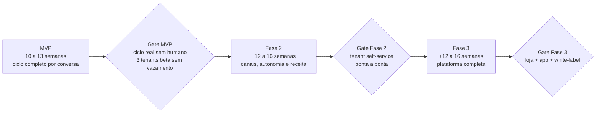
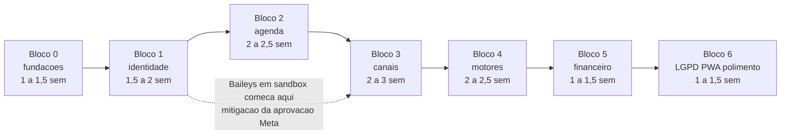

# 04 — Roadmap: MVP → Fase 2 → Fase 3

**Sumário executivo.** Este documento sequencia a construção do atende-ai em três fases com **gates objetivos de saída** — nenhuma fase começa antes de a anterior provar, por teste automatizado ou operação real, que entregou o que prometeu. O MVP (10–13 semanas) entrega o ciclo completo de valor num fio só: cliente agenda pela conversa → lembrete → comparece → cobrança → paga → baixa automática, com 3 tenants beta operando sem vazamento de dados comprovado por teste de isolamento no CI. A Fase 2 (+12–16 semanas) expande canais, receita e autonomia do tenant (builder visual, contratos, recorrência, fluxo de caixa, API pública, RLS). A Fase 3 (+12–16 semanas) completa a plataforma (loja, DRE, app nativo, marketplace, white-label total). A premissa de execução é **1 dev full-time + agentes de IA executores** — o monorepo é estruturado para isso desde o Bloco 0 (`AGENTS.md` por módulo, contratos Zod, testes como especificação executável; ver doc 09) — e as estimativas assumem essa alavancagem: os blocos são sequenciados por dependência, mas trabalho paralelizável (conectores, templates, relatórios) é delegado a agentes enquanto o dev segura o caminho crítico. O documento fecha com o anti-escopo explícito (o que NÃO entra em nenhuma das três fases), os riscos de cronograma com mitigação e as métricas que dizem, a cada fase, se o produto está funcionando ou só existindo.

---

## 1. Visão geral

| Fase | Duração | Tema | Gate de saída |
|---|---|---|---|
| **MVP** | 10–13 semanas | Ciclo completo de agendamento por conversa, WhatsApp primeiro, multi-tenant seguro | Ciclo real sem intervenção humana (agenda → lembrete → cobrança → baixa) + 3 tenants beta sem vazamento, comprovado por teste automatizado de isolamento no CI |
| **Fase 2** | +12–16 semanas | Expansão de canais, autonomia do tenant e motores de receita (recorrência, contratos, API) | Tenant 100% self-service: publica fluxo próprio no builder, ativa recorrência que cobra sozinha, consome a API pública com key própria; RLS ativo em produção |
| **Fase 3** | +12–16 semanas | Plataforma completa: loja, DRE/impostos, app nativo, marketplace, white-label total | Pedido de loja pago com NF-e emitida; app publicado nas lojas com paridade; ≥1 tenant em domínio próprio |

### 1.1 Premissa de equipe — 1 dev + agentes de IA executores

O roadmap inteiro assume **um dev full-time** como gargalo deliberado e **agentes de IA como força de execução**. Isso não é otimismo: é decisão de engenharia refletida na estrutura do repo (doc 09) — cada package/app carrega um `AGENTS.md` com propósito, contratos (schemas Zod), invariantes e o-que-nunca-fazer, e **toda feature atualiza o `AGENTS.md` do módulo no mesmo PR** (convenção do `CLAUDE.md` raiz). O efeito prático no cronograma: o dev segura o caminho crítico (decisões de arquitetura, integração Meta/Asaas, revisão de segurança de tenancy) enquanto agentes executam em paralelo o que tem contrato claro e teste objetivo (conectores, templates de vertical, CRUD, relatórios). As estimativas por bloco são **semanas de calendário** já contando essa paralelização; a soma linear dos intervalos é maior que a duração da fase de propósito.

**Decisão registrada:** estimar em intervalos (piso–teto) por bloco em vez de datas fixas. Trade-off honesto: intervalos são menos "vendáveis" que um Gantt de datas, mas datas fixas num projeto de 1 dev com dependências externas (aprovação Meta, capacidade OCI) seriam ficção — o compromisso real é com os **gates**, não com o calendário. Alternativa descartada: cronograma por data com buffer escondido — recusado por desonestidade estrutural (o buffer sempre é consumido e ninguém sabe onde foi).

---

## 2. MVP — 10 a 13 semanas

Sete blocos sequenciados por dependência. A soma linear dos intervalos é 10,5–14,5 semanas; o calendário-alvo de **10–13** vem de duas sobreposições planejadas: o conector Baileys começa em sandbox durante o Bloco 2 (mitigação do risco de aprovação Meta — seção 6) e o Bloco 6 corre em paralelo ao onboarding dos tenants beta.

### 2.1 Bloco 0 — Fundações (1–1,5 semanas)

**Escopo.** Monorepo conforme doc 09 (`apps/web`, `apps/worker`, `packages/*`, `AGENTS.md` por módulo desde o primeiro commit); CI GitHub Actions (lint + typecheck + testes + `prisma migrate deploy` gated); Neon provisionado com a primeira migration — **incluindo os 5 models LGPD** (`AuditLog`, `AccessLog`, `ConsentimentoLGPD`, `SolicitacaoLGPD`, `ConfigLgpd`), porque as regras invioláveis 4–9 valem desde a primeira tabela, não a partir do Bloco 6; deploy contínuo do web (Wrangler/OpenNext → Cloudflare Workers) e do worker (imagem Docker → VM OCI com provisionamento idempotente); `packages/db` com a **Prisma Client Extension de tenancy** (AsyncLocalStorage + injeção de `empresaId`), `prismaSemTenant` confinado em `unsafe.ts` com regra de lint, e a **suíte de testes de isolamento de tenant** que acompanhará todo o resto do projeto no CI.

**Dependências.** Nenhuma interna. Externas: conta OCI criada (cartão para verificação — única exceção, doc 07 §2) e **registro da app Meta iniciado já aqui** (a aprovação é o lead time mais longo do MVP).

**Critério de pronto (objetivo e testável).**
- Pipeline verde fazendo deploy de uma página autenticável nos dois alvos (Workers + VM OCI) a partir de um push em `main`.
- Suíte de isolamento no CI: query via client com contexto do tenant A retorna zero linhas do tenant B; query sem contexto de tenant **lança erro** (não retorna tudo); escrita injeta `empresaId` automaticamente; import de `prismaSemTenant` fora de `unsafe.ts` quebra o lint.
- `prisma migrate` é o único caminho de schema (CI falha se houver drift).

### 2.2 Bloco 1 — Identidade (1,5–2 semanas)

**Escopo.** Tenancy operacional (Empresa, Unidade, Usuario); sessão JWT própria com `jose` (payload `{usuarioId, empresaId, unidadeId, papelId, escopos[]}`, reuso de `session.ts` do ev-tracker); RBAC com papéis e escopos; **onboarding de empresa em wizard**: vertical (salão/clínica/advocacia) → papéis padrão do vertical → primeira unidade → serviços → profissionais; convites por e-mail (cascata Brevo→Resend mínima, herdada); **aceite de DPA versionado** no onboarding, registrado em `AuditLog`.

**Dependências.** Bloco 0 (extension de tenancy, CI, e-mail driver mínimo).

**Critério de pronto.**
- Empresa nova sai do wizard operável (unidade, serviços, profissionais, papéis) sem tocar em banco ou suporte; teste E2E do wizard completo no CI.
- Convidado recebe e-mail, cria senha e enxerga exatamente o que os escopos do papel permitem (teste de autorização por rota/ação para cada papel padrão).
- Aceite de DPA gera registro em `AuditLog` com versão do documento; empresa sem aceite não sai do onboarding.

### 2.3 Bloco 2 — Agenda (2–2,5 semanas)

**Escopo.** CRUD completo de serviços, profissionais, **salas/recursos físicos** e **bloqueios** (por profissional, sala ou unidade); horários de funcionamento por unidade; `Agendamento` com **exclusion constraint anti-sobreposição** cobrindo profissional e recurso (juiz final da disponibilidade — cache nunca decide, doc 03); visões dia/semana/profissional no painel; **booking page pública white-label** em `{slug}.atende-ai.com.br` (resolução de tenant por hostname via KV, única superfície onde isso é permitido); **Google Calendar pull** (cron de sincronização, eventos ocupados viram bloqueios em cache).

**Dependências.** Bloco 1 (tenant, unidades, profissionais). Em paralelo a este bloco, inicia-se o Baileys em sandbox (antecipação do Bloco 3).

**Critério de pronto.**
- Teste de concorrência no CI: duas requisições simultâneas para o mesmo horário/profissional → exatamente uma vence, a outra recebe erro de conflito vindo do banco (constraint, não da aplicação).
- Booking page cria agendamento que aparece no painel do tenant certo; teste garante que `slug` de um tenant nunca expõe dados de outro.
- Evento ocupado no GCal do profissional bloqueia o horário na booking em até 15 minutos (janela do cron de pull, documentada na UI).

### 2.4 Bloco 3 — Canais (2–3 semanas)

**Escopo.** `packages/canais` com a interface `Conector` e o formato canônico (doc 05 §1); conector **WhatsApp oficial** (Meta Cloud API — extração de `whatsapp.ts` do ev-tracker: parse, retry, HMAC); conector **Baileys multi-tenant** — a refatoração de maior esforço do MVP: socket global do ev-tracker vira `Map<canalId, socket>` no worker, auth-state no Postgres, reconexão com backoff; **webhooks que só validam assinatura e enfileiram** (pg-boss), com dedup por `@@unique([empresaId, canalId, idExterno])` (unique canônico no doc 02); **painel de atendimento com SSE** servido pelo worker (fallback polling 5s); handoff humano básico (`fila_humano` → assumir → responder).

**Dependências.** Bloco 1 (canais pertencem a tenants). A aprovação da app Meta (iniciada no Bloco 0) precisa chegar até aqui; se atrasar, o bloco inteiro roda em Baileys + sandbox Meta (seção 6).

**Critério de pronto.**
- Mensagem inbound (oficial e Baileys) aparece no painel do atendente em <3s via SSE; teste de fallback polling passa com SSE desabilitado.
- Dois tenants com números distintos operando simultaneamente no mesmo worker sem cruzamento (teste de isolamento por `canalId` na suíte do CI).
- Webhook reentregue pelo provedor não duplica mensagem (teste de dedup); handler da borda responde 200 antes de qualquer processamento (só valida + enfileira).
- Atendente assume conversa da fila e responde pelo painel nos dois conectores; degradação botões→lista numerada testada no Baileys.

**Nota honesta:** o handoff neste bloco entra "cru" (sem resumo de IA) — o resumo automático chega no Bloco 4 junto com o motor. Aceitável por 1–2 semanas de intervalo; o contrato da fila já nasce com o campo.

### 2.5 Bloco 4 — Motores (2–2,5 semanas)

**Escopo.** Motor de **árvore de decisão por templates de vertical** (salão, clínica, advocacia — instanciados no onboarding, editáveis por formulário; **sem construtor visual no MVP**, decisão do doc 05 §3.4); motor de **IA com propose-confirm** (adaptação de `esteira/` do ev-tracker: Gemini 2.5 Flash default + Claude Haiku escalação, tools de agendar/remarcar/cancelar criando `PropostaAcao` PENDENTE com TTL 15 min, execução determinística auditada — regras invioláveis 10 e 11); **transições completas** árvore⇄IA→humano com resumo de handoff; **lembretes automáticos** via pg-boss em outbox transacional — por WhatsApp, **exclusivamente pela API oficial** com template `utility` aprovado (regra inviolável 12); por **e-mail** (cascata Brevo/Resend) quando o único canal do tenant é Baileys (doc 06 §4 — é o cenário base do Basic na precificação).

**Dependências.** Blocos 2 (agenda: disponibilidade e escrita de agendamento) e 3 (canais: formato canônico, envio).

**Critério de pronto.**
- Template de salão completa um agendamento inteiro por conversa (menu → serviço → profissional → horário → proposta → confirmação → agendamento no banco) sem humano, nos dois conectores — teste E2E gravado no CI com conector fake.
- Proposta expirada (TTL 15 min) **nunca** executa; confirmação vinda de outra conversa/identidade **nunca** executa; só existe uma proposta PENDENTE por conversa (testes unitários das três regras do doc 05 §4.3).
- Outbox: teste prova que agendamento gravado e job de lembrete nascem na mesma transação (rollback de um desfaz o outro).
- Envio proativo por canal Baileys é **estruturalmente impossível** (a interface do conector não expõe o método — teste de tipo + teste de runtime); tenant só-Baileys recebe o lembrete por e-mail (teste E2E da cascata) e vê no painel o aviso "lembretes por WhatsApp exigem canal oficial; por e-mail permanecem disponíveis".
- Duas falhas de compreensão consecutivas → `fila_humano` com resumo de IA + transcrição anexada (teste da máquina de estados).

### 2.6 Bloco 5 — Financeiro mínimo (1–1,5 semanas)

**Escopo.** Camada `PaymentProvider` em `packages/core/financeiro` com driver Asaas; **subconta white-label por tenant** criada via API no onboarding financeiro; **cobrança Pix/boleto vinculada a agendamento** (gerada pelo painel ou pelo nó `cobrar`/tool de IA via propose-confirm), entregue na conversa como **Pix copia-e-cola + QR Code** (`Cobranca.pixCopiaECola`, imagem on-demand — doc 02 §6) ou link de boleto; **webhook de baixa automática idempotente** (dedup por id de evento Asaas); recibo por WhatsApp (template utility, canal oficial) e e-mail.

**Dependências.** Blocos 2 (agendamento) e 4 (propose-confirm para cobrança iniciada em conversa; eventos via outbox — `financeiro` nunca chama `atendimento` de volta, regra de dependência do doc 01 §4).

**Critério de pronto.**
- Pix pago no sandbox Asaas → baixa automática em <1 min → evento via outbox → recibo entregue na conversa do cliente (E2E sandbox).
- Webhook de pagamento reentregue 3× resulta em exatamente uma baixa e um recibo (teste de idempotência).
- Dinheiro do cliente final cai na subconta do tenant, nunca na conta da plataforma (verificação manual documentada no sandbox + assert de configuração no código).

### 2.7 Bloco 6 — LGPD multi-tenant + PWA + polimento (1–1,5 semanas)

**Escopo.** Superfície **self-service** de LGPD por tenant: painel de solicitações de titular (`SolicitacaoLGPD`), consentimentos, `ConfigLgpd` (retenção e textos por empresa); **cron de retenção** (pg-boss) executando a política de cada tenant; **export de dados de titular** (excluindo hash de senha, tokens e segredos — regra inviolável 8); **PWA** (manifest + service worker: instalável, cache de shell); polimento de UX e onboarding assistido dos 3 tenants beta. Roda em paralelo ao início do beta.

**Dependências.** Todos os anteriores (o export atravessa agenda, conversas e financeiro). **Nota estrutural:** este bloco NÃO é "onde a LGPD começa" — models, auditoria e soft-delete existem desde o Bloco 0; aqui nasce a interface que o tenant opera sozinho.

**Critério de pronto.**
- Export de titular gerado por tenant no painel; teste automatizado varre o artefato provando ausência de hash de senha/tokens/segredos.
- Cron de retenção em staging anonimiza conforme `ConfigLgpd` de cada tenant, com `AuditLog` **antes** da mutação (regra inviolável 5) — teste com dois tenants de políticas diferentes.
- Lighthouse: PWA instalável nos dois painéis (atendimento e booking).
- 3 tenants beta reais onboardados e operando.

### 2.8 Gate de saída do MVP

O MVP só está pronto quando **os dois** critérios abaixo valem simultaneamente — um sem o outro não abre a Fase 2:

1. **Ciclo completo real sem intervenção humana:** um cliente real agenda pela conversa → recebe lembrete (API oficial) → comparece → recebe cobrança → paga → baixa automática → recibo. Comprovação: o mesmo fluxo roda como teste E2E no CI (com sandboxes) **e** aconteceu ao menos uma vez com cliente real de tenant beta, verificado nos logs de auditoria.
2. **3 tenants beta operando sem vazamento de dados**, comprovado pelo **teste automatizado de isolamento de tenant rodando no CI** (a suíte nascida no Bloco 0, expandida a cada bloco — a cada model novo, um caso de isolamento novo; o CI falha se um model de tenant não tiver caso correspondente).

---

## 3. Fase 2 — +12 a 16 semanas

Tema: **autonomia do tenant e motores de receita**. Soma linear 13–17,5 semanas; calendário 12–16 com paralelização (conectores e relatórios são trabalho de agente com contrato fechado; o dev segura builder, RLS e recorrência).

**Decisão de sequenciamento registrada:** RLS entra **primeiro**, antes de expandir a superfície de ataque com 5 conectores e uma API pública. Endurecer depois de expandir seria retrofit em código já em produção — mais caro e mais arriscado. Trade-off honesto: adia em ~1 semana as features visíveis; aceito, porque a Fase 2 multiplica os pontos de entrada de dados e a camada 2 de defesa precisa existir antes deles. Alternativa descartada: RLS no fim da fase — recusada porque a disciplina de `SET LOCAL` por transação fica mais barata quanto menos código existe para adaptar.

### 3.1 Bloco 7 — RLS Postgres, defesa em profundidade (1–1,5 semanas)

**Escopo.** Políticas Row-Level Security em todas as tabelas de tenant; `SET LOCAL app.empresa_id` por transação (integrado à extension existente); adaptação do pooler; benchmark de overhead.

**Dependências.** Gate do MVP.

**Critério de pronto.** Teste no CI que **desliga a extension de tenancy** e prova que o banco sozinho recusa leitura/escrita cross-tenant; overhead de latência p95 <10% no benchmark; `prismaSemTenant` documentado como único caminho que bypassa RLS (role dedicada, uso auditado).

### 3.2 Bloco 8 — Conectores novos (2–2,5 semanas)

**Escopo.** **Telegram** (Bot API — trivial), **webchat** próprio (widget embeddable + SSE do worker), **Instagram Direct + Messenger** (mesma app Meta da Cloud API — reaproveita webhook, verificação e review), **e-mail inbound** (webhook Brevo). Nenhum motor é tocado — é a promessa arquitetural do formato canônico (doc 05).

**Dependências.** Bloco 7. Externas: review Meta das permissões de Instagram/Messenger (pedir no início da fase).

**Critério de pronto.** A mesma conversa de agendamento do template de salão completa nos 5 canais novos (E2E com degradação testada: botões→numerada onde não há suporte); identidade IG que informa telefone verificado faz **merge automático** com o cadastro WhatsApp e timelines se fundem com `AuditLog` (doc 05 §5.2); zero `if canal ===` fora de `packages/canais` (lint).

### 3.3 Bloco 9 — Construtor visual de fluxo (2–3 semanas)

**Escopo.** Canvas **React Flow** sobre o modelo já existente (nós tipados, arestas com DSL JSON, versionamento publicar-é-congelar — o modelo nasceu pronto para isso no MVP; o builder é uma view); validação de publicação (fallback obrigatório, config Zod por nó); biblioteca de templates como ponto de partida.

**Dependências.** Bloco 7 (nenhuma dependência nova de dados — deliberado).

**Critério de pronto.** Tenant cria fluxo do zero no canvas e publica sem suporte; fluxo sem aresta `padrao` em saída condicional **não publica** (validador); conversa aberta na versão N termina na versão N após publicação da N+1 (teste da regra do doc 05 §3.1); template instanciado no onboarding é editável no canvas.

### 3.4 Bloco 10 — Contratos + assinatura eletrônica própria (2–2,5 semanas)

**Escopo.** Templates de contrato por tenant; geração de documento com dados do agendamento/cliente; **envio automático por gatilho via outbox** — serviço com `exigeContrato=true` dispara job de geração/envio na criação do agendamento; **assinatura eletrônica própria** (MP 2.200-2/2001 art. 10 §2º + Lei 14.063/2020): documento congelado + SHA-256, OTP por WhatsApp/e-mail, trilha de evidências, manifesto PDF, tudo em `AuditLog` (doc 03). ZapSign só como ponte ICP-Brasil sob demanda.

**Dependências.** Blocos 7–8 (OTP pelos canais; outbox já existente).

**Critério de pronto.** Agendamento de serviço com `exigeContrato=true` dispara contrato sem qualquer intervenção (teste E2E do gatilho outbox); assinatura com OTP validado gera manifesto PDF cujo hash confere com o documento congelado (teste de integridade); trilha completa (IP, user-agent, timestamps, id do OTP) presente no `AuditLog`; documento alterado após congelamento invalida a verificação (teste).

### 3.5 Bloco 11 — Cartão, recorrência e régua completa (2–2,5 semanas)

**Escopo.** Cartão de crédito via Asaas no `PaymentProvider`; **assinaturas recorrentes** por cartão e **Pix Automático** (nativos do Asaas — o motivo da escolha do gateway, doc 03); **régua de cobrança completa** D-3/D0/D+3 com escalonamento (templates utility pela API oficial — regra 12; por e-mail quando o único canal do tenant é Baileys, doc 06 §4); **negativação Serasa opcional** via Asaas, com opt-in explícito do tenant.

**Dependências.** Bloco 10 (contrato pode preceder cobrança recorrente no mesmo fluxo comercial).

**Critério de pronto.** Assinatura recorrente cobra 2 ciclos consecutivos no sandbox sem intervenção (cartão e Pix Automático); régua dispara nos offsets exatos em teste com relógio simulado, e **nada proativo sai por Baileys** (mesmo teste estrutural do MVP, estendido à régua); negativação só executa com opt-in registrado em `AuditLog` — sem opt-in, o botão nem aparece (teste de autorização).

### 3.6 Bloco 12 — Provisionamentos, fluxo de caixa e projeções (1,5–2 semanas)

**Escopo.** **Contas a pagar/receber futuras** (provisionamentos) por tenant; **fluxo de caixa** com visão diária/mensal; **projeções** realizado vs. provisionado (a recorrência do Bloco 11 alimenta o provisionado automaticamente).

**Dependências.** Bloco 11 (recorrência gera provisionamento).

**Critério de pronto.** Fluxo de caixa realizado concilia com o extrato da subconta Asaas em teste de conciliação automática; criar/baixar/cancelar provisionamento recalcula a projeção imediatamente (teste); assinatura ativa aparece como provisionamento futuro nos N próximos ciclos; valores exclusivamente em centavos Int (regra 16 — teste de schema).

### 3.7 Bloco 13 — API pública v1 + Google Calendar bidirecional (1,5–2 semanas)

**Escopo.** **API pública `/api/v1`** com OpenAPI gerado dos schemas Zod de `packages/core`; **API keys por tenant com escopos**; **rate limit por plano** com resposta 429 + headers padrão; **GCal bidirecional** via watch channels (push da Google substitui o pull do MVP; renovação automática de canal) — incluindo o **sync outbound**: agendamento criado/remarcado/cancelado no atende-ai cria/atualiza/remove o evento correspondente no Google Calendar do profissional conectado.

**Dependências.** Bloco 7 (RLS ativo antes de abrir API externa — deliberado).

**Critério de pronto.** Spec OpenAPI validada no CI contra os handlers (drift quebra o build); key sem escopo recebe 403, key estourando o plano recebe 429 com `Retry-After` (testes); evento criado direto no GCal vira bloqueio no atende-ai em <1 min via watch channel; agendamento criado no painel aparece no GCal do profissional conectado em <1 min e cancelamento remove o evento (teste E2E do sync outbound); expiração de canal renova sozinha (teste com relógio).

### 3.8 Bloco 14 — NFS-e automática + relatórios operacionais (1–1,5 semanas)

**Escopo.** **Focus NFe** — incluso no Premium (doc 06, P10); add-on com custo repassado nos demais planos (emissão automática de NFS-e pós-baixa de pagamento, padrão nacional LC 214/2025); relatórios operacionais por tenant: ocupação por profissional/sala, no-show, receita por serviço/unidade, motivos de handoff (fechando o ciclo do doc 05 §6).

**Dependências.** Blocos 11–12 (baixa e dados financeiros).

**Critério de pronto.** Pagamento baixado em tenant Premium ou com add-on ativo emite NFS-e no sandbox Focus sem intervenção (E2E); tenant sem NFS-e automática segue no fluxo manual do MVP sem regressão; relatórios batem com queries de verificação independentes no CI (mesmo número por dois caminhos).

### 3.9 Gate de saída da Fase 2

Um tenant real, **sem nenhuma ajuda da plataforma**: (a) publica um fluxo criado por ele no builder e o fluxo atende clientes; (b) ativa uma recorrência que cobra sozinha por 2 ciclos; (c) consome a API pública com key própria e recebe 429 ao estourar o plano; e (d) **RLS ativo em produção**, comprovado pelo teste que desliga a camada 1 e o banco ainda isola.

---

## 4. Fase 3 — +12 a 16 semanas

Tema: **plataforma completa**. O caminho crítico é o app mobile (Bloco 17, o mais longo do roadmap); loja, DRE, marketplace e white-label intercalam ao redor dele. Soma linear 11,5–15 semanas; calendário 12–16 porque o app não paraleliza bem com um dev só (decisão honesta: paridade nativa é trabalho de dev, não de agente — UI nativa sem contrato Zod prévio é exatamente o tipo de tarefa que agentes executam mal sem supervisão).

### 4.1 Bloco 15 — Loja virtual + NF-e de produto (3–4 semanas)

**Escopo.** Catálogo de produtos, estoque, carrinho e checkout na booking page, **reutilizando a camada `PaymentProvider`** — mesma `Cobranca`, mesmo webhook de baixa do financeiro (doc 01 §4: `loja` reusa, não duplica); pedidos com ciclo de vida; **NF-e de produto** vinculada ao pedido.

**Dependências.** Gate da Fase 2 (checkout usa cartão/Pix já existentes).

**Critério de pronto.** Pedido pago tem baixa processada pelo **mesmo** handler de webhook do financeiro (teste compartilhado — um handler, dois domínios); estoque decrementa na transação do pedido e teste de concorrência prova que não vende além do saldo; NF-e emitida e vinculada ao pedido no sandbox; devolução/cancelamento repõe estoque com `AuditLog`.

### 4.2 Bloco 16 — DRE + controle de impostos (2–2,5 semanas)

**Escopo.** **DRE por empresa/período** (receitas de serviço + loja, custos, resultado); **controle de impostos incidentes**: apuração por período e histórico imutável (ISS/DAS conforme regime do tenant), alimentado pelos dados fiscais dos Blocos 14–15.

**Dependências.** Blocos 12 (fluxo de caixa), 14–15 (NFS-e/NF-e).

**Critério de pronto.** DRE do período fecha com o fluxo de caixa realizado (teste de reconciliação); apuração mensal gera registro imutável (insert-only — reprocessar cria nova versão, nunca sobrescreve); troca de regime tributário do tenant só afeta períodos futuros (teste).

### 4.3 Bloco 17 — App mobile nativo Expo/React Native (4–5 semanas)

**Escopo.** App **Expo/React Native** com **paridade** com o painel PWA (checklist formal de paridade como artefato do bloco): inbox omnichannel, agenda, financeiro, notificações **push nativas** (a lacuna real do PWA que justifica o app — doc 03 adiou exatamente até aqui, quando há receita para sustentá-lo).

**Dependências.** Gate da Fase 2 (API pública v1 é o backend do app — o app é o primeiro consumidor de peso da própria API, decisão deliberada: se a API não sustenta o nosso app, não sustenta integrador nenhum).

**Critério de pronto.** Checklist de paridade 100% verificado item a item; app consumindo exclusivamente `/api/v1` (nenhum endpoint privado — lint de URLs no código do app); push nativo entrega evento de nova mensagem em <5s com app em background; publicado em TestFlight + faixa interna do Play como saída do bloco (lojas públicas são critério do gate da fase).

### 4.4 Bloco 18 — Marketplace de templates de fluxo (1,5–2 semanas)

**Escopo.** Tenants publicam fluxos como templates; curadoria da plataforma; instalação por outros tenants com **sanitização** (variáveis, webhooks e referências específicas do tenant de origem são removidas/re-mapeadas na instalação); atribuição e versionamento do template.

**Dependências.** Bloco 9 (builder) maduro em produção.

**Critério de pronto.** Instalar template de outro tenant não carrega **nenhum** dado do tenant de origem (teste de sanitização na suíte de isolamento — extensão natural do teste do Bloco 0); template instalado abre no builder e publica; ≥5 templates de qualidade publicados pela plataforma como seed.

### 4.5 Bloco 19 — White-label total (1–1,5 semanas)

**Escopo.** **Domínio próprio do tenant** para a booking page/loja (CNAME + TLS automático via Cloudflare for SaaS — 100 hostnames custom no free tier); tema completo (cores, logo, tipografia); e-mail já sai pelo SMTP do tenant (herdado da cascata, doc 03).

**Dependências.** Bloco 15 (a loja é a superfície que mais valoriza o domínio próprio).

**Critério de pronto.** Tenant aponta `agenda.dominiodotenant.com.br` e opera booking + loja com TLS válido sem tocar em suporte (fluxo self-service com verificação de DNS no painel); resolução de tenant por hostname custom passa pelos mesmos testes de isolamento do wildcard; remoção do domínio reverte para o slug sem quebrar links de cobrança já enviados.

### 4.6 Gate de saída da Fase 3

(a) Pedido real na loja pago com NF-e emitida; (b) app publicado nas duas lojas públicas com checklist de paridade 100%; (c) ≥1 tenant operando em domínio próprio; (d) marketplace com ≥5 templates e ≥1 instalação real entre tenants sem incidente de isolamento.

---

## 5. Fora de escopo até o fim da Fase 3 (anti-scope-creep)

Itens abaixo **não entram em nenhuma das três fases**. Qualquer um deles só vira pauta depois do gate da Fase 3, com decisão registrada em novo documento — este é o contrato anti-scope-creep do projeto:

| Item | Por que fica fora |
|---|---|
| **Multi-idioma** | O mercado-alvo é 100% brasileiro (WhatsApp, Pix, NFS-e, LGPD — o produto é estruturalmente BR); i18n antes de PMF é custo permanente sem cliente que o pague |
| **Franquias/rede com consolidação** | Multi-unidade já existe (`Unidade`); consolidação cross-empresa (franqueador enxergando franqueados) exige modelo de permissão inter-tenant que contradiz a premissa de isolamento — só com desenho dedicado, nunca como "featurezinha" |
| **BI avançado** | Relatórios operacionais (Bloco 14) e DRE (Bloco 16) cobrem a gestão; dashboards exploráveis, cubos e ML de previsão são produto próprio, não incremento |
| **Telefonia/voz** | Canal de voz (URA, transcrição de chamada, voice bot) é outra classe de infraestrutura (SIP, latência, custo por minuto) que quebraria a premissa de custo zero e o formato canônico de mensagem |

---

## 6. Riscos de cronograma e mitigação

| Risco | Blocos afetados | Impacto no cronograma | Mitigação |
|---|---|---|---|
| **Aprovação da app Meta WhatsApp demora** (verificação de negócio + review) | 3, 4, 5 (proativo e recibo dependem do canal oficial) | Até +3 semanas se esperada em série | Registro da app **no Bloco 0** (lead time corre em paralelo a 5 blocos); Bloco 3 **começa pelo Baileys em sandbox** durante o Bloco 2 — o formato canônico garante que o motor não distingue; número de teste da Meta (sandbox) valida a integração oficial antes da aprovação definitiva |
| **Capacidade ARM da OCI indisponível** (ou conta Always Free encerrada) | 0 (provisionamento), operação inteira | +1 semana no pior caso | Tentar provisionar a VM **na semana 1** (falha cedo é barata); plano B documentado e testado: **Northflank free** (2 serviços, sem cartão) ou Railway US$ 5/mês; worker é Docker Compose portável, auth-state Baileys no Postgres, nenhum webhook aponta para a VM — recriação <1h (doc 01 §6) |
| **Estouro do free tier Neon** (0,5 GB — conversas crescem rápido no beta) | 6 em diante | Sem impacto se a mitigação for acionada a tempo; risco real é acionar tarde | **Arquivamento em R2** de mensagens >90 dias (JSON compactado, metadados + ponteiro no Postgres, preservando export/auditoria LGPD) implementado como job de plataforma já no Bloco 6; monitoramento semanal de CU-h/storage desde a semana 1 com alerta em 80% (doc 07 §4.3); degrau pago (Launch ~US$ 19/mês) só com receita que o cobre |
| **Dependência de 1 dev** (doença, indisponibilidade, gargalo de revisão) | Todos | O risco estrutural do projeto | `AGENTS.md` por módulo + contratos Zod + critérios de pronto testáveis = **agentes executam com autonomia** o que tem contrato fechado; a suíte de testes (isolamento, E2E, idempotência) é a rede que permite delegar sem medo; blocos com criterio objetivo significam que "pronto" não depende de julgamento do dev — depende do CI. O que NÃO se delega: decisões de arquitetura, segurança de tenancy e integrações de dinheiro |

---

## 7. Métricas de acompanhamento por fase

As métricas saem da instrumentação que o próprio produto já carrega (doc 05 §6: taxa de resolução, conversão bot→agendamento, motivos de handoff) mais o módulo `plataforma` (billing/medição). Revisão **semanal** durante o MVP e beta; quinzenal depois. Metas são de fim de fase; ficar abaixo delas não bloqueia gate técnico, mas obriga discussão registrada antes de abrir a fase seguinte.

| Métrica | Fim do MVP | Fim da Fase 2 | Fim da Fase 3 |
|---|---|---|---|
| **Tenants ativos** | 3 beta (gratuitos) + primeiros 5–10 pagantes em conversão | 20–40 pagantes | 80–150 pagantes |
| **Conversas/mês** (agregado) | ≥500 | 10.000–20.000 | ≥50.000 |
| **Taxa de resolução sem humano** | ≥50% (templates crus, sem tuning) | ≥65% (builder + instruções por tenant) | ≥75% (marketplace + iteração medida) |
| **MRR** | R$ 0–1.500 (beta → primeiras conversões) | R$ 4.000–10.000 | R$ 20.000–40.000 |
| **Churn mensal** | n/a (base pequena demais para taxa honesta) | <4% | <2,5% |

Notas de leitura: (1) as faixas de MRR assumem a precificação do doc 06 (Basic ~R$ 149; mix com Pro/Premium puxa para cima) e são coerentes com o doc 07 — o primeiro custo fixo de infra (US$ 5–19/mês) chega com 5–20 pagantes, ou seja, **a infraestrutura nunca queima caixa antes da receita**; (2) conversas/mês é também a métrica de custo de IA (~R$ 0,14/conversa, US$ 1 = R$ 5,50) — 20k conversas ≈ R$ 2.800/mês de custo de IA, coberto por assinatura + excedente cobrado; (3) a taxa de resolução é a métrica de produto que mais importa: é ela que justifica o preço contra concorrentes que são "só um chatbot" — se ela estagnar abaixo da meta por duas revisões seguidas, a prioridade da fase muda para qualidade de motor antes de qualquer feature nova.

---

*Documentos relacionados: `docs/01-arquitetura.md` (topologia e riscos estruturais), `docs/03-stack.md` (decisões de stack que este roadmap sequencia), `docs/05-omnichannel.md` (spec dos motores dos Blocos 3–4 e conectores do Bloco 8), `docs/06-precificacao.md` (planos que as metas de MRR assumem), `docs/07-infra-free-tier.md` (gatilhos de custo monitorados desde a semana 1), `docs/09-estrutura-monorepo.md` (a estrutura de `AGENTS.md` que sustenta a premissa de equipe).*
