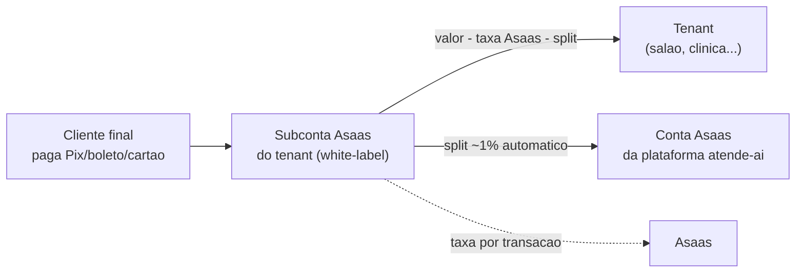

# 06 — Precificação

**Sumário executivo.** Este documento registra a precificação do atende-ai — **Basic R$ 149, Pro R$ 349 e Premium R$ 749 por mês** — com a **memória de cálculo completa** de cada plano, não apenas os valores finais. A estrutura de custo é dominada por dois variáveis (IA ~R$ 0,14/conversa e templates WhatsApp oficial ~R$ 0,044/mensagem) sobre uma infraestrutura de custo fixo ~R$ 0 (doc 07), o que produz margens brutas declaradas de **66% (Basic), 58% (Pro) e 40% (Premium)** — cada uma demonstrada linha a linha, com arredondamentos explícitos. O documento também registra: a **divergência consciente** em relação ao requisito original de cobrança proativa por canal não oficial (vetada pela regra inviolável 12 — tenant Basic só-Baileys tem régua proativa por e-mail, decisão nº 9 do doc 05, pendente de validação do dono); o **segundo motor de receita** via split de ~1% nas subcontas Asaas (upside que **não entra** na margem declarada); o ponto de equilíbrio (no 1º tenant pagante, por construção); e a política de trial de 14 dias sem cartão com DPA aceito no onboarding. Premissas cambiais e de preço de API têm revisão trimestral (risco já registrado no doc 01, seção 6).

---

## 1. Os três planos

| | **Basic — R$ 149/mês** | **Pro — R$ 349/mês** | **Premium — R$ 749/mês** |
|---|---|---|---|
| Unidades | 1 | 3 | Ilimitado (fair-use) |
| Profissionais | 5 | 15 | Ilimitado (fair-use) |
| Canais | 1 canal WhatsApp (oficial **ou** Baileys) | Todos os canais disponíveis na fase corrente | Todos os canais |
| Conversas IA/mês inclusas | 200 | 600 | 2.000 |
| Agenda + booking page pública | Sim | Sim | Sim |
| Cobrança Pix/boleto (Asaas) | Sim | Sim | Sim |
| Lembretes automáticos | Sim — por WhatsApp oficial; por **e-mail** se o canal for Baileys (seção 4) | Sim | Sim |
| Régua de cobrança | Sim (mesma regra de canal acima) | Sim | Sim |
| Contratos + assinatura eletrônica própria | — | Sim | Sim |
| Recorrência (assinaturas, Pix Automático) | — | Sim | Sim |
| API pública `/api/v1` | — | Sim | Sim |
| Loja virtual na booking page | — | — | Sim |
| NFS-e automática (Fase 2, Focus NFe incluso) | — | — | Sim |
| White-label da booking page | — | — | Sim |
| DRE por empresa/período | — | — | Sim |
| SLA prioritário de suporte | — | — | Sim |
| SMTP próprio (e-mail sai do domínio do tenant) | — | — | Sim |
| **Excedente de IA** | R$ 0,49/conversa | R$ 0,49/conversa | R$ 0,49/conversa |

Regras transversais dos planos:

- **Excedente de IA (todos os planos):** R$ 0,49 por conversa adicional, **cobrado no ciclo seguinte**, com **teto configurável pelo tenant** (anti-surpresa na fatura). Default do teto: 50% da mensalidade do plano. Aviso automático a 80% da franquia e a 80% do teto; atingido o teto, o atendimento **não para** — a IA degrada para árvore de decisão + fila humana (corta-se o motor caro, nunca o atendimento). Unit economics na seção 3.4.
- **Fair-use do Premium:** "ilimitado" cobre a operação normal de uma rede local (referência interna: até ~10 unidades / ~50 profissionais sem conversa comercial). Templates WhatsApp acima de 5.000/mês no ciclo são repassados ao custo (R$ 0,044/msg, seção 2). Fair-use existe para proteger a margem de abuso estrutural, não para punir crescimento — acima da referência, negocia-se plano enterprise caso a caso.
- **Funcionalidades de fase futura** (canais Fase 2, NFS-e automática, loja, DRE) entram no plano correspondente **quando lançadas**, sem reprecificação — o preço já as contempla (é por isso que a margem do Premium é a mais apertada das três).

---

## 2. Premissas de custo

Todas as contas deste documento derivam destas premissas. Fonte primária: docs 01, 03, 05 e 07. **Revisão trimestral obrigatória** (câmbio e preços de API — risco registrado no doc 01, seção 6).

| # | Premissa | Valor | Fonte / justificativa |
|---|---|---|---|
| P1 | Câmbio | US$ 1 = R$ 5,50 | Premissa de projeto (doc 01, seção 6 — risco cambial com revisão trimestral); as margens têm folga para absorver oscilação sem reprecificar a cada trimestre |
| P2 | Conversa de IA média | ~10 turnos | Fluxos de agendamento são curtos e estruturados (doc 05); contexto em duas camadas (janela + resumo persistido) limita tokens por turno |
| P3 | Custo de IA por conversa | **~R$ 0,14** | Gemini 2.5 Flash default ~R$ 0,10/conversa + escalação Claude Haiku 4.5 em ~15% das conversas (doc 03). Free tier **vetado em produção por LGPD** (doc 07) — produção é paga desde o dia 1 |
| P4 | WhatsApp oficial BR — template utility | **US$ 0,008/msg = R$ 0,044/msg** (0,008 × 5,50) | Tabela Meta BR para categoria utility (lembrete/cobrança); **inbound e resposta em janela de 24h são grátis** (doc 05, seção 7) — só o disparo proativo custa |
| P5 | WhatsApp Baileys | R$ 0/msg | Canal não oficial sem custo por mensagem; **proibido para envio proativo** (regra inviolável 12) — só responde conversa iniciada pelo cliente |
| P6 | E-mail | R$ 0 no MVP | Cascata Brevo (300/dia) → Resend (3.000/mês) cobre o volume do MVP com folga (doc 07); degrau Brevo Starter ~US$ 9/mês só com >400 e-mails/dia sustentado |
| P7 | Infra compartilhada | ~R$ 0 real; **rateio provisionado de R$ 10/tenant/mês** | Doc 07: custo fixo do mês 1 é R$ 0. O rateio é provisão conservadora para os degraus pagos (Workers US$ 5 = R$ 27,50; Neon US$ 19 = R$ 104,50) — a margem declarada já os paga antes de eles existirem |
| P8 | Suporte | Provisão de R$ 12 (Basic) / R$ 15 (Pro) / R$ 20 (Premium) por tenant/mês | Provisão interna de horas de atendimento e on-call. No início o suporte é do fundador (custo-caixa zero); provisionamos mesmo assim para que a margem declarada **sobreviva à contratação futura** — margem que só existe enquanto o fundador não dorme é margem falsa |
| P9 | Asaas | R$ 0 de mensalidade para nós | Gateway cobra **por transação recebida, do cliente final do tenant via subconta** (doc 03) — não é custo nosso nem do plano; para a plataforma, Asaas é fonte de receita (split, seção 5), não de custo |
| P10 | NFS-e automática (Premium, Fase 2) | Provisão de R$ 40/tenant Premium/mês | Ordem de grandeza do plano de entrada da Focus NFe (sem setup, sem fidelidade — doc 03), a confirmar na contratação. Refinamento do doc 03: **no Premium a automação é inclusa no preço** (provisão na memória de cálculo); fora do Premium permanece add-on com custo repassado |

---

## 3. Memória de cálculo por plano

Método: cada linha de custo mostra a conta; as linhas somam o total; `margem bruta = (preço − total) / preço`, com arredondamento explicitado. Os volumes de WhatsApp são **provisões orçamentárias** (o mix real varia por tenant); estouros custam R$ 0,044/msg e são imateriais dentro da folga de margem — estouros estruturais caem no fair-use.

### 3.1 Basic — R$ 149/mês

**Cenário base (canal único = Baileys — o perfil típico de entrada).** Pela regra inviolável 12, nada proativo sai por Baileys: lembretes e régua de cobrança vão por **e-mail** (seção 4); o WhatsApp responde reativamente (grátis).

| Linha de custo | Conta | Valor/mês |
|---|---|---|
| IA (200 conversas inclusas) | 200 × R$ 0,14 | R$ 28,00 |
| WhatsApp proativo | 0 msgs × R$ 0,044 (regra 12 — proativo vetado no Baileys) | R$ 0,00 |
| E-mail (lembretes + régua, ~600/mês) | Dentro da cascata free Brevo/Resend (P6) | R$ 0,00 |
| Infra rateada | Provisão P7 | R$ 10,00 |
| Suporte rateado | Provisão P8 | R$ 12,00 |
| **Total custo variável** | 28 + 0 + 0 + 10 + 12 | **R$ 50,00** |

**Margem bruta:** (149,00 − 50,00) / 149,00 = 99,00 / 149,00 = **66,4% → declarada 66%** (arredondamento para baixo, 0,4 p.p.).

**Cenário alternativo (canal único = WhatsApp oficial).** Tenant Basic que verificou número na Meta ganha lembrete e régua proativos nativos. Provisão: 300 agendamentos/mês × 2 templates utility cada (lembrete de véspera + lembrete/cobrança do dia; a resposta do cliente é inbound grátis):

| Linha de custo | Conta | Valor/mês |
|---|---|---|
| IA | 200 × R$ 0,14 | R$ 28,00 |
| WhatsApp proativo | 300 lembretes × 2 msgs × US$ 0,008 × 5,50 = 600 msgs × R$ 0,044 | R$ 26,40 |
| E-mail | Cascata free | R$ 0,00 |
| Infra rateada | P7 | R$ 10,00 |
| Suporte rateado | P8 | R$ 12,00 |
| **Total custo variável** | 28 + 26,40 + 0 + 10 + 12 | **R$ 76,40** |

Margem no cenário oficial: (149,00 − 76,40) / 149,00 = 72,60 / 149,00 = **48,7%**. Aceitamos: é o pior caso do plano, ainda saudável, e esse perfil de tenant (proativo intenso) é exatamente o que migra para o Pro. **A margem declarada do Basic (66%) refere-se ao cenário base**; o cenário oficial é o piso conhecido, não surpresa.

### 3.2 Pro — R$ 349/mês

Provisão de proativo: 3 unidades / 15 profissionais geram mais eventos; orçamos **800 templates utility/mês** (composição de referência: ~600 lembretes de agendamento + ~200 toques de régua de cobrança sobre ~100 cobranças; confirmações do cliente são inbound grátis).

| Linha de custo | Conta | Valor/mês |
|---|---|---|
| IA (600 conversas inclusas) | 600 × R$ 0,14 | R$ 84,00 |
| WhatsApp proativo | 800 msgs × US$ 0,008 × 5,50 = 800 × R$ 0,044 | R$ 35,20 |
| E-mail (fallback + notificações, ~1.500/mês) | Dentro da cascata free (P6) | R$ 0,00 |
| Infra rateada | Provisão P7 | R$ 10,00 |
| Suporte rateado | Provisão P8 | R$ 15,00 |
| **Total custo variável** | 84 + 35,20 + 0 + 10 + 15 | **R$ 144,20** |

**Margem bruta:** (349,00 − 144,20) / 349,00 = 204,80 / 349,00 = **58,7% → declarada 58%** (arredondamento conservador para baixo, 0,7 p.p.). O total de R$ 144,20 é o "~R$ 145" da conversa comercial.

### 3.3 Premium — R$ 749/mês

Provisão de proativo: **2.000 templates utility/mês** (~1.500 lembretes + ~500 toques de régua). Infra ganha uma segunda parcela: mídia de conversas e histórico maiores (R2/Neon — mitigação de arquivamento do doc 07) + rateio dos degraus pagos, que um tenant Premium pressiona primeiro.

| Linha de custo | Conta | Valor/mês |
|---|---|---|
| IA (2.000 conversas inclusas) | 2.000 × R$ 0,14 | R$ 280,00 |
| WhatsApp proativo | 2.000 msgs × US$ 0,008 × 5,50 = 2.000 × R$ 0,044 | R$ 88,00 |
| E-mail | Cascata free; acima disso, SMTP próprio do tenant (custo dele) | R$ 0,00 |
| Infra rateada ampliada | Base P7 R$ 10,00 + provisão storage/banco (mídia, histórico, DRE) R$ 12,00 | R$ 22,00 |
| NFS-e automática (Focus NFe rateado) | Provisão P10 | R$ 40,00 |
| Suporte SLA prioritário rateado | Provisão P8 | R$ 20,00 |
| **Total custo variável** | 280 + 88 + 0 + 22 + 40 + 20 | **R$ 450,00** |

**Margem bruta:** (749,00 − 450,00) / 749,00 = 299,00 / 749,00 = **39,92% → declarada 40%** (arredondamento para cima de 0,08 p.p., explicitado). É deliberadamente a margem mais apertada: o Premium carrega as promessas de fase futura (NFS-e, loja, DRE) já pagas no preço, e é o plano onde o split Asaas (seção 5) — que **não** está nesta conta — mais compensa.

### 3.4 Unit economics do excedente de IA

| Item | Valor |
|---|---|
| Preço por conversa excedente | R$ 0,49 |
| Custo por conversa (P3) | R$ 0,14 |
| Margem por conversa excedente | R$ 0,35 → 0,35 / 0,49 = **71,4%** |

O excedente tem margem **maior** que a de qualquer plano — crescimento de uso melhora o mix, nunca o corrói. A cobrança no ciclo seguinte + teto configurável + degradação para árvore (seção 1) eliminam o risco de fatura-surpresa, que em SaaS PME destrói mais contas do que preço alto.

### 3.5 Síntese das margens

| Plano | Preço | Custo variável | Margem R$ | Margem % real | Declarada |
|---|---|---|---|---|---|
| Basic (cenário base) | R$ 149,00 | R$ 50,00 | R$ 99,00 | 66,4% | **66%** |
| Pro | R$ 349,00 | R$ 144,20 | R$ 204,80 | 58,7% | **58%** |
| Premium | R$ 749,00 | R$ 450,00 | R$ 299,00 | 39,9% | **40%** |

---

## 4. Decisão registrada — cobrança proativa no Basic sem API oficial (divergência consciente, para validação do dono)

**O requisito original** pedia disparos de cobrança por WhatsApp "com API oficial **ou** não oficial, configurável por empresa".

**A regra inviolável 12** (herdada do ev-tracker, CLAUDE.md raiz) determina: envio proativo (lembrete, cobrança) **só pela API oficial**; canais não oficiais (Baileys) apenas respondem conversas iniciadas pelo cliente. O doc 05 (seção 7 e decisão nº 9) já tornou isso estrutural: o conector Baileys **não expõe método de envio proativo** — não é configuração, é ausência de código.

**Consequência prática registrada:** tenant Basic cujo único canal é Baileys tem régua de cobrança e lembretes proativos por **e-mail** (cascata Brevo/Resend, custo zero — cenário base da seção 3.1), e o WhatsApp funciona **reativamente**: quando o cliente inicia conversa, o bot responde, cobra e agenda normalmente (inclusive enviando o link Pix dentro da janela da conversa iniciada pelo cliente).

**Trade-off honesto:** perdemos a conveniência do "lembrete grátis pelo Baileys" que concorrentes informais oferecem — e que termina em número banido e cliente furioso. Ganhamos compliance Meta, previsibilidade e **dois caminhos de upsell naturais**: (a) verificar um número oficial **dentro do próprio Basic** (cenário alternativo da seção 3.1 — nossa margem cai para ~49%, aceito); (b) subir para o Pro. O painel deixa a limitação explícita, com o botão de upgrade ao lado — o produto não oferece atalho inseguro.

**Status:** divergência consciente do requisito original, alinhada às regras invioláveis e ao doc 05; **pendente de validação do dono do projeto** antes da Fase 2.

---

## 5. Segundo motor de receita — split Asaas

Cada tenant opera numa **subconta white-label Asaas** (doc 03): o dinheiro do cliente final vai direto à subconta do tenant — nunca passa pela nossa PJ — e a plataforma configura, via API, um **split de ~1%** sobre cada transação processada pelo atende-ai (cobranças, assinaturas, checkout da loja).

Regras registradas:

- O split incide sobre **transações processadas pela plataforma** (geradas pelo atende-ai), não sobre o faturamento total do tenant.
- "Receita invisível" no sentido de **não aparecer na mensalidade** — contratualmente é transparente: o percentual consta dos termos de uso aceitos no onboarding.
- **Estimativa conservadora por tenant Premium:** R$ 20–40 mil/mês processados → **R$ 200–400/mês** de receita adicional por tenant — na prática, um segundo Premium escondido dentro de cada Premium ativo.

### 5.1 Sensibilidade — volume processado × receita de split (por tenant/mês)

| Volume processado/mês | Split 0,5% | **Split 1,0%** | Split 1,5% |
|---|---|---|---|
| R$ 5.000 | R$ 25 | **R$ 50** | R$ 75 |
| R$ 10.000 | R$ 50 | **R$ 100** | R$ 150 |
| R$ 20.000 | R$ 100 | **R$ 200** | R$ 300 |
| R$ 40.000 | R$ 200 | **R$ 400** | R$ 600 |
| R$ 80.000 | R$ 400 | **R$ 800** | R$ 1.200 |

**Decisão de disciplina financeira:** o split **NÃO entra na margem declarada dos planos** (seção 3) nem nas projeções da seção 6. É upside, não dependência — se o Asaas reprecificar ou o driver mudar (camada `PaymentProvider`, doc 03), a economia dos planos continua de pé sozinha. Precificar contando com o split seria construir a casa sobre a receita do vizinho.

---

## 6. Ponto de equilíbrio e projeção

**Breakeven: o 1º tenant pagante.** Custo fixo de infraestrutura é ~R$ 0 (doc 07); o único custo fixo inevitável é o domínio (~R$ 40/ano ≈ R$ 3,33/mês). Um único Basic no cenário base gera R$ 99,00/mês de margem bruta — 30× o custo fixo total. Não existe vale da morte de infraestrutura: **o primeiro custo fixo relevante chega depois da receita que o paga, por construção** (doc 07, seção 4.2).

### 6.1 Projeção por mix de tenants (60% Basic / 30% Pro / 10% Premium)

Ticket médio ponderado: 0,6 × 149 + 0,3 × 349 + 0,1 × 749 = 89,40 + 104,70 + 74,90 = **R$ 269,00**. Custo variável médio ponderado: 0,6 × 50,00 + 0,3 × 144,20 + 0,1 × 450,00 = 30,00 + 43,26 + 45,00 = **R$ 118,26**. Margem bruta média: 150,74 / 269,00 = **56,0%**.

| Tenants (B/P/Pr) | MRR | Custo variável total | Margem bruta total | Margem % |
|---|---|---|---|---|
| **10** (6/3/1) | 6×149 + 3×349 + 1×749 = **R$ 2.690** | 6×50 + 3×144,20 + 1×450 = **R$ 1.182,60** | R$ 1.507,40 | 56,0% |
| **50** (30/15/5) | 30×149 + 15×349 + 5×749 = **R$ 13.450** | 30×50 + 15×144,20 + 5×450 = **R$ 5.913,00** | R$ 7.537,00 | 56,0% |
| **200** (120/60/20) | 120×149 + 60×349 + 20×749 = **R$ 53.800** | 120×50 + 60×144,20 + 20×450 = **R$ 23.652,00** | R$ 30.148,00 | 56,0% |

### 6.2 Quando os degraus pagos de infra viram ruído

Os dois primeiros degraus esperados (doc 07): **Workers Paid US$ 5/mês = R$ 27,50** e **Neon Launch US$ 19/mês = R$ 104,50** — juntos, **R$ 132,00/mês**. Pelo doc 07, eles chegam com ~5–20 tenants pagantes. Peso dos **dois somados** sobre o MRR:

| Tenants | MRR | Degraus (R$ 132) como % do MRR |
|---|---|---|
| 10 | R$ 2.690 | 132 / 2.690 = **4,9%** |
| 50 | R$ 13.450 | 132 / 13.450 = **1,0%** |
| 200 | R$ 53.800 | 132 / 53.800 = **0,25%** |

Ou seja: mesmo no pior caso (ambos os degraus disparando já com 10 tenants), o custo é 4,9% do MRR; **a partir de ~50 tenants os degraus são ≤1% do MRR — irrelevantes**. A provisão de infra de R$ 10/tenant/mês (P7) cobre os dois degraus integralmente a partir de 14 tenants (14 × 10 = 140 > 132) — a margem declarada já os pagava antes de existirem.

---

## 7. Comparação de mercado

Ordem de grandeza apenas — faixas típicas do mercado BR em 2026, sem precisão de centavos (preços de concorrentes mudam; o argumento é estrutural, não numérico):

| Categoria | Faixa típica/mês | O que entrega | O que falta vs. atende-ai |
|---|---|---|---|
| Agenda pura para salão/clínica (apps de agendamento BR) | ~R$ 50–150 | Agenda, cadastro, lembrete simples (push/SMS/e-mail) | Sem omnichannel, sem IA conversacional, sem cobrança integrada com régua |
| Agenda + marketplace/marketing | ~R$ 100–300 | Agenda + vitrine/captação (às vezes com comissão sobre agendamento) | Atendimento é formulário, não conversa; IA e WhatsApp são add-ons pagos quando existem |
| Bot/atendimento WhatsApp genérico (horizontal) | ~R$ 100–400+ | Fluxos de chatbot, inbox multiatendente (frequentemente cobrado por atendente) | Sem agenda vertical, sem cobrança/contrato/NFS-e — o tenant paga dois sistemas e integra na mão |

**Por que o atende-ai cobra premium sobre a agenda pura:** o Basic a R$ 149 não compete com a agenda de R$ 80 — compete com **agenda de R$ 80 + bot de R$ 200 + régua de cobrança manual**, vendidos juntos, integrados e com IA **inclusa no preço** (200–2.000 conversas/mês), não como add-on por atendente. A âncora de valor é o custo evitado da recepcionista dedicada ao WhatsApp, não o preço da planilha de horários. O risco assumido: contra a agenda pura barata, o Basic parece caro — a resposta comercial é o trial (seção 8) demonstrando o atendimento automático funcionando no número do próprio tenant.

---

## 8. Trial e onboarding

| Regra | Decisão |
|---|---|
| Duração | **14 dias grátis** |
| Cartão de crédito | **Não exigido** — fricção zero na entrada; coerente com a política do projeto (doc 07, seção 2) |
| Limites durante o trial | **Os do Basic** (1 unidade, 5 profissionais, 1 canal WhatsApp, 200 conversas IA) — o trial demonstra o produto real, não uma vitrine ilimitada |
| Exposição de custo por trial | Teto aritmético: 200 conversas × R$ 0,14 = **R$ 28,00** por trial (pior caso; o consumo típico é fração disso). Sem cartão não há proativo oficial pago por nós: trial usa Baileys/e-mail — o custo marginal real do trial é praticamente só IA. Tratado como CAC, não como perda |
| LGPD no onboarding | **DPA versionado aceito no onboarding, antes de qualquer dado de cliente final entrar** — registro do aceite em `AuditLog` (doc 01, seção 5.4). Sem aceite, o tenant não sai do wizard |
| Fim do trial sem conversão | Conta vira **somente-leitura por 30 dias** (o tenant exporta o que quiser); depois, anonimização/exclusão conforme `ConfigLgpd` e cron de retenção — nunca exclusão imediata silenciosa, nunca retenção indefinida |
| Conversão | Upgrade dentro do painel via Asaas (Pix/cartão/boleto), pró-rata do ciclo; o wizard de onboarding já instancia o template de árvore da vertical (doc 05, seção 3.4), então o tenant chega ao fim do trial com o bot funcionando — o produto se vende operando |

---

## Resumo das decisões deste documento

| # | Decisão | Alternativa recusada |
|---|---|---|
| 1 | Três planos (149/349/749) com margem declarada demonstrada linha a linha (66/58/40%) | Precificação por assento ou por mensagem (imprevisível para PME; pune o sucesso do tenant) |
| 2 | Provisões de suporte e infra dentro da margem desde o dia 1 (P7, P8) | Margem "de fundador" sem custo de suporte — falsa e não sobrevive à contratação |
| 3 | Excedente de IA a R$ 0,49/conversa, ciclo seguinte, teto configurável, degradação para árvore no teto | Corte seco do atendimento ou fatura aberta sem teto (bill shock) |
| 4 | Basic só-Baileys: régua proativa por e-mail; WhatsApp reativo (regra 12 / doc 05 decisão 9) — **pendente validação do dono** | Proativo por canal não oficial configurável (requisito original) — risco de ban do número do tenant |
| 5 | Split Asaas ~1% como upside fora da margem declarada e das projeções | Precificar planos contando com o split (dependência de terceiro no preço) |
| 6 | NFS-e automática inclusa no Premium com provisão de R$ 40 (refinamento do doc 03) | NFS-e como add-on repassado também no Premium (enfraquece a proposta do plano topo) |
| 7 | Trial 14 dias sem cartão, limites do Basic, DPA no onboarding, teto de exposição R$ 28/trial | Trial com cartão (mata conversão no público-alvo) ou trial ilimitado (custo de IA sem teto) |

---

*Documentos relacionados: `docs/01-arquitetura.md` (riscos e revisão cambial), `docs/03-stack.md` (custos de IA, WhatsApp e Asaas), `docs/05-omnichannel.md` (política anti-ban e decisão nº 9), `docs/07-infra-free-tier.md` (custo fixo zero e degraus pagos).*
