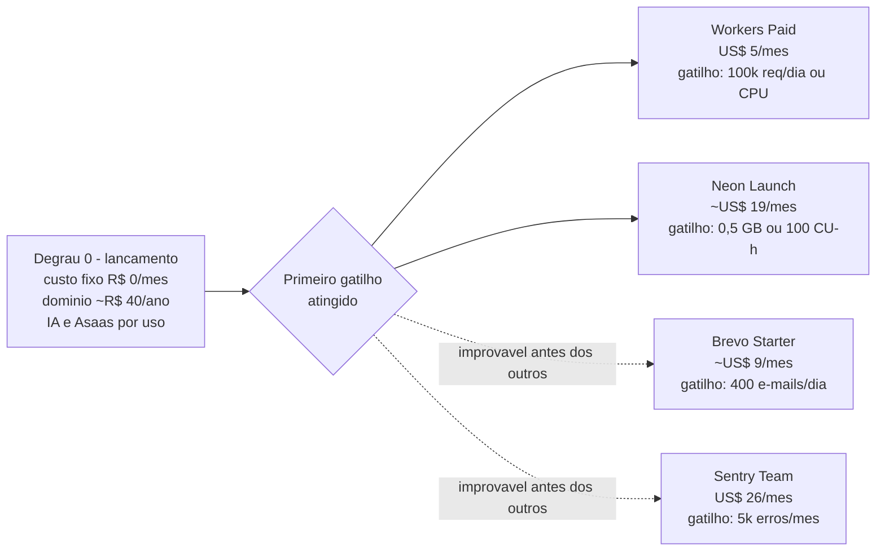

# 07 — Infraestrutura em nuvem sem investimento inicial

**Sumário executivo.** Este documento é o mapa operacional da regra de **orçamento zero** do atende-ai: para cada componente da infraestrutura, registra a opção gratuita escolhida, o limite exato do free tier, o gatilho objetivo que dispara a migração e o custo do próximo degrau. Todos os números foram verificados em **julho/2026**. Três princípios governam a tabela: (1) **free tier permanente e comercialmente permitido** — nenhum serviço em produção viola termos de uso comercial (veto ao Vercel Hobby) nem a LGPD (veto ao Gemini free em produção); (2) **cada componente tem porta de saída numerada** — limite, gatilho e preço do degrau seguinte são conhecidos antes de precisarmos deles; (3) **os únicos custos aceitos no dia 1** são o domínio `.com.br` (~R$ 40/ano), a IA paga por uso (~R$ 0,14/conversa, já coberta na precificação do doc 06) e as taxas por transação do Asaas (modelo-alvo do gateway). O primeiro degrau pago esperado — Workers Paid US$ 5/mês ou Neon Launch ~US$ 19/mês — só chega com ~5–20 tenants pagantes, quando será irrelevante.

---

## 1. Tabela mestra — componente a componente

| Componente | Opção gratuita | Limite do free tier | Quando migrar (gatilho) | Custo do próximo degrau |
|---|---|---|---|---|
| Hospedagem web | Cloudflare Workers + OpenNext | 100k req/dia, 10 ms CPU/invocação, uso **comercial permitido** | >100k req/dia ou CPU estourando (5xx/timeout na borda) | Workers Paid US$ 5/mês (10M req, 30 s CPU) |
| Worker sempre-ativo | Oracle Cloud Always Free (VM Ampere A1 até 4 OCPU / 24 GB RAM) | Always Free **permanente** | Indisponibilidade de capacidade ARM ou encerramento de conta | Northflank free (2 serviços) ou Railway Hobby US$ 5/mês |
| Postgres | Neon | 100 CU-h/mês, 0,5 GB/projeto (5 GB agregado em 10 projetos), PITR 6 h, sem pausa de projeto | >0,5 GB ou >100 CU-h/mês | Launch ~US$ 19/mês |
| Storage | Cloudflare R2 | 10 GB, 1M ops classe A + 10M ops classe B/mês, **egress zero para sempre** | >10 GB armazenados | US$ 0,015/GB-mês |
| Fila/cron | pg-boss (dentro do Neon) | Custo zero, ilimitado | Nunca (plano B: QStash, 1.000 msgs/dia free) | n/a |
| E-mail | Brevo (primário) + Resend (secundário) em cascata | Brevo 300/dia (~9k/mês); Resend 3.000/mês (100/dia) | >400 e-mails/dia sustentado | Brevo Starter ~US$ 9/mês; tenants Premium plugam SMTP próprio |
| Realtime | SSE do próprio worker | Custo zero | Se SSE virar gargalo operacional | Pusher free (200k msgs/dia, 200 conexões), depois pago |
| Monitoramento | Sentry Developer + BetterStack Uptime free | Sentry: 5k erros/mês, 1 usuário, retenção 30 d | >5k erros/mês | Sentry Team US$ 26/mês |
| CI/CD | GitHub Actions | 2.000 min/mês em repo privado | >2.000 min/mês | US$ 0,008/min ou repo público |
| Assinatura eletrônica | Motor próprio (OTP + SHA-256 + trilha de evidências) | Custo zero | Tenant exigir ICP-Brasil | ZapSign API sob demanda (custo repassado) |
| Gateway de pagamento | Asaas | Sem mensalidade; Pix R$ 1,99/recebida (R$ 0,99 nos 3 primeiros meses; 100 Pix/mês grátis por subconta), boleto R$ 1,99, cartão 2,99% + R$ 0,49 | n/a — o modelo-alvo **é** por transação | n/a |
| NFS-e | Emissor nacional gratuito do governo (manual) | Grátis | Automação na Fase 2 | Focus NFe (repassado como add-on) |
| IA | Gemini free tier (1.500 req/dia) **SOMENTE em dev** | Free **não vai a produção** — dados podem treinar modelos = veto LGPD | Produção é paga desde o dia 1 | Pago por uso ~R$ 0,14/conversa (coberto na precificação, doc 06) |
| DNS/domínio | Cloudflare DNS free + Registro.br | Domínio `.com.br` ~R$ 40/ano — **único custo inevitável do dia 1** | n/a | n/a |

### Notas de leitura da tabela

- **Hospedagem web.** O teto de 10 ms de CPU por invocação é restrição de projeto, não surpresa: SSR minimalista e webhooks que só validam e enfileiram (doc 01, seção 1.1). O upgrade para Workers Paid é o mais barato de toda a stack e não envolve migração — mesmo deploy, mesmo código.
- **Worker sempre-ativo.** Em 2026, o Oracle Always Free é o único always-on gratuito real que restou (Railway e Fly encerraram os free tiers; o free do Render hiberna e derrubaria o socket Baileys). O gatilho aqui não é volume, é **disponibilidade**: o risco conhecido da OCI é capacidade ARM escassa na criação de instância e, raramente, encerramento de contas ociosas. A mitigação é estrutural: auth-state Baileys no Postgres + Docker Compose portável (seção 3).
- **Postgres.** O limite que aperta primeiro é o armazenamento (0,5 GB), pressionado pelo histórico de conversas. A mitigação antes do degrau pago: arquivar mensagens com mais de 90 dias em R2 como JSON compactado, mantendo no Postgres metadados + ponteiro (preserva export e auditoria LGPD) — risco já mapeado no doc 01, seção 6.
- **Fila/cron.** pg-boss roda dentro do Neon: o "custo" dele é o consumo de CU-h do próprio banco, já contabilizado na linha do Postgres. O gatilho é "nunca" porque a saturação da fila aparece primeiro como pressão no plano do Neon — o degrau é do banco, não da fila. QStash fica documentado como plano B arquitetural (ao custo de perder o outbox transacional, ver doc 01, seção 3.3).
- **E-mail.** E-mail é canal secundário (lembrete primário é WhatsApp), então a cascata de dois free tiers cobre o MVP com folga. O terceiro degrau nem é nosso custo: tenants Premium plugam SMTP próprio (white-label, e-mail sai do domínio da empresa).
- **Gateway e NFS-e** não têm "degrau" porque não são free tiers em risco: o Asaas é por transação **por design** (é assim que queremos pagar), e o emissor nacional é serviço público — a Fase 2 troca conveniência (automação via Focus NFe), não gratuidade.
- **IA.** É a única linha em que o free tier é proibido em produção por decisão, não por limite: os termos do free tier do Gemini permitem uso dos dados para treinar modelos, o que é veto LGPD absoluto para dados de clientes dos tenants. Dev e testes usam o free (1.500 req/dia sobra); produção nasce paga por uso, e a precificação do doc 06 já absorve os ~R$ 0,14/conversa.

---

## 2. Onde cartão de crédito é exigido

Regra do projeto: **nenhum serviço deve exigir cartão de crédito para operar no free tier**. Há exatamente **uma exceção**, conhecida e aceita:

| Serviço | Exige cartão? | Observação |
|---|---|---|
| **Oracle Cloud (OCI)** | **Sim — única exceção** | Cartão exigido na criação da conta apenas para **verificação de identidade, sem cobrança**. O Always Free não converte em cobrança automaticamente: contas free não são debitadas sem upgrade explícito para conta paga. |
| Cloudflare (Workers, R2, KV, DNS) | Não | Cadastro só com e-mail |
| Neon | Não | Cadastro só com e-mail/GitHub |
| Brevo | Não | Free tier sem cartão |
| Resend | Não | Free tier sem cartão |
| Sentry | Não | Plano Developer sem cartão |
| BetterStack | Não | Free tier sem cartão |
| GitHub | Não | Actions free em repo privado sem cartão |
| Asaas | Não | Conta sem mensalidade; cobra por transação recebida |
| Registro.br | n/a | Domínio é pago (~R$ 40/ano) — pagamento por boleto/Pix, sem cartão obrigatório |

Se a exigência de cartão da OCI for impeditiva para o dono do projeto, o plano B do worker (Northflank free) não exige cartão — ao custo de limites mais apertados (2 serviços) e de abrir mão dos 4 OCPU/24 GB da Ampere A1.

---

## 3. Estratégia anti-lock-in — por componente

Free tier sem porta de saída é armadilha. Cada componente da tabela tem uma estratégia explícita de reversão ou troca, e nenhuma delas exige reescrita:

| Componente | Estratégia anti-lock-in |
|---|---|
| Hospedagem web | **OpenNext é a apólice de seguro**: o app é Next.js padrão — o mesmo código volta para Vercel (se um dia o preço fizer sentido) ou para Node auto-hospedado sem mudança de framework. O adapter é camada de deploy, não de código. |
| Worker sempre-ativo | O worker é **Docker Compose portável** com provisionamento idempotente (script único). Nenhum webhook aponta para a VM (tudo entra pela Cloudflare e vira job), e o auth-state Baileys vive no Postgres — a VM é gado, não estimação. **Recriação em menos de 1 h** em Northflank ou Railway, sem reconfigurar nenhuma integração externa. |
| Postgres / fila | **pg-boss é SQL puro sobre Postgres puro** — sem dialeto proprietário, sem extensão exótica. Um dump do Neon restaura em qualquer Postgres (RDS, Supabase, VM própria) com filas, cron e outbox intactos. |
| Storage | **R2 é S3-compatível**: o código usa SDK S3 padrão. Trocar de provedor de storage é trocar endpoint + credenciais e migrar objetos — zero mudança de código de aplicação. |
| Gateway | Todo acesso ao Asaas passa pela camada **`PaymentProvider`** em `packages/core/financeiro` (interface própria: cobrança, assinatura, webhook de baixa, split). Mercado Pago é o segundo driver planejado — se o Asaas reprecificar, a troca é um driver novo, não uma reescrita. |
| E-mail | A cascata **já é multi-provedor por construção** (Brevo → Resend → SMTP do tenant): perder ou trocar um provedor é remover/inserir um degrau da cascata, comportamento herdado e provado no ev-tracker. |
| Realtime | **SSE é padrão web** (HTTP puro, `EventSource` nativo do navegador). Se o hub do worker saturar, o contrato de eventos permanece e só o transporte muda (Pusher ou similar) — nenhum componente do painel é reescrito. |
| Monitoramento / CI | Sentry SDK é substituível (GlitchTip é API-compatível); pipelines GitHub Actions são YAML portável. Ambos são periféricos — trocá-los não toca o produto. |
| Assinatura eletrônica | O motor é nosso (OTP + SHA-256 + trilha + AuditLog). ZapSign entra apenas como ponte ICP-Brasil sob demanda — dependência por exceção contratada, nunca no fluxo padrão. |
| IA | Dual-provider por construção (Gemini + Claude, herdado do ev-tracker): a queda ou reprecificação de um provedor degrada, não derruba. |

---

## 4. Custo total do mês 1 e o primeiro degrau pago

### 4.1 O que se paga no dia 1

| Item | Custo | Natureza |
|---|---|---|
| Domínio `.com.br` (Registro.br) | ~R$ 40/**ano** | Fixo — o único custo inevitável |
| IA em produção (Gemini 2.5 Flash + Claude Haiku) | ~R$ 0,14/conversa | Variável por uso — coberto pela precificação (doc 06) |
| Taxas Asaas | Por transação recebida (Pix R$ 1,99; boleto R$ 1,99; cartão 2,99% + R$ 0,49) | Variável — só existe quando existe receita |

**Custo fixo de infraestrutura do mês 1: R$ 0.** Tudo que é fixo está em free tier permanente; tudo que é variável só cresce junto com uso real (conversas de IA) ou com dinheiro entrando (transações Asaas). Não existe cenário em que a infraestrutura queime caixa antes de haver produto rodando.

### 4.2 A escada de custos

**O primeiro degrau pago esperado é Workers Paid (US$ 5/mês) ou Neon Launch (~US$ 19/mês)** — qual dos dois chega primeiro depende do perfil de uso: tráfego de painel/booking pressiona o Workers; volume de conversas armazenadas pressiona o Neon. Pela projeção de volumes do doc 06, qualquer um dos dois gatilhos só é atingido com **~5–20 tenants pagantes** — ou seja, com receita mensal entre ~R$ 750 e ~R$ 3.000+ no pior caso (todos Basic). Nesse ponto, US$ 5–19/mês é irrelevante: **o primeiro custo fixo de infraestrutura chega depois da receita que o paga, por construção.**

### 4.3 Como monitoramos os gatilhos (desde a semana 1)

Gatilho sem medição é gatilho decorativo. Rotina operacional mínima:

- **CPU time e req/dia** no dashboard da Cloudflare — acompanhado desde a semana 1 (compromisso já registrado no doc 01, seção 6).
- **CU-h e armazenamento** no console do Neon — revisão semanal; a mitigação de arquivamento em R2 é acionada **antes** dos 0,5 GB, não depois.
- **Cota de erros** no Sentry e **volume diário de e-mail** na própria cascata (contador por provedor) — alertas de 80% do limite.
- **Heartbeat do worker** no BetterStack — não é gatilho de custo, mas é o alarme mais crítico da operação (worker caído = WhatsApp mudo).

---

*Documentos relacionados: `docs/01-arquitetura.md` (topologia e riscos), `docs/03-stack.md` (justificativa de cada escolha), `docs/06-precificacao.md` (memória de cálculo que absorve IA e taxas por uso).*
