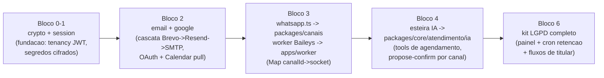

# 08 — Reuso do ev-tracker

**Sumário executivo.** Este documento é o mapa de reuso do **ev-tracker** (`C:\Users\raydo\ev-tracker`, produção em Vercel + Railway + Neon) no atende-ai. A estratégia é **cópia adaptada** — nunca dependência de código, nunca git submodule: o ev-tracker é um sistema **single-tenant e Sankhya-específico**, e amarrar os dois repositórios condenaria o atende-ai a herdar decisões que já rejeitamos (driver Neon HTTP sem transação, `db push`, config em linha única `id='default'`). O que se copia é o **código endurecido em produção** — os fixes do Baileys que custaram semanas de depuração (@lid, nono dígito, 502), o loop de tool-use dual-provider com propose-confirm, a cascata de e-mail, o kit LGPD completo — e cada módulo copiado é adaptado na entrada do monorepo. **Regra geral de adaptação, sem exceção: todo dado ganha `empresaId` e todo acesso a banco passa a rodar sob a Prisma Client Extension de tenancy** (regra inviolável 1 do `CLAUDE.md`); toda config que no ev-tracker era linha única `id='default'` vira registro por empresa; todo fallback para variável de ambiente vira configuração por tenant cifrada no banco. Cada linha da tabela mestra abaixo cita o path real verificado no repositório e o tamanho em linhas — este documento foi escrito com o código-fonte aberto, não de memória.

---

## 1. Estratégia: cópia adaptada, não dependência

**Decisão:** os módulos listados são **copiados** para o monorepo do atende-ai, adaptados no ato e passam a evoluir de forma independente. Nenhum import cruzado, nenhum submodule, nenhum package compartilhado entre os dois projetos.

**Motivo:** os dois sistemas divergem no eixo mais estrutural possível — tenancy. O ev-tracker tem um tenant (a Sankhya), config em linhas únicas (`ConfigWhatsApp`, `ConfigEmail`, `ConfigIA`, `ConfigLgpd`, todas `id='default'`), sessão WhatsApp única (`WhatsAppSession` `id='default'`) e queries sem filtro de empresa. O atende-ai exige `empresaId` pervasivo desde a primeira migration. Um código compartilhado precisaria servir aos dois modelos ao mesmo tempo — abstração prematura que quebraria os dois lados.

**Trade-off honesto:** cópia significa que um bugfix futuro no ev-tracker **não chega de graça** ao atende-ai (e vice-versa). Aceitamos: os módulos copiados são maduros e estáveis (o grosso dos fixes já aconteceu), e o custo de um port consciente ocasional é muito menor que o custo permanente de manter uma abstração dual-tenancy. A alternativa descartada — extrair um package npm comum — foi rejeitada porque criaria um terceiro codebase para manter, com dois consumidores de requisitos incompatíveis.

**O que a adaptação sempre inclui (checklist por módulo):**

1. `empresaId` em todo model e toda query; unicidade composta `@@unique([empresaId, ...])`.
2. Acesso a banco pelo Prisma Client com extension de tenancy (AsyncLocalStorage) — nunca client cru.
3. Config por tenant (registro por empresa, segredos cifrados), eliminando fallbacks para env vars globais.
4. Nomes e contratos alinhados ao doc 09 (schemas Zod em `packages/core` como borda).
5. Comentários e workarounds do driver Neon HTTP ("sem transação, usar `Promise.all`") **removidos** — o atende-ai tem transação interativa (adapter `pg`), e o outbox pg-boss depende dela.

---

## 2. Tabela mestra — origem → destino

Todos os paths de origem foram verificados no repositório em 2026-07-11; linhas contadas por `wc -l`.

| Origem (ev-tracker) | Linhas | O que faz | Destino (atende-ai, doc 09) | Esforço | Adaptações obrigatórias |
|---|---|---|---|---|---|
| `src/lib/whatsapp.ts` + `src/lib/whatsapp-config.ts` | 207 + 82 | Camada de mensageria com 3 provedores (Meta Cloud API, Evolution, Baileys): parse de inbound por provedor, HMAC `X-Hub-Signature-256` com `timingSafeEqual`, retry 1x em 5xx no envio via worker, política anti-ban (`contexto: 'resposta' \| 'proativo'` — proativo bloqueado em provedor não oficial) | `packages/canais` (conectores `whatsapp_oficial` e cliente do worker Baileys) | Médio | Virar implementação da interface `Conector` (doc 05 §1.1) com formato canônico; suportar mídia/botões/listas/interativo (hoje só texto); `ConfigWhatsApp id='default'` → `CanalWhatsApp` por `(empresaId, canalId)`; descartar driver Evolution (fora do doc 05); dedup por `@@unique([canalId, idExterno])` |
| `whatsapp-worker/` (`src/index.ts` 474, `src/auth-state.ts` 53, `src/db.ts` 92 + Dockerfile) | ~620 | Worker Baileys always-on: auth-state no Postgres (creds+keys JSON com `BufferJSON`), reconexão com backoff (2s×tentativas, teto 30s), QR→data URL no banco, heartbeat 20s, fixes de produção (@lid via `jidEnderecavel`, nono dígito via `onWhatsApp()`, 502 via `unhandledRejection` engolida + timeouts de 15s/25s), store de enviadas p/ retry de decodificação, rastreio de acks | `apps/worker` (gestor de N sockets) | Alto | Refatorar **socket único global → `Map<canalId, socket>`**; `WhatsAppSession id='default'` → keyed por `canalId`; estado em memória (`chatsRecentes`, `enviadas`, `stats`) vira por-canal; HTTP `/send` → consumidor pg-boss; **fixar versão exata do Baileys** (hoje `^6.7.9` com caret) |
| `src/lib/esteira/` (13 arquivos TS, ~2.416 linhas; núcleo portável ≈ 870) | 2.416 | IA dual-provider: `agent.ts` (66, dispatcher), `provedores/anthropic.ts` (108) e `provedores/gemini.ts` (162) com loop de tool-use (máx. 8 iterações, prompt caching), `tools.ts` (53, agregador c/ filtro `somenteLeitura`), `tool-context.ts` (34, anti-injection: sessão NUNCA vem do modelo), `tools-plataforma.ts` (838, tools escopadas por papel; escrita cria `AcaoPropostaIA` PENDENTE, TTL 15 min), `confirmar-proposta.ts` (143, execução determinística sem LLM, lock por `updateMany` condicional), `prompts.ts` (95), `whatsapp-runner.ts` (85), `config.ts` (60) | `packages/core/atendimento/ia` | Médio | Trocar prompts/tools Sankhya por domínio de agendamento; `PropostaAcao` ciente de canal (doc 05 §4) com `conversaId + identidadeCanalId`; escalação automática Gemini→Claude (~15%) é código **novo** (no ev-tracker o provedor é seleção manual); descartar `knowledge.ts` (527) + `tools-knowledge.ts` (179) + JSONs |
| `src/lib/google.ts` | 555 | OAuth Google completo: `state` JWT assinado com nonce anti-CSRF (15 min), troca code→token, `getValidAccessToken` com refresh automático (margem 60s) e **tokens cifrados em repouso**, CRUD Calendar (`listarEventos`, `criarEvento`, `criarBloqueio`, `deletarEvento`, `obterEvento`), cache com invalidação por tag, `redirectUriFromRequest` multi-domínio | `packages/core/agenda/google` | Médio | `GoogleAccount` por usuário → conta por `(empresaId, profissionalId)`; remover `unstable_cache`/`next/cache` (o sync roda no worker — cache de memória com TTL); escopo `gmail.send` removido (e-mail tem cascata própria); cifra dos tokens migra para variante hard-fail; pull no MVP, watch channels na Fase 2 |
| `src/lib/email.ts` | 127 | Cascata de envio com degradação: SMTP (config no banco, senha decifrada) → Gmail API → Resend → log; alinhamento SPF/DKIM automático (remetente = conta autenticada, desejado em Reply-To), versão texto-puro anti-spam, `escHtml` | `packages/core/email` | Baixo | Reordenar cascata: **Brevo (novo driver, primário) → Resend → SMTP do tenant**; remover degrau Gmail API (acoplado à conta Google de admin — padrão single-tenant); `ConfigEmail id='default'` → SMTP por empresa; `layoutEmail` hardcoded (EV Tracker, laranja) → templates white-label por tenant |
| Kit LGPD: `src/lib/lgpd.ts` (466) + models em `prisma/schema.prisma` linhas 928–1031 (~104) + painel `src/app/(app)/lgpd/` (~800, 7 páginas) + cron `src/app/api/cron/retencao/route.ts` (169) + `src/app/api/dados-pessoais/route.ts` (43) | ~1.580 | Auditoria (`registrarAuditoria`, nunca lança), AccessLog, consentimento **insert-only**, anonimização de titular, exportação (art. 18 V), prazo de resposta 15 dias (art. 19); 5 models **sem `@relation`** (cascade não apaga trilha); cron com dry-run, preservação de provas por 5 anos, purge por prazos configuráveis | `packages/core/lgpd` + models em `packages/db` + painel em `apps/web` + cron como job pg-boss no `apps/worker` | Médio | Todos os models ganham `empresaId`; `ConfigLgpd id='default'` (com dados do dono hardcoded como default) → por empresa, preenchida no onboarding com aceite de DPA; cron Vercel (`CRON_SECRET`) → pg-boss cron iterando tenants com prazos de cada um; auditoria+mutação agora podem ir na **mesma transação** |
| `src/lib/crypto.ts` + `src/lib/session.ts` | 149 + 65 | AES-256-GCM (`cifrar`/`decifrar` com passthrough retrocompat; `cifrarSegredo`/`decifrarSegredo` **hard-fail**; `cifrarObj` p/ colunas Json) e sessão JWT com `jose` (HS256, cookie httpOnly 7d, hard-fail sem `SESSION_SECRET` em produção) | `packages/core/crypto` + `packages/core/identidade` (session) | Trivial / Baixo | Crypto: **só a variante hard-fail sobrevive** (regra inviolável 15 — o passthrough silencioso é banido); manter formato `enc:iv:tag:data`. Session: payload `{userId, name, email, filial, role}` → `{usuarioId, empresaId, unidadeId, papelId, escopos[]}`; separar assinatura/verificação (pura, roda no worker p/ SSE) do manuseio de cookie (acoplado a `next/headers`, fica no `apps/web`) |

---

## 3. Módulo a módulo

### 3.1 `src/lib/whatsapp.ts` + `whatsapp-config.ts` → `packages/canais`

**O que o código faz hoje.** Um único ponto de envio (`enviarTexto`) e de parse (`parseInbound`) para três provedores: Meta Cloud API (Graph `v21.0` fixada), Evolution API e o worker Baileys próprio. A assinatura do webhook Meta é validada com HMAC-SHA256 e `crypto.timingSafeEqual` (anti timing attack). O envio ao worker Baileys retenta 1x em 5xx/erro de rede (502/503 de worker reiniciando), com 4xx tratado como definitivo. A peça mais valiosa é a **política anti-ban codificada no tipo**: todo envio declara `contexto: 'resposta' | 'proativo'`, e proativo em provedor não oficial é recusado na função — não existe caminho de código que dispare proativo pelo Baileys.

**O que muda no atende-ai:**
- Vira implementação da interface `Conector` do doc 05 §1.1, consumindo/produzindo o formato canônico (`MensagemInboundNormalizada`/`MensagemOutbound`).
- Hoje só trata `type === 'text'`; o conector precisa de mídia (download p/ R2), botões, listas e `interativo`.
- `obterConfigWhatsApp()` lê linha única `id='default'` com fallback para 9 env vars — vira resolução por `canalId` (uma empresa, N números), segredos cifrados, sem env.
- O driver Evolution API **não é portado** (seção 4).
- Dedup de inbound (hoje `MensagemWhatsApp` com purge de 90 dias) vira `@@unique([canalId, idExterno])` do doc 05.

**O que NÃO muda (o valor do reuso):** a validação HMAC com comparação constante, o formato de retry com distinção 4xx/5xx, a versão fixada da Graph API e — principalmente — o desenho "política anti-ban como tipo do domínio, não como disciplina": é exatamente a regra inviolável 12, já provada em produção (o conector Baileys do atende-ai nem expõe método proativo).

**Armadilhas conhecidas:** o parse da Meta ignora silenciosamente status/entregas — o atende-ai precisa consumi-los (correlação de `idExterno` para status de mensagem); o retry de envio não é idempotente por si (o worker pode ter enviado antes do 502 do proxy) — no atende-ai o job pg-boss de envio precisa de chave de idempotência.

### 3.2 `whatsapp-worker/` → `apps/worker`

**O que o código faz hoje.** Processo Node always-on (Railway) que segura **um** socket Baileys. É o módulo com mais conhecimento de produção embutido por linha:

- **Auth-state no Postgres** (`auth-state.ts` + `db.ts`): creds e keys serializados com `BufferJSON` em `WhatsAppSession`, via conexão `pg` normal — reinício/redeploy não exige novo QR. É o que torna a VM descartável (doc 01 §6).
- **Fix @lid** (`jidEnderecavel`): contas migradas para LID chegam com `remoteJid` anônimo; extrair dígitos dali produz número falso — a resposta é "enviada" sem erro e **nunca entregue**. O número real vem de `senderPn`/`participantPn`/`remoteJidAlt`, e a resposta sai pelo **chat de origem** (`chatsRecentes`, TTL 24h), como um cliente WhatsApp real faz.
- **Fix nono dígito**: contas BR antigas têm JID **sem** o 9 — enviar "com 9" é aceito e nunca entregue; sem inbound recente, `onWhatsApp()` resolve a variante canônica antes de enviar.
- **Fix 502**: o Baileys emite rejections fora de qualquer try/catch; no Node 20 isso mata o processo → host reinicia → `/send` devolve 502. `unhandledRejection`/`uncaughtException` são logadas e engolidas; `sendMessage`/`onWhatsApp` têm timeout (25s/15s) para falhar rápido em vez de pendurar no proxy.
- **Retry de decodificação**: store das últimas 200 mensagens enviadas alimenta o `getMessage` do Baileys — sem isso, o retry pedido pelo destinatário devolve `undefined` e a mensagem morre em silêncio.
- **Observabilidade de entrega**: acks (`messages.update`/`message-receipt.update`) rastreados por envio — `sendMessage` "ok" não significa entregue; reconexão com backoff linear até 30s; heartbeat de 20s no banco.

**O que muda no atende-ai:**
- **Socket único → `Map<canalId, socket>`** (a refatoração central): `iniciarSocket()`, flags (`waConectado`, `iniciando`, `tentativasReconexao`) e todo estado em memória (`chatsRecentes`, `enviadas`, `stats`) viram por-canal.
- `WhatsAppSession`/`WhatsAppConexao` `id='default'` → keyed por `canalId` com `empresaId`.
- Entrada de comandos: HTTP `/send`+`WORKER_SECRET` → consumidores pg-boss; o encaminhamento de inbound via `fetch(webhookUrl)` morre — o worker grava direto na fila/banco (ele **é** o processamento).
- QR code: gravado no banco e servido ao painel via SSE.

**O que NÃO muda:** todos os fixes acima — são o motivo do reuso. Cada um custou depuração em produção contra comportamento não documentado do WhatsApp, e nenhum é reconstruível de leitura de docs.

**Armadilhas conhecidas:** (1) engolir `unhandledRejection` globalmente é correto para um processo que só segura socket, mas o worker do atende-ai também roda consumidores pg-boss e SSE — um rejection engolido de um consumidor esconderia perda de job; isolar o tratamento (capturar, marcar origem, deixar pg-boss fazer retry). (2) `fetchLatestBaileysVersion()` a cada boot consulta a rede — com N sockets, buscar uma vez e compartilhar. (3) `^6.7.9` com caret: Baileys quebra contrato em minor — fixar versão exata (seção 6).

### 3.3 `src/lib/esteira/` → `packages/core/atendimento/ia`

**O que o código faz hoje.** O agente de IA completo, com as três propriedades que o doc 03 chama de "componente de maior risco técnico já resolvido":

- **Dual-provider**: `agent.ts` despacha para `provedores/anthropic.ts` ou `provedores/gemini.ts`; ambos implementam o mesmo loop de tool-use (máx. 8 iterações) sobre o mesmo agregador de tools e o mesmo prompt — trocar de modelo não muda contrato. O adapter Anthropic usa prompt caching (`cache_control: ephemeral` no system e no bloco de tools) e aceita anexos imagem/PDF em base64.
- **Propose-confirm**: tools de escrita (`tools-plataforma.ts`) **nunca executam** — criam `AcaoPropostaIA` com status PENDENTE e `expiraEm` de 15 minutos (`EXPIRACAO_PROPOSTA_MIN = 15`). `confirmar-proposta.ts` decide de forma **determinística, sem LLM no caminho**: valida dono (`p.userId !== session.userId` → recusa), expiração, toma lock por `updateMany` condicional (PENDENTE → EXECUTANDO; `count !== 1` = corrida/duplo clique perdeu), grava auditoria **antes** de executar e registra o desfecho no histórico do chat.
- **Anti-injection**: `tool-context.ts` fixa a regra — a `session` do `ContextoTool` vem **sempre** de `getSession()` na rota, nunca de input do modelo; o modelo pode pedir dados de outro usuário por parâmetro, mas o escopo é validado contra a sessão real. `somenteLeitura` remove tools de escrita em canais sem UI de confirmação (`whatsapp-runner.ts` usa isso para a IA no WhatsApp).

**O que muda no atende-ai:**
- **Prompts e tools trocados por completo**: `prompts.ts` (Sankhya/ERP) e as ~25 tools de `tools-plataforma.ts` dão lugar às tools de agendamento (`consultarDisponibilidade`, `criarAgendamento` via proposta, `iniciar_fluxo`, `chamar_humano` — doc 05 §2.1/§4). O que se porta é a **estrutura**: agregador, filtro por sessão/escopo, formato `ResultadoTool`.
- Propose-confirm vira **ciente de canal** (doc 05 §4): confirmação por reply button com `propostaId` no payload, ou parser numerado conservador; vínculo passa de `userId` para `conversaId + identidadeCanalId`; uma proposta PENDENTE por conversa.
- **Escalação automática é código novo**: no ev-tracker o provedor é escolhido manualmente em Configurações (`config.ts`); o atende-ai adiciona a política Gemini default → Claude Haiku por escalação (~15%: baixa confiança, sentimento negativo). O dispatcher já suporta; a política não existe lá.
- `somenteLeitura` no WhatsApp deixa de existir como limitação: o atende-ai confirma por botão/parser no próprio canal.
- Não portados: `knowledge.ts` (527), `tools-knowledge.ts` (179), `knowledge-base.json`, `rotinas-nativas.json`, `customizacao.json` — 100% Sankhya.

**O que NÃO muda:** o loop de tool-use dos dois adapters (com caching), o ciclo de vida da proposta (PENDENTE→EXECUTANDO→EXECUTADA/ERRO/CANCELADA/EXPIRADA), o lock por `updateMany` condicional — que **continua valendo mesmo com transação disponível** (é a defesa correta contra duplo clique/entrega dupla de webhook) — e a regra de contexto anti-injection, que é literalmente a regra inviolável 11.

**Armadilhas conhecidas:** o desfecho da proposta é gravado em várias escritas sequenciais sem atomicidade (padrão Neon HTTP) — no atende-ai, executar ação + atualizar proposta + evento outbox vão na mesma transação; auditoria antes, como manda a regra 5. `maxIteracoes` estourado devolve mensagem de desculpa — no atende-ai isso deve contar como falha de compreensão (2 falhas → `fila_humano`, doc 05).

### 3.4 `src/lib/google.ts` → `packages/core/agenda/google`

**O que o código faz hoje.** Integração Google OAuth + Calendar sem SDK (fetch puro sobre endpoints estáveis): `state` do OAuth é um **JWT assinado com nonce e expiração de 15 min** (anti-CSRF verificável sem estado no servidor); `trocarCodigoPorToken`/`getValidAccessToken` fazem o ciclo completo com **refresh automático** (renova quando faltam <60s, persiste token novo cifrado); tokens em repouso passam por `cifrar`/`decifrar`. CRUD do Calendar: `listarEventos` (com paginação e recorrência), `criarEvento`, `criarBloqueio`, `deletarEvento`, `obterEvento`, mais cache por tag (`listarEventosCacheado` + `tagEventos`) e `redirectUriFromRequest` (monta o redirect do domínio da requisição — evita `redirect_uri_mismatch` em multi-domínio).

**O que muda no atende-ai:** conta Google por `(empresaId, profissionalId)` em vez de por `User` global; `unstable_cache`/`revalidateTag` (API do Next) sai — o sync pull roda no worker (job pg-boss por conta conectada), com cache de memória TTL curto; escopos reduzidos a `calendar.events` (o `gmail.send` era o degrau 2 da cascata de e-mail, que morre — §3.5); cifra dos tokens migra para a variante hard-fail; watch channels ficam para a Fase 2 (decisão congelada — pull no MVP).

**O que NÃO muda:** o padrão JWT-state com nonce (elegante e stateless — reusado também no fluxo de conexão de canais), o refresh com margem e persistência cifrada, e o `redirectUriFromRequest` (o atende-ai também é multi-domínio: painel + wildcard).

**Armadilhas conhecidas:** o refresh não trata revogação pelo usuário de forma distinta de erro transitório — o atende-ai precisa marcar a conta como `desconectada` e avisar o tenant no painel (agenda dessincronizada em silêncio é bug de produto); `calendar/primary` hardcoded — profissional pode querer calendário secundário (campo por conta).

### 3.5 `src/lib/email.ts` → `packages/core/email`

**O que o código faz hoje.** `enviarEmail` percorre uma cascata com degradação silenciosa: (1) SMTP configurado no banco (senha decifrada, via nodemailer), (2) Gmail API (conta Google de um admin com escopo `gmail.send`), (3) Resend (env `RESEND_API_KEY`), (4) log. Nenhum degrau lança — falha de e-mail nunca quebra o fluxo principal (regra do ev-tracker herdada com gosto). Detalhes que valem o port: **alinhamento SPF/DKIM automático** (se o `fromEmail` desejado tem domínio diferente da conta autenticada, envia como a conta e põe o desejado em Reply-To — evita "via" e spam), versão texto-puro gerada do HTML (pontuação anti-spam) e `escHtml` para interpolação segura.

**O que muda no atende-ai:** ordem e degraus — **Brevo (driver novo, primário, 300/dia) → Resend (3.000/mês) → SMTP próprio do tenant** (white-label Premium); o degrau Gmail API morre (acoplado à conta pessoal de um admin — padrão single-tenant sem equivalente multi-tenant decente); `ConfigEmail id='default'` vira config SMTP por empresa; `layoutEmail` (header laranja "EV Tracker · Sankhya" hardcoded) vira template por tenant; contador de volume por provedor (gatilho de 80% do doc 07 §4.3).

**O que NÃO muda:** o formato da cascata (tenta, loga, degrada — nunca lança), o alinhamento SPF/DKIM e o texto-puro anti-spam.

**Armadilhas conhecidas:** a degradação silenciosa é correta para não travar fluxo, mas invisível para operação — no atende-ai cada degrau usado/falho emite métrica (o doc 07 exige monitorar o volume diário da cascata); e-mail proativo de cobrança precisa registrar em `AuditLog` qual provedor enviou (trilha da régua).

### 3.6 Kit LGPD → `packages/core/lgpd` + `packages/db` + `apps/web` + job no `apps/worker`

**O que o código faz hoje.** A implementação de referência das regras invioláveis 4–9:

- `src/lib/lgpd.ts` (466): `capturarContextoRequest` (IP/user-agent), `registrarAuditoria` (**nunca lança** — falha de log não pode quebrar o fluxo; chamada **antes** de toda mutação destrutiva), `registrarAcesso` (logins e tentativas, p/ força bruta), `registrarConsentimento` (**insert-only** — revogação é linha nova), `anonimizarUsuario`/`anonimizarExecutivo`, `exportarDadosUsuario`/`exportarDadosExecutivo` (portabilidade, art. 18 V), `calcularPrazoResposta` (15 dias, art. 19).
- Models (`prisma/schema.prisma:928-1031`): `AuditLog`, `AccessLog`, `ConsentimentoLGPD`, `SolicitacaoLGPD`, `ConfigLgpd` — IDs de titular como `String?` **sem `@relation`**, de propósito: cascade delete não pode apagar trilha.
- Painel admin `src/app/(app)/lgpd/` (~800 linhas): auditoria, acessos, consentimentos, fila de solicitações com resposta e prazo, configuração de retenção.
- Cron `src/app/api/cron/retencao/route.ts` (169): purge diário com **dry-run** (`?dry=1`), prazos lidos de `ConfigLgpd`, preservação de `AuditLog` de ANONIMIZAR/DELETE/EXPORT_DADOS por 5 anos (prova), purge de propostas IA (90d) e dedup WhatsApp (90d), auditoria do próprio purge.
- `src/app/api/dados-pessoais/route.ts` (43): endpoint do titular.

**O que muda no atende-ai:** todos os models ganham `empresaId` (cada tenant é **controladora**; a plataforma é operadora — regra 4); `ConfigLgpd` deixa de ser linha única com defaults pessoais do dono hardcoded (`dpoNome`, `dpoEmail`) e vira registro por empresa criado no onboarding junto do aceite de DPA versionado; o cron Vercel (auth por `CRON_SECRET`/`x-vercel-cron`) vira **pg-boss cron** no worker, iterando tenants e aplicando os prazos de cada um; a exportação passa a cobrir os dados de clientes finais (conversas, agendamentos, cobranças) e **nunca inclui** hash de senha, tokens OAuth ou segredos cifrados (regra 8); solicitações de titular podem nascer da própria conversa (canal → `SolicitacaoLGPD`).

**O que NÃO muda:** as sete regras de ouro — auditoria antes de mutação, consentimento insert-only, models sem `@relation`, `registrarAuditoria` que nunca lança, soft-delete em leitura de titular, dry-run no purge, preservação de provas por 5 anos. Elas já estão promovidas a regras invioláveis do `CLAUDE.md` do atende-ai; o código do ev-tracker é a prova de que funcionam.

**Armadilhas conhecidas:** os comentários "Neon HTTP não suporta transação" justificavam auditoria em escrita separada — no atende-ai auditoria e mutação vão na mesma transação **mantendo a ordem** (auditar antes: o rastro da tentativa vale mais); o purge multi-tenant precisa de `empresaId` em todo `deleteMany` (é exatamente o tipo de job de plataforma que roda com `prismaSemTenant` auditado — regra 1); retenção de mensagens conversa com o arquivamento em R2 (doc 01 §6) — purge e arquivamento não podem competir.

### 3.7 `src/lib/crypto.ts` + `src/lib/session.ts` → `packages/core/crypto` + `packages/core/identidade`

**O que o código faz hoje.** `crypto.ts` (149): AES-256-GCM com IV de 12 bytes e auth tag, formato `enc:iv:tag:data` em base64, chave de 32 bytes via `ENCRYPTION_KEY` (hex 64 ou base64). Duas famílias: `cifrar`/`decifrar` com **passthrough retrocompat** (sem chave, devolve texto puro com WARN) e `cifrarSegredo`/`decifrarSegredo` **hard-fail** (lança sem chave válida ou tag adulterada), mais `cifrarObj`/`decifrarObj` para colunas Json. `session.ts` (65): JWT com `jose` (HS256, 7 dias), cookie httpOnly/secure/lax, `getSessionSecret` com **hard-fail em produção** sem `SESSION_SECRET` e fallback explícito só em dev.

**O que muda no atende-ai:** em crypto, **só a família hard-fail sobrevive** — o passthrough existiu para migrar dados legados em texto puro, situação que o atende-ai não tem, e a regra inviolável 15 exige cifra sempre; mantém-se o formato `enc:iv:tag:data` (auditável, versionável). Em session, o payload vira `{usuarioId, empresaId, unidadeId, papelId, escopos[]}` (regra 3: tenant vem **sempre** da sessão); o módulo se divide em núcleo puro (assinar/verificar — usado também pelo worker para autenticar SSE e pelo motor de assinatura eletrônica p/ OTP-state) e adapter de cookie (o único trecho acoplado a `next/headers`, que fica no `apps/web`).

**O que NÃO muda:** os parâmetros criptográficos (AES-256-GCM/12-byte IV/auth tag), o formato em repouso, o padrão `jose` HS256 (compatível com Web Crypto do runtime Workers — motivo da escolha no doc 03) e o hard-fail de segredo em produção.

**Armadilhas conhecidas:** o passthrough do ev-tracker é a armadilha canônica — dado "cifrado" que na verdade está em claro porque a env sumiu num deploy; o hard-fail elimina a classe de bug. Rotação de `ENCRYPTION_KEY` não existe em nenhum dos dois projetos — aceito no MVP, registrado como dívida (exige re-cifra em lote).

---

## 4. O que NÃO será reaproveitado

| Item do ev-tracker | Onde está | Por que fica de fora |
|---|---|---|
| Driver Neon HTTP (adapter Prisma) | `src/lib/prisma.ts` + padrão espalhado ("sem transação, usar `Promise.all`") | **Sem transação interativa** — o atende-ai depende de transação para o outbox pg-boss e para a exclusion constraint da agenda (doc 01/03). Portar o driver seria portar um defeito; o atende-ai usa adapter `pg` via pooler |
| Padrões single-tenant | Todo o codebase: queries sem `empresaId`, configs `id='default'`, fallbacks para env vars globais, `@unique` global | Violam as regras invioláveis 1–3. Nenhuma query do ev-tracker entra sem reescrita sob a extension de tenancy — é por isso que a cópia é "adaptada", nunca colada |
| `prisma db push --accept-data-loss` | `vercel.json` (build do ev-tracker) | **Banido** no atende-ai (regra inviolável 13) — `prisma migrate` sempre, com SQL revisado |
| Prompts e knowledge Sankhya | `src/lib/esteira/prompts.ts`, `knowledge.ts` (527), `tools-knowledge.ts` (179), `knowledge-base.json`, `rotinas-nativas.json`, `customizacao.json` | 100% específicos do domínio ERP/pré-vendas Sankhya (packs, SOPs, rotinas nativas). O atende-ai escreve prompts e tools de agendamento do zero sobre a mesma estrutura |
| Driver Evolution API (`nao_oficial`) | `src/lib/whatsapp.ts` (`parseEvolution`/`enviarEvolution`) | O doc 05 fecha os canais WhatsApp em `whatsapp_oficial` + `whatsapp_baileys`. Evolution é um terceiro não oficial que duplica o papel do Baileys adicionando um vendor — descartado |
| UI do ev-tracker | `src/app/(app)/*`, `src/components/*` | O atende-ai é white-label com design system próprio (Tailwind 4 + componentes próprios, doc 03); a UI do ev-tracker é interna, com identidade Sankhya. Exceção parcial: os fluxos de tela do painel LGPD servem de referência funcional, não de código |
| Domínio EV/pré-vendas | `matching.ts`, `metas.ts`, `forecast`, `chamados*`, `ploomes-import.ts`, `ocupacao.ts` etc. | Domínio de outro produto — sem equivalente no atende-ai |

---

## 5. Ordem recomendada de portabilidade

Alinhada aos blocos do MVP (doc 04): cada módulo entra no bloco em que é pré-requisito, nunca antes (port sem consumidor é código morto que envelhece sem teste).

| Ordem | Bloco (doc 04) | Módulos portados | Por que nesta posição |
|---|---|---|---|
| 1º | Bloco 0–1 | `crypto.ts`, `session.ts` | Tudo depende deles: a extension de tenancy lê a sessão; qualquer config de canal/IA/e-mail grava segredo cifrado. São também os ports mais baratos (trivial/baixo) — validam o fluxo de cópia adaptada |
| 2º | Bloco 2 | `email.ts`, `google.ts` | Agenda (coração do Bloco 2) precisa do sync Google; onboarding e notificações precisam de e-mail. Nenhum dos dois depende de canais/IA |
| 3º | Bloco 3 | `whatsapp.ts` → `packages/canais`; `whatsapp-worker/` → `apps/worker` | O port mais arriscado (refatoração socket único → Map) entra quando já há agenda para conversar sobre — e antes da IA, porque a IA fala **através** dos conectores |
| 4º | Bloco 4 | `esteira/` → `packages/core/atendimento/ia` | Depende dos canais (Bloco 3) para confirmar propostas e da agenda (Bloco 2) para as tools terem o que propor |
| 5º | Bloco 6 | Kit LGPD (lib + painel + cron + fluxos de titular) | **Nuance honesta:** os 5 models LGPD e `registrarAuditoria` entram no schema/`packages/core` desde a migration inicial (Bloco 0) — a regra 5 (auditoria antes de mutação) vale desde o primeiro write. O que fecha no Bloco 6 é a superfície completa: painel, cron de retenção multi-tenant, exportação/anonimização de clientes finais e fluxos de solicitação de titular |

---

## 6. Riscos do reuso

| Risco | Detalhe concreto | Mitigação |
|---|---|---|
| Divergência de versão de libs — Baileys em particular | O worker usa `@whiskeysockets/baileys ^6.7.9` (caret!). Baileys muda shape de payload em minor (o próprio fix @lid existe porque `senderPn`/`remoteJidAlt` variam "conforme a versão do Baileys" — comentário no código). Um `npm install` inocente pode quebrar @lid/nono dígito silenciosamente: mensagens "enviadas" que nunca chegam | **Fixar versão exata** no `apps/worker` (sem caret, lockfile commitado); upgrade de Baileys é PR dedicado com teste manual dos três fixes (conta @lid, conta sem nono dígito, retry de decodificação); os fixes são portados **conscientemente** a cada bump, nunca assumidos como ainda válidos |
| Acoplamento oculto a env vars do ev-tracker | Inventário verificado nos módulos portados: `SESSION_SECRET`, `ENCRYPTION_KEY`, `DATABASE_URL`, `WORKER_SECRET`, `APP_WEBHOOK_URL`, `WHATSAPP_{PROVIDER,ACCESS_TOKEN,APP_SECRET,VERIFY_TOKEN,PHONE_NUMBER_ID,WABA_ID,API_URL,API_KEY,INSTANCE}`, `RESEND_API_KEY`, `EMAIL_FROM`, `APP_BASE_URL`, `GOOGLE_CLIENT_ID/SECRET`, `ANTHROPIC_API_KEY`, `CRON_SECRET`, `EXEC_EMAIL_DOMAIN`. Quase todos são **fallbacks single-tenant** (config global de um tenant só) — portados como estão, virariam vazamento de config entre tenants | Na entrada do monorepo, cada env é classificada: **de plataforma** (`SESSION_SECRET`, `ENCRYPTION_KEY`, `DATABASE_URL`, chaves de IA) permanece env; **de tenant** (tokens WhatsApp, SMTP, Google do profissional) vira registro cifrado por empresa, sem fallback para env — a ausência de config falha explícito no painel, nunca cai em global |
| Código portado "funciona" mas viola tenancy em query esquecida | O risco clássico da cópia: um `findFirst` do ev-tracker sem `empresaId` compila e passa em teste de um tenant só | Todo módulo portado roda sob a Prisma Client Extension (o filtro é injetado, não escrito à mão — regra 1); o **teste de isolamento de tenants** (critério de pronto do MVP, doc 01 §5.2) exercita cada módulo portado com 2+ tenants e dados adversariais |
| Regressão funcional na adaptação | A adaptação multi-tenant reescreve exatamente as partes mais sensíveis (config, chaves de unicidade, estado por canal) | **Teste de regressão mínimo por módulo portado**, escrito antes da adaptação: crypto (roundtrip + tamper da auth tag + hard-fail sem chave), session (payload de tenancy + expiração), whatsapp (parse Meta/Baileys + HMAC + bloqueio de proativo), worker (auth-state roundtrip + `jidEnderecavel` com fixtures @lid), esteira (loop com tool fake + proposta expira/lock de corrida), email (cascata degrada na ordem), google (refresh com margem + state adulterado), LGPD (consentimento insert-only + purge dry-run preserva provas) |
| Dois codebases divergem em silêncio (fix aplicado num só) | Cópia adaptada corta o vínculo — um fix de produção no ev-tracker (ex.: novo campo do @lid) não chega sozinho | Aceito por decisão (seção 1). Registro leve: cada módulo portado tem no `AGENTS.md` do package a linha "origem: ev-tracker `<path>` @ `<data do port>`" — quando um fix relevante aparecer lá, o diff é localizável em minutos |
