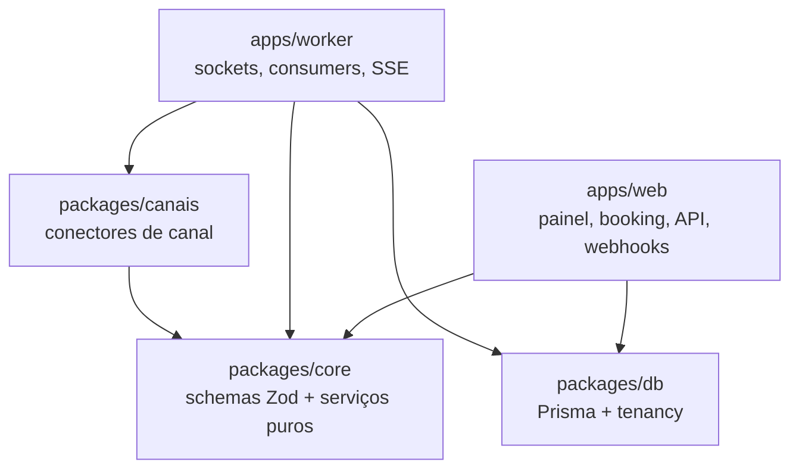
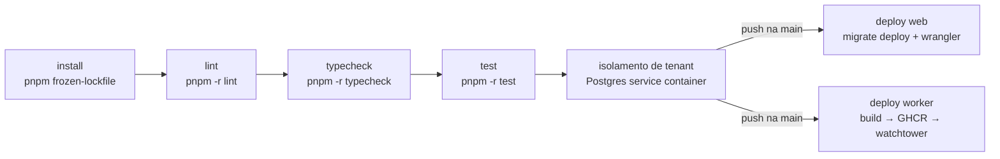

# 09 — Estrutura do Monorepo, Convenções e AGENTS.md

**Sumário executivo.** Este documento fixa a estrutura física do repositório atende-ai e as convenções que impedem dois deploys independentes (web na Cloudflare, worker na Oracle) de divergirem: um monorepo **pnpm workspaces sem Turborepo** (2 apps + 4 packages não justificam orquestrador de build), com árvore completa comentada, fronteiras de import explícitas e verificadas por lint (lógica de domínio em `packages/core`; `packages/canais` como camada anticorrupção de canal; `packages/db` como única porta para o banco, com tenancy por construção), e o mecanismo de documentação viva que sustenta o desenvolvimento por agentes de IA: **um `AGENTS.md` por módulo**, com template canônico, exemplo preenchido (`packages/canais`) e a regra de que **PR que muda um módulo sem atualizar seu `AGENTS.md` está incompleto**. Fecha com o pipeline de CI (install → lint → typecheck → test → isolamento de tenant → deploys) e o fluxo de trabalho passo a passo para agentes. Nada aqui rediscute decisões dos docs 01–07 — este documento as materializa em pastas, scripts, regras de lint e checklists.

---

## 1. Gerenciador do monorepo — pnpm workspaces, sem Turborepo

**Decisão:** o monorepo usa **pnpm workspaces puro**. Sem Turborepo, sem Nx, sem Lerna.

**Motivo:** 2 apps + 4 packages não justificam um orquestrador de build. `pnpm -r` (recursivo, respeitando a ordem topológica de dependências entre workspaces) e `pnpm --filter` cobrem 100% das necessidades reais do projeto: rodar lint/typecheck/teste em tudo, buildar um app específico, executar comandos de um único package. É uma dependência a menos para instalar, configurar (`turbo.json`), atualizar e depurar — e o CI fica legível como uma sequência de comandos pnpm, sem camada de indireção.

**Trade-off honesto:** sem cache remoto de build nem paralelização otimizada por grafo de tarefas. Nesta escala, irrelevante: o build completo leva minutos e o CI cabe com folga nos 2.000 min/mês do GitHub Actions (doc 07). **Gatilho de revisita:** se o monorepo passar de ~10 packages ou o tempo de CI virar gargalo, o Turborepo entra de forma incremental — ele opera *sobre* pnpm workspaces, então a adoção é adicionar `turbo.json`, não reestruturar o repositório.

**Alternativa descartada:** **Turborepo** — excelente em monorepos grandes; aqui adicionaria configuração e uma camada de cache para economizar segundos. **Nx** — ainda mais pesado, com generators e plugins que impõem opinião estrutural sem contrapartida neste porte.

### 1.1 Scripts da raiz (`package.json`)

A raiz orquestra; cada workspace define seus próprios scripts com os mesmos nomes (`lint`, `typecheck`, `test`, `build`), o que faz `pnpm -r <script>` funcionar uniformemente.

| Script raiz | Executa | Uso |
|---|---|---|
| `pnpm lint` | `pnpm -r lint` | ESLint em todos os workspaces (inclui a regra de fronteira do `unsafe.ts`, seção 3.2) |
| `pnpm typecheck` | `pnpm -r typecheck` | `tsc --noEmit` em todos os workspaces |
| `pnpm test` | `pnpm -r test` | Vitest em todos os workspaces |
| `pnpm test:tenancy` | `pnpm --filter @atende/db test:tenancy` | Teste de isolamento de tenant contra Postgres real (seção 3.6) |
| `pnpm build` | `pnpm -r build` | Build de todos os workspaces em ordem topológica |
| `pnpm db:migrate` | `pnpm --filter @atende/db migrate:dev` | `prisma migrate dev` (nome descritivo obrigatório, seção 3.7) |
| `pnpm db:generate` | `pnpm --filter @atende/db generate` | `prisma generate` após mudança de schema |

Workspaces nomeados como `@atende/web`, `@atende/worker`, `@atende/db`, `@atende/core`, `@atende/canais`, `@atende/config` — o filtro do pnpm e os paths do tsconfig (seção 3.5) usam o mesmo nome.

---

## 2. Árvore do monorepo

A árvore completa, comentada. Cada app e cada package de produto tem um `AGENTS.md` na raiz do módulo (seções 4 e 5). A estrutura interna de `apps/web/src/modules` e `packages/core/src` espelha os **bounded contexts do doc 01, seção 4** — a pasta é o contexto.

```
atende-ai/
├── CLAUDE.md                        # Regras invioláveis + mapa de docs — TODO agente lê ANTES de qualquer tarefa
├── README.md                        # Visão de 1 tela: o que é, como rodar, onde está cada coisa
├── .gitignore
├── pnpm-workspace.yaml              # packages: ["apps/*", "packages/*"]
├── package.json                     # Scripts raiz de orquestração (seção 1.1) — sem código
├── tsconfig.base.json               # strict: true + paths @atende/* (seção 3.5); todos estendem daqui
├── .github/
│   └── workflows/
│       └── ci.yml                   # Pipeline único: lint → typecheck → test → isolamento → deploys (seção 6)
├── docs/                            # 01-arquitetura.md ... 09-estrutura-monorepo.md — fonte de verdade das decisões
│
├── apps/
│   ├── web/                         # Next.js App Router via OpenNext → Cloudflare Workers (doc 01, 1.1)
│   │   ├── AGENTS.md
│   │   ├── package.json
│   │   ├── next.config.ts
│   │   ├── open-next.config.ts      # Adapter OpenNext para o runtime Workers
│   │   ├── wrangler.jsonc           # Bindings KV (config de tenant) e R2 (mídia); rotas app.* e *.atende-ai.com.br
│   │   └── src/
│   │       ├── app/
│   │       │   ├── (painel)/        # Painel único app.atende-ai.com.br — tenant SEMPRE da sessão JWT
│   │       │   │   ├── agenda/          #   Rotas por domínio: page.tsx e layouts finos;
│   │       │   │   ├── clientes/        #   componentes e server actions vivem em src/modules/
│   │       │   │   ├── atendimento/     #   Inbox omnichannel (SSE do worker + fallback polling)
│   │       │   │   ├── financeiro/
│   │       │   │   ├── contratos/
│   │       │   │   ├── fiscal/
│   │       │   │   ├── loja/
│   │       │   │   ├── lgpd/            #   Painel LGPD self-service do tenant (doc 04, Bloco 6)
│   │       │   │   └── configuracoes/   #   identidade: usuários, papéis, unidades, canais
│   │       │   ├── (publico)/
│   │       │   │   └── [slug]/      # Booking white-label {slug}.atende-ai.com.br — ÚNICA superfície host→tenant
│   │       │   └── api/
│   │       │       ├── v1/          # API pública versionada — route handlers + Zod + API key por tenant (Pro+)
│   │       │       └── webhooks/    # Borda: valida assinatura, normaliza NADA, enfileira no pg-boss
│   │       │           ├── meta/route.ts       #   HMAC da Meta (WhatsApp oficial; Instagram na Fase 2)
│   │       │           ├── asaas/route.ts      #   Token do Asaas (baixa de pagamento)
│   │       │           └── telegram/route.ts   #   Secret do Bot API (Fase 2)
│   │       ├── modules/             # UI + Server Actions POR DOMÍNIO (espelha os bounded contexts do doc 01)
│   │       │   ├── identidade/      #   Cada módulo: componentes React + actions.ts (Server Actions).
│   │       │   ├── agenda/          #   Lógica de domínio NUNCA aqui — vive em packages/core (seção 3.2).
│   │       │   ├── clientes/        #   UI de um módulo nunca importa UI de outro módulo.
│   │       │   ├── atendimento/
│   │       │   ├── financeiro/
│   │       │   ├── contratos/
│   │       │   ├── fiscal/
│   │       │   ├── loja/
│   │       │   └── lgpd/            #   UI do painel LGPD: consentimentos, solicitações, export, config
│   │       └── lib/                 # Helpers DE BORDA apenas: sessao.ts (JWT com jose), kv.ts (cache edge)
│   │
│   └── worker/                      # Node sempre-ativo — VM Ampere A1 (OCI), Docker Compose (doc 01, 1.3)
│       ├── AGENTS.md
│       ├── package.json
│       ├── Dockerfile               # Multi-stage; imagem publicada no GHCR pelo CI (seção 6)
│       ├── docker-compose.yml       # Serviços: worker + watchtower (auto-pull de imagem nova)
│       └── src/
│           ├── index.ts             # Bootstrap: pg-boss.start() → sockets → consumers → hub SSE → health
│           ├── health.ts            # /healthz para o BetterStack (worker caído = WhatsApp mudo)
│           ├── sockets/             # Gestor Map<canalId, socket> Baileys; auth-state no Postgres; backoff
│           ├── consumers/           # Consumidores pg-boss — um arquivo por fila:
│           │   ├── inbound.ts       #   webhook bruto → Conector.receber → IdentidadeCanal → motor do estado
│           │   ├── lembretes.ts     #   lembrete de agendamento (SÓ API oficial — regra inviolável 12)
│           │   ├── regua.ts         #   régua de cobrança com escalonamento
│           │   ├── email.ts         #   cascata Brevo → Resend → SMTP do tenant
│           │   ├── ia.ts            #   turnos de IA assíncronos (dual-provider, propose-confirm)
│           │   ├── retencao-lgpd.ts #   cron pg-boss de retenção: itera tenants com os prazos de cada um
│           │   ├── plataforma.ts    #   jobs de plataforma AUDITADOS (billing, uso mensal) — único consumer
│           │   │                    #   autorizado a usar prismaSemTenant (seção 3.2)
│           │   └── outbox.ts        #   eventos entre domínios (agenda/financeiro → atendimento reage aqui)
│           └── sse/                 # Hub SSE do painel — a ÚNICA conexão de entrada que a VM aceita
│
├── packages/
│   ├── db/                          # Prisma + tenancy — a ÚNICA porta para o banco
│   │   ├── AGENTS.md
│   │   ├── package.json
│   │   ├── prisma/
│   │   │   ├── schema.prisma        # empresaId pervasivo; @@unique([empresaId, ...]); 5 models LGPD
│   │   │   └── migrations/          # prisma migrate SEMPRE (regra 13). Inclui a migration SQL MANUAL
│   │   │                            #   da exclusion constraint anti-sobreposição da agenda
│   │   │                            #   (CREATE EXTENSION btree_gist + EXCLUDE cobrindo profissional e recurso)
│   │   └── src/
│   │       ├── client.ts            # prisma com Client Extension: injeta where/data { empresaId } lendo
│   │       │                        #   o AsyncLocalStorage — o filtro não é escrito à mão (regra 1)
│   │       ├── tenancy.ts           # runWithTenant(ctx, fn) — todo acesso a dado de tenant roda dentro dele
│   │       ├── resolver-slug.ts     # resolverEmpresaPorSlug(slug) — a ÚNICA consulta pré-tenant da booking,
│   │       │                        #   interna ao package (usa prismaSemTenant sem exportá-lo)
│   │       └── unsafe.ts            # prismaSemTenant — lint-gated; allowlist na seção 3.2
│   │
│   ├── core/                        # Domínio puro: contratos Zod + serviços SEM I/O — o coração testável
│   │   ├── AGENTS.md
│   │   ├── package.json
│   │   └── src/
│   │       ├── identidade/          # Cada domínio segue o mesmo trio:
│   │       │   ├── schemas.ts       #   Zod = CONTRATO (Server Actions, /api/v1, webhooks, jobs pg-boss)
│   │       │   ├── services.ts      #   lógica pura: recebe dados, devolve decisões — sem Prisma, sem fetch
│   │       │   └── types.ts         #   tipos derivados (z.infer) e enums de domínio
│   │       ├── agenda/              # Disponibilidade e anti-sobreposição em código (juiz final é a constraint)
│   │       ├── clientes/            # Resolução de identidade, regras de merge (automático só verificado)
│   │       ├── atendimento/
│   │       │   ├── schemas.ts       #   inclui mensagens canônicas e config de nós (discriminated unions)
│   │       │   ├── services.ts
│   │       │   ├── types.ts
│   │       │   ├── arvore/          #   motor da árvore: nós tipados, DSL de condições — NUNCA eval (doc 05, 3.3)
│   │       │   └── ia/              #   provider.ts (dual Gemini/Claude), prompts/, tools/, propose-confirm.ts
│   │       ├── financeiro/
│   │       │   ├── schemas.ts / services.ts / types.ts
│   │       │   └── payment-provider/    # interface PaymentProvider + drivers/asaas.ts (anti lock-in, doc 03)
│   │       ├── contratos/           # Motor de assinatura: hash SHA-256, OTP, trilha de evidências, manifesto
│   │       ├── fiscal/              # Organização do dado p/ NFS-e manual (MVP); driver Focus NFe (Fase 2)
│   │       ├── loja/                # Catálogo, carrinho, pedidos (reusa payment-provider)
│   │       ├── lgpd/                # Auditoria, consentimento insert-only, anonimização, export (regras 4-9)
│   │       ├── plataforma/          # Regras de planos/limites e feature flags — PURO como o resto do core;
│   │       │                        #   os jobs que acessam banco vivem em apps/worker/consumers/plataforma.ts
│   │       ├── crypto/              # AES-256-GCM p/ segredos em repouso (regra 15) — herdado do ev-tracker
│   │       └── email/               # Motor de cascata (drivers brevo, resend, smtp) — herdado do ev-tracker
│   │
│   ├── canais/                      # Camada anticorrupção de canal — ÚNICO lugar que importa SDK de canal
│   │   ├── AGENTS.md
│   │   ├── package.json
│   │   └── src/
│   │       ├── tipos.ts             # interface Conector + tipos MensagemInboundNormalizada / MensagemOutbound
│   │       │                        #   (os schemas Zod das mensagens vivem em core/atendimento — contrato
│   │       │                        #   web↔worker; tipos.ts deriva e reexporta)
│   │       ├── degradacao.ts        # botões → lista numerada; lista → sequência; mídia → link R2 (doc 05, 1.3)
│   │       └── conectores/          # Cada conector implementa a MESMA interface Conector:
│   │           ├── whatsapp-oficial/    # MVP — Meta Cloud API: templates, reply buttons (de ev-tracker)
│   │           ├── whatsapp-baileys/    # MVP — SEM método de envio proativo: restrição ESTRUTURAL (regra 12)
│   │           ├── telegram/            # Fase 2 — Bot API
│   │           ├── webchat/             # Fase 2 — widget próprio + SSE do worker
│   │           ├── instagram/           # Fase 2 — mesma app Meta (messenger acompanha)
│   │           └── email/               # Fase 2 — inbound via webhook Brevo + cascata no outbound
│   │
│   └── config/                      # Configuração compartilhada — sem código de produto, sem AGENTS.md
│       ├── package.json
│       ├── tsconfig/                # Bases (base, next, node) estendidas por cada workspace
│       └── eslint/                  # Config compartilhada + regra no-restricted-imports:
│                                    #   import de packages/db/src/unsafe.ts é PROIBIDO fora de
│                                    #   packages/db (interno: migração/seed, resolver-slug.ts) e de
│                                    #   apps/worker/src/consumers/plataforma.ts (jobs auditados)
```

Duas escolhas da árvore merecem registro explícito:

- **`src/app/(painel)` fino, `src/modules` gordo.** As rotas do App Router contêm apenas `page.tsx`/`layout.tsx` que compõem componentes de `src/modules/<dominio>`. Motivo: o file-system router do Next.js é infraestrutura de roteamento, não lugar de código — manter componentes e actions em `modules/` deixa o domínio navegável por pasta e o roteamento trocável. Alternativa descartada: colocar tudo dentro de `app/` (padrão de projetos pequenos) — vira labirinto de `page.tsx` gigantes e mistura URL com domínio.
- **`AGENTS.md` por módulo, não um só na raiz.** O `CLAUDE.md` raiz carrega o que vale para tudo; cada `AGENTS.md` carrega o que só vale ali (invariantes, comandos, estado). Um documento único na raiz inflaria a cada feature e nenhum agente leria inteiro. Trade-off: mais arquivos para manter — mitigado pela regra do PR (seção 7).

---

## 3. Convenções de código

### 3.1 Nomenclatura

Regra inviolável 17 do `CLAUDE.md`, operacionalizada:

| O quê | Convenção | Exemplos |
|---|---|---|
| Domínio (models, funções, variáveis de negócio) | **PT-BR sem acentos** | `Agendamento`, `Cobranca`, `criarAgendamento`, `PropostaAcao` |
| Infraestrutura (pastas e utilitários técnicos) | **EN** | `db`, `queue`, `connectors`, `client.ts`, `health.ts` |
| Arquivos | **kebab-case** | `payment-provider.ts`, `propose-confirm.ts`, `agenda-semanal.tsx` |
| Componentes React | **PascalCase** (o arquivo continua kebab-case) | `AgendaSemanal` em `agenda-semanal.tsx` |
| Packages | `@atende/<nome>` | `@atende/core`, `@atende/canais` |
| Filas pg-boss | `<dominio>.<evento>` em kebab-case | `atendimento.inbound`, `agenda.lembrete`, `financeiro.regua` |
| Variáveis de ambiente | SCREAMING_SNAKE em EN | `DATABASE_URL`, `META_APP_SECRET` |

A fronteira PT-BR/EN não é estética: separa **o que o negócio entende** (domínio, lido por dono de salão em log de auditoria e por agente de IA em prompt) do **que só o desenvolvedor toca** (infra). Na dúvida: se o conceito aparece numa conversa com o tenant, é PT-BR.

### 3.2 Fronteiras de import

O grafo de dependências é **acíclico e curto** — e é verificado por lint, não por disciplina:



| Regra | Enforcement |
|---|---|
| **Lógica de domínio vive em `packages/core`, NUNCA em componente React** ou route handler. O componente coleta input, a Server Action valida com Zod e chama o service do core; a persistência sai via `@atende/db` sob `runWithTenant`. | Revisão + a regra prática: se um `if` de negócio está num `.tsx`, está no lugar errado |
| `apps/web` importa `@atende/core` e `@atende/db`. **Não importa `@atende/canais`**: webhooks na borda só validam assinatura e enfileiram — a normalização roda no worker (doc 05, 1.2) | ESLint `no-restricted-imports` por workspace |
| `apps/worker` importa `@atende/core`, `@atende/db` e `@atende/canais` | — |
| `packages/canais` importa **apenas** `@atende/core` (tipos/schemas das mensagens canônicas). Nunca importa `web`, `worker` nem `db` | ESLint |
| `packages/core` **não importa nada do repositório** (só libs). Serviços são puros: sem Prisma, sem fetch — quem orquestra I/O são os apps | ESLint |
| `packages/db/src/unsafe.ts` (`prismaSemTenant`) só é importável **dentro de `packages/db`** (migração/seed e `resolver-slug.ts` — a consulta pré-tenant da booking fica interna ao package) e em **`apps/worker/src/consumers/plataforma.ts`** (jobs de plataforma auditados: billing, uso mensal). `packages/core` permanece 100% puro — allowlist idêntica no CLAUDE.md regra 1, doc 01 §5.2 e doc 02 §15.2 | ESLint `no-restricted-imports` em `packages/config/eslint` — violação quebra o CI |
| Nenhum package importa `apps/*`; UI de um módulo nunca importa UI de outro módulo | ESLint + revisão |
| **Eventos entre domínios via outbox pg-boss**: `atendimento` e `financeiro` chamam `agenda`/`clientes` por função do core; **ninguém chama `atendimento` de volta** — publica evento e o consumer `outbox.ts` do atendimento reage (doc 01, seção 4) | Revisão + AGENTS.md de cada módulo |

### 3.3 Mutações

- **Server Actions** para toda mutação do painel — vivem em `apps/web/src/modules/<dominio>/actions.ts`. Toda action: valida input com o schema Zod do core → resolve tenant da sessão JWT → executa sob `runWithTenant`.
- **Route handlers** apenas para a **API pública `/api/v1`** (versionada, API key por tenant) e para **webhooks** (validam assinatura e enfileiram — zero lógica de negócio na borda).
- Mutação via GET não existe. Webhook que processa em vez de enfileirar é bug de arquitetura, não estilo.

### 3.4 Validação

**Zod em toda borda** (regra inviolável 14): webhooks, Server Actions, `/api/v1`, config JSON de nós de fluxo (discriminated unions) e **payloads de jobs pg-boss** — o mesmo schema que valida o enqueue no web valida o consumo no worker; é o contrato que impede drift entre os dois deploys. Os schemas vivem em `packages/core/src/<dominio>/schemas.ts` e os tipos derivam deles (`z.infer`) — nunca o contrário. Regra prática: **nenhum `JSON.parse` sem schema na sequência**; `unknown` só vira tipo depois de `schema.parse()`.

### 3.5 Imports e paths

`tsconfig.base.json` define os paths e todo workspace estende dele:

```jsonc
{
  "compilerOptions": {
    "strict": true,
    "paths": {
      "@atende/core": ["packages/core/src"],
      "@atende/core/*": ["packages/core/src/*"],
      "@atende/db": ["packages/db/src"],
      "@atende/canais": ["packages/canais/src"]
    }
  }
}
```

Import relativo atravessando package (`../../../packages/core/...`) é proibido — sempre pelo alias. Dentro do mesmo package, relativo curto é o normal.

### 3.6 Testes

- **Vitest** em todo o monorepo; testes colocados junto do código: `src/**/*.test.ts`.
- A arquitetura decide onde o teste é barato: `packages/core` é puro, então a maioria dos testes de negócio (disponibilidade, DSL de condições, degradação, parser de confirmação, propose-confirm) roda **sem banco e sem mock de I/O**.
- **Teste de isolamento de tenant é obrigatório no CI** (critério de pronto do MVP, doc 01): vive em `packages/db`, roda contra Postgres real (service container no CI, seção 6), cria dois tenants e prova que query sob `runWithTenant(A)` nunca retorna dado de B — inclusive quando o `where` tenta forjar `empresaId` de B. Falhou, pipeline vermelho, sem exceção.

### 3.7 Migrations

- **`prisma migrate dev --name <descricao>`** com nome descritivo em PT-BR sem acentos: `adiciona_exclusion_constraint_agendamento`, `cria_models_lgpd`. **`db push` é banido** (regra inviolável 13) — inclusive "só em dev".
- SQL que o Prisma não expressa (ex.: `CREATE EXTENSION btree_gist` + `EXCLUDE` da agenda) entra por **migration criada com `--create-only` e editada à mão** — versionada como qualquer outra, aplicada por `migrate deploy` no CI.
- Migrations são **aditivas primeiro** (expand/contract): coluna nova entra num deploy, código passa a usá-la, remoção da antiga vem em migration posterior — obrigatório porque web e worker fazem deploy independente e convivem com o mesmo banco.

### 3.8 Commits

**Conventional Commits em PT-BR**, escopo = domínio ou workspace:

```
feat(agenda): adiciona bloqueio de horario por sala
fix(canais): parser de confirmacao aceita "pode ser" sem acento
docs(09): registra decisao pnpm sem turborepo
chore(ci): cacheia pnpm store no workflow
```

Tipos aceitos: `feat`, `fix`, `docs`, `chore`, `refactor`, `test`. A descrição segue a regra de nomenclatura (sem acentos, imperativo presente).

---

## 4. Template de AGENTS.md

Todo app e todo package de produto (`web`, `worker`, `db`, `core`, `canais`) tem um `AGENTS.md` na raiz do módulo. Ele é **contrato de trabalho para agentes de IA e humanos**: curto, específico e atualizado no mesmo PR de cada feature (seção 7). O template canônico — copiar e preencher:

````markdown
# AGENTS.md — <caminho do módulo, ex.: packages/core>

> Leia o `CLAUDE.md` da raiz ANTES deste arquivo. Este documento complementa
> as regras invioláveis — nunca as substitui nem as relaxa.

## Propósito

<1 parágrafo: o que este módulo faz, o que fica DENTRO dele e o que fica
explicitamente FORA (com o lugar certo indicado).>

## Contratos

Os contratos deste módulo são schemas Zod — os tipos derivam deles via
`z.infer`, nunca o contrário. **Não duplique tipos ou shapes aqui**: esta
seção só aponta para o arquivo-fonte.

| Contrato | Onde vive |
|---|---|
| <NomeDoSchema> | `packages/core/src/<dominio>/schemas.ts` |

## Invariantes

O que SEMPRE vale neste módulo. Se um PR quebra uma linha desta lista,
o PR está errado — não a lista. (Mudar um invariante exige decisão
registrada em docs/, não um commit oportunista.)

1. <ex.: toda query a dado de tenant roda sob `runWithTenant`>
2. <...>

## O que NUNCA fazer

1. <ex.: nunca importar `packages/db/src/unsafe.ts`>
2. <ex.: nunca enviar mensagem proativa por Baileys>
3. <...>

## Dependências

- **Importa:** <workspaces `@atende/*` e libs relevantes — e o que é proibido importar>
- **É importado por:** <quem consome este módulo>

## Comandos

```bash
pnpm --filter @atende/<pacote> test        # testes do módulo
pnpm --filter @atende/<pacote> typecheck   # verificação de tipos
pnpm --filter @atende/<pacote> build       # build
# <comandos específicos do módulo: migrate, generate, dev...>
```

## Estado atual

Atualize esta seção NO MESMO PR de cada feature — PR que muda o módulo sem
atualizar este arquivo está incompleto (doc 09, seção 7).

| Item | Status |
|---|---|
| <feature/arquivo> | implementado \| em progresso \| planejado (MVP/Fase 2) |
````

Notas de uso:

- **Propósito** de um parágrafo — se precisar de dois, o módulo provavelmente está com responsabilidade demais.
- **Contratos nunca duplicam código**: `AGENTS.md` desatualizado com shape copiado é pior que nenhum — por isso a seção só referencia.
- **Invariantes ≠ o-que-nunca-fazer**: invariante descreve o estado que sempre vale (positivo); a outra lista descreve ações proibidas (negativo). Agentes de IA respondem melhor às duas formas juntas.
- **Estado atual** é o que impede um agente de reimplementar o que existe ou depender do que ainda não existe.

---

## 5. Exemplo preenchido — `packages/canais/AGENTS.md`

O módulo mais didático para exemplificar: interface única, formato canônico, degradação por canal e uma regra inviolável estrutural (nº 12).

````markdown
# AGENTS.md — packages/canais

> Leia o `CLAUDE.md` da raiz ANTES deste arquivo. Este documento complementa
> as regras invioláveis — nunca as substitui nem as relaxa.

## Propósito

Camada anticorrupção entre os provedores de canal (Meta Cloud API, Baileys,
Bot API do Telegram, webchat próprio, e-mail) e os motores de atendimento.
Todo canal entra e sai por um formato canônico: `receber()` converte webhook
bruto em `MensagemInboundNormalizada[]`; `enviar()` converte
`MensagemOutbound` na chamada do provedor, degradando o que o canal não
suporta (botões → lista numerada). Este é o ÚNICO package que importa SDK de
canal — motor (árvore, IA, humano) nunca sabe em qual canal está falando, e
conector nunca sabe qual motor está respondendo. FORA daqui: máquina de
estados da Conversa e propose-confirm (packages/core/atendimento);
persistência e dedup (consumers do apps/worker).

## Contratos

| Contrato | Onde vive |
|---|---|
| `interface Conector` (tipo, capacidades, receber, enviar) | `src/tipos.ts` |
| `MensagemInboundNormalizada` / `MensagemOutbound` (schemas Zod) | `packages/core/src/atendimento/schemas.ts` — `src/tipos.ts` deriva e reexporta os tipos |
| Payloads de webhook por provedor (validação de entrada) | `src/conectores/<canal>/schemas.ts` |
| Tabela de capacidades por canal | `docs/05-omnichannel.md`, seção 1.4 |

## Invariantes

1. Todo conector implementa `Conector` por inteiro; as `capacidades`
   declaradas correspondem ao que `enviar()` realmente faz — degradação
   decide por elas, nunca por `if (tipo === ...)` espalhado.
2. `empresaId` e `canalId` do inbound vêm do registro do webhook/rota,
   NUNCA do corpo do payload (regra inviolável 3 aplicada ao inbound).
3. `receber()` valida o payload bruto com Zod; payload inválido é rejeitado
   e logado — nunca chega aos motores.
4. Mídia inbound é baixada para o R2 no ato da normalização (URL da Meta
   expira em minutos); a mensagem canônica carrega a URL do R2.
5. `enviar()` retorna `{ idExterno }` sempre — idempotência, correlação de
   status e threading (`respostaA`) dependem disso.
6. Degradação é do conector, o motor nunca se adapta: `degradacao.ts`
   converte botões/lista em texto numerado e devolve o mapa
   `numero → payloadBotao` para o parser de resposta.

## O que NUNCA fazer

1. NUNCA criar método de envio proativo no conector `whatsapp-baileys` —
   a restrição é ESTRUTURAL (a interface do conector não expõe a operação),
   não configurável. Regra inviolável 12, política anti-ban (doc 05, seção 7).
2. Nunca importar SDK de canal fora de `src/conectores/<canal>/`.
3. Nunca importar `@atende/db`, `apps/web` ou `apps/worker` — este package
   normaliza e traduz; persistir e orquestrar é papel do worker.
4. Nunca vazar tipo de SDK de canal na assinatura pública de um conector —
   só tipos canônicos entram e saem.
5. Nunca enviar mensagem de sessão fora da janela de 24h da Meta sem
   template aprovado — o roteador de envio bloqueia; não contornar.

## Dependências

- **Importa:** `@atende/core` (schemas/tipos das mensagens canônicas);
  SDKs de canal (baileys, grammY, ...) confinados em `src/conectores/`.
- **É importado por:** `apps/worker` (único consumidor). `apps/web` NÃO
  importa este package: webhooks na borda só validam assinatura e enfileiram.

## Comandos

```bash
pnpm --filter @atende/canais test        # inclui testes de degradação e parsers
pnpm --filter @atende/canais typecheck
pnpm --filter @atende/canais build
```

## Estado atual

| Item | Status |
|---|---|
| `tipos.ts` (interface Conector, reexport dos tipos canônicos) | planejado (MVP) |
| `degradacao.ts` (botões→numerada, lista→sequência, mídia→link) | planejado (MVP) |
| `conectores/whatsapp-oficial` | planejado (MVP — extração de `ev-tracker/src/lib/whatsapp.ts`) |
| `conectores/whatsapp-baileys` | planejado (MVP — extração de `ev-tracker/whatsapp-worker/`; socket global → `Map<canalId, socket>`) |
| `conectores/telegram` | planejado (Fase 2) |
| `conectores/webchat` | planejado (Fase 2) |
| `conectores/instagram` (+ messenger, mesma app Meta) | planejado (Fase 2) |
| `conectores/email` | planejado (Fase 2 — inbound Brevo) |
````

---

## 6. CI/CD — `.github/workflows/ci.yml`

Pipeline único (GitHub Actions, free tier 2.000 min/mês — doc 07), com deploys condicionados a push na `main` **e** sucesso da verificação:



### 6.1 Job `verificar` (todo push e PR)

1. **Install** — `pnpm install --frozen-lockfile` com cache do store do pnpm; `prisma generate` na sequência.
2. **Lint** — `pnpm -r lint`. Inclui a regra de fronteira: import de `unsafe.ts` fora dos lugares permitidos quebra o build aqui, não em revisão.
3. **Typecheck** — `pnpm -r typecheck`.
4. **Test** — `pnpm -r test` (Vitest; o grosso é `packages/core`, puro e rápido).
5. **Isolamento de tenant** — `pnpm test:tenancy` contra um **Postgres efêmero** (service container `postgres:17` do próprio Actions — não gasta CU-h do Neon e não exige secret): `prisma migrate deploy` aplica todas as migrations (validando de quebra a migration manual da exclusion constraint), o teste cria dois tenants e prova o isolamento sob `runWithTenant`, incluindo tentativa de forjar `empresaId` no `where`. É o critério de pronto do MVP rodando em cada commit.

### 6.2 Job `deploy-web` (push na `main`, após `verificar`)

1. `prisma migrate deploy` contra o Neon (**conexão direta, sem pooler** — DDL não passa pelo pgbouncer).
2. `pnpm --filter @atende/web build` (OpenNext) e `wrangler deploy`.

Migration antes do deploy + disciplina expand/contract (seção 3.7) mantém compatibilidade com o worker antigo até o passo seguinte.

### 6.3 Job `deploy-worker` (push na `main`, após `verificar`)

1. `docker build` do `apps/worker` e push para o **GHCR** com tags `latest` + SHA do commit.
2. Na VM, o **Watchtower** (serviço no mesmo `docker-compose.yml`) detecta a imagem nova e faz pull + restart.

**Decisão — deploy pull-based via Watchtower, não push via SSH.** Motivo: preserva a postura de segurança do doc 01 ("nenhuma seta externa aponta para a VM") — o GitHub não precisa de acesso SSH de entrada; a VM só faz conexões de saída (GHCR incluso). Trade-off honesto: latência de até um intervalo de polling (~5 min) entre push e deploy, e menos controle do momento exato — aceitável para um worker cujo protocolo de atualização é idempotente (auth-state Baileys no Postgres; jobs pg-boss com retry sobrevivem ao restart). **Alternativa descartada:** step SSH (`docker compose pull && up -d`) — deploy imediato, mas exige porta SSH exposta ao Actions e chave privada em secret; fica documentada como **procedimento manual do operador** para hotfix urgente, não como caminho padrão do pipeline.

### 6.4 Secrets necessários

| Secret | Usado por | Conteúdo |
|---|---|---|
| `CLOUDFLARE_API_TOKEN` | deploy-web | Token com escopo Workers (deploy via wrangler) |
| `CLOUDFLARE_ACCOUNT_ID` | deploy-web | Account ID da Cloudflare |
| `NEON_DIRECT_URL` | deploy-web | Connection string **direta** (sem pooler) do Neon, só para `migrate deploy` |
| `GITHUB_TOKEN` | deploy-worker | Nativo do Actions — push de imagem no GHCR (sem secret extra) |
| `SENTRY_AUTH_TOKEN` | deploy-web / deploy-worker | Upload de source maps (opcional, recomendado) |

O teste de isolamento **não usa secret nenhum** — Postgres efêmero do próprio runner. Segredos de runtime (chaves Meta, Asaas, IA, `SESSION_SECRET`, chave AES) **não vivem no CI**: ficam nos secrets do Wrangler (web) e no `.env` da VM (worker), fora do escopo deste workflow.

---

## 7. Fluxo de trabalho para agentes de IA

Este repositório é desenvolvido com agentes de IA como primeira classe. O fluxo obrigatório para **qualquer tarefa de código**:

1. **Ler `CLAUDE.md` da raiz** — regras invioláveis e mapa de docs. Nenhuma tarefa começa sem isso.
2. **Ler o `AGENTS.md` de cada módulo que será tocado** — propósito, contratos, invariantes, proibições, estado atual. Se a tarefa cruza módulos (ex.: feature de agenda com cobrança), ler todos os envolvidos.
3. **Implementar dentro das fronteiras** da seção 3.2 — na dúvida sobre onde o código vive, a resposta quase sempre é `packages/core` (lógica) ou o módulo de UI correspondente (apresentação). Fronteira nova ou invariante alterado = decisão a registrar em `docs/`, não um commit silencioso.
4. **Atualizar o `AGENTS.md` do módulo no mesmo PR** — no mínimo a seção *Estado atual*; se a feature criou contrato, invariante ou proibição nova, as seções correspondentes também.
5. **Rodar os comandos do módulo** (seção *Comandos* do `AGENTS.md`): teste, typecheck e lint dos workspaces tocados — antes de considerar a tarefa pronta. Mudança em `packages/db` roda também `pnpm test:tenancy`.

**Regra de aceitação: PR que muda um módulo sem atualizar o `AGENTS.md` correspondente está incompleto** — o revisor (humano ou agente) devolve sem analisar o diff de código. A razão é econômica: o custo de manter o `AGENTS.md` no PR é de minutos; o custo de um agente futuro trabalhar com documentação defasada é retrabalho e, no pior caso, violação de invariante que o arquivo teria prevenido. Documentação viva só funciona com acoplamento forte entre mudança e registro — é isso que esta regra compra.

---

*Documentos relacionados: `docs/01-arquitetura.md` (topologia e bounded contexts que a árvore materializa), `docs/03-stack.md` (justificativa de pnpm/Prisma/Zod/CI), `docs/05-omnichannel.md` (spec do `packages/canais`), `docs/08-reuso-ev-tracker.md` (origem dos módulos herdados citados nos AGENTS.md).*
